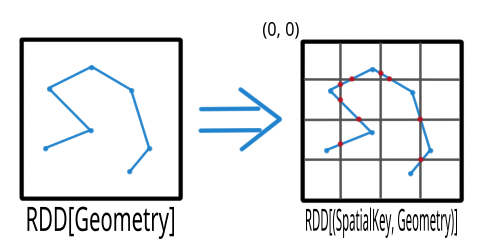
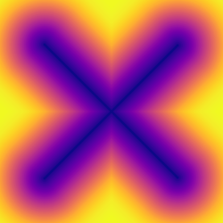
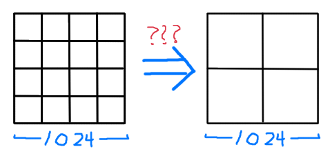

Changelog
=========

3.0.0-SNAPSHOT
-----

API Changes & Project structure changes
^^^^^^^^^^^^^^^^^^^^^^^^^^^^^^^^^^^^^^^^

- ``geotrellis.s3``

  - **Change**  Use the AWS S3 SDK v2 instead of v1 (`#2911 <https://github.com/locationtech/geotrellis/pull/2911>`_).
  - **Change**  The S3 client wrapper that was used to support AWS SDK v1 has been removed in favor of directly using `S3Client` (`#2911 <https://github.com/locationtech/geotrellis/pull/2911>`_).
  - **Change**  Classes and functions that will require an `S3Client` to be created now provide parameters to customize `S3Client` creation. (`#2911 <https://github.com/locationtech/geotrellis/pull/2911>`_).
  - **Change**  s3-testkit is no longer used; testing now depends on an external min.io server which mocks the S3 API. (`#2911 <https://github.com/locationtech/geotrellis/pull/2911>`_).

- ``geotrellis.s3-testkit``

  - **Remove:**  ``geotrellis.s3-testkit`` has been removed. (`#2911 <https://github.com/locationtech/geotrellis/pull/2911>`_).

- ``geotrellis.accumulo``

  - **Remove:** The following types have been moved from ``geotrellis.accumulo`` to the ``geotrellis.layers.accumulo`` package:
    - ``AccumuloAttributeStore``
    - ``AccumuloCollectionLayerReader``
    - ``AccumuloCollectionReader``
    - ``AccumuloInstance``
    - ``AccumuloKeyEncoder``
    - ``AccumuloLayerDeleter``
    - ``AccumuloLayerHeader``
    - ``AccumuloUtils``
    - ``AccumuloValueReader``

- ``geotrellis.layers.accumulo``

  - **New:** ``geotrellis.layers.accumulo`` is a new package where non-Spark related Accumulo API will be contained.

- ``geotrellis.slick``

  - **Remove:**  ``geotrellis.slick`` has been removed. Slick support will now reside in `geotrellis-contrib` (`#2902 <https://github.com/locationtech/geotrellis/pull/2902>`_).

- ``geotrellis.tiling``

  - **New:** ``geotrellis.tiling`` is a new package where the tiling and key API will be contained.

- ``geotrellis.spark``

  - **Remove:** The following types have been moved from ``geotrellis.spark`` to the ``geotrellis.tiling`` package:
    - ``SpatialKey``
    - ``SpaceTimeKey``
    - ``TemporalKey``
    - ``Bounds``
    - ``Boundable``
    - ``EmptyBounds``
    - ``KeyBounds``
    - ``TemporalProjectedExtent``
    - ``EmptyBoundsError``
    - ``SpatialComponent``
    - ``TemporalComponent``

- ``geotrellis.spark.tiling``

  - **Remove:** The following types have been moved from ``geotrellis.spark.tiling`` to the ``geotrellis.tiling`` package:
    - ``LayoutDefinition``
    - ``LayoutScheme``
    - ``LayoutLevel``
    - ``LocalLayoutScheme``
    - ``FloatingLayoutScheme``
    - ``ZoomedLayoutScheme``
    - ``MapKeyTransform``

- ``geotrellis.raster``

  - **Change:** The implicit/package structure of the ``raster`` package has changed such that it's now possible to import almost
    all features/extensions with a single line (`#2891 <https://github.com/locationtech/geotrellis/pull/2891>`_):

    ``import geotrellis.raster._``

Fixes & Updates
^^^^^^^^^^^^^^^

- Update pureconfig to version 0.10.2 (`#2882 <https://github.com/locationtech/geotrellis/pull/2882>`_).
- Update dependencies (`#2904 <https://github.com/locationtech/geotrellis/pull/2904>`_).
- Bump ScalaPB version up with some API enhancements (`#2898 <https://github.com/locationtech/geotrellis/pull/2898>`_).
- Artifacts in Viewshed have been addressed, the pixels/meter calculation has also been improved (`#2917 <https://github.com/locationtech/geotrellis/pull/2917>`_).
- Fix map{X|Y}ToGrid function behavior that could give a bit incorrect results (`#2953 <https://github.com/locationtech/geotrellis/pull/2953>`_).

2.3.0
-----
*2019 Apr 18*

Fixes & Updates
^^^^^^^^^^^^^^^

- Fix Accumulo and HBase AttributeStore performance (`#2899 <https://github.com/locationtech/geotrellis/pull/2899>`_).
- Fix Cassandra AttributeStore performance (`#2901 <https://github.com/locationtech/geotrellis/pull/2901>`_).
- Fix createAlignedGridExtent function actually to align to GridExtents (`#2878 <https://github.com/locationtech/geotrellis/pull/2878>`_).
- Fix to rasterRegionReproject function (`#2880 <https://github.com/locationtech/geotrellis/pull/2880>`_).

2.2.0
-----
*2019 Jan 11*

API Changes & Project structure changes
^^^^^^^^^^^^^^^^^^^^^^^^^^^^^^^^^^^^^^^^

- ``geotrellis.proj4j``

  - **Change:** Extract Proj4J to org.locationtech.proj4j (`#2846 <https://github.com/locationtech/geotrellis/pull/2846>`_).

Fixes & Updates
^^^^^^^^^^^^^^^

- Fix {Backend}LayerCopy exception handling (`#2860 <https://github.com/locationtech/geotrellis/pull/2860>`_).
- Fix cache level in Ingest objects (`#2854 <https://github.com/locationtech/geotrellis/pull/2854>`_).
- Catch a possible precision loss on reprojection to the same projection (`#2849 <https://github.com/locationtech/geotrellis/pull/2849>`_).
- Make histogram.merge methods more specific (`#2852 <https://github.com/locationtech/geotrellis/pull/2852>`_).
- Fixed elliptical radius check in IDW algorithm (`#2844 <https://github.com/locationtech/geotrellis/pull/2844>`_).
- Replace all JavaConversions imports by JavaConverters (`#2843 <https://github.com/locationtech/geotrellis/pull/2843>`_).
- Made implicit conversions to/from Raster and ProjectedRaster deprecated (`#2834 <https://github.com/locationtech/geotrellis/pull/2834>`_).
- Fix vectorizer bug (`#2839 <https://github.com/locationtech/geotrellis/pull/2839>`_).
- Added `mapTile` to `ProjectedRaster` (`#2830 <https://github.com/locationtech/geotrellis/pull/2830>`_).
- Downgrade Avro version (`#2837 <https://github.com/locationtech/geotrellis/pull/2837>`_).
- Fix error in `ReprojectRasterExtent` (`#2825 <https://github.com/locationtech/geotrellis/pull/2825>`_).
- Dependency updates (`#2813 <https://github.com/locationtech/geotrellis/pull/2813>`_).
- Bump Spark version up to 2.4 (`#2823 <https://github.com/locationtech/geotrellis/pull/2823>`_).
- Use a local[2] mode inside TestEnvironment trait (`#2821 <https://github.com/locationtech/geotrellis/pull/2821>`_).
- Make IO code agnostic about effects (`#2818 <https://github.com/locationtech/geotrellis/pull/2818>`_).
- Make IO code agnostic about effects (`#2818 <https://github.com/locationtech/geotrellis/pull/2818>`_).

2.1.0
-----
*2018 Oct 2*

- ``gerotrellis.spark``

  - ``TileRDDReproject`` now works on RDD of ``TileFeature[T, D]`` (`#2803 <https://github.com/locationtech/geotrellis/pull/2803>`_).
  - ``TileRDDReproject`` now uses ``Reproject.Options.errorThreshold`` value (`#2803 <https://github.com/locationtech/geotrellis/pull/2803>`_).

- ``geotrellis.spark.testkit``

  - ``TestEnvironment`` now includes ``SparkSession`` (`#2808 <https://github.com/locationtech/geotrellis/pull/2808>`_).

- ``geotrellis.spark.etl``

  - Add ``TemporalIngest`` main method (`#2709 <https://github.com/locationtech/geotrellis/pull/2709>`_).

- ``geotrellis.raster``

  - ``RasterRegionReproject`` defaults to approximate resampling for ``MultibandBandTile`` (`#2803 <https://github.com/locationtech/geotrellis/pull/2803>`_).
  - ``Stitcher`` type class instance is now defined for ``TileFeature[T, D]`` (`#2803 <https://github.com/locationtech/geotrellis/pull/2803>`_).
  - Fix ``GeoTiffSegment`` conversion to ``UByteCellType`` and ``UShortCellType`` (`#2794 <https://github.com/locationtech/geotrellis/pull/2794>`_).
  - Fix ``GeoTiff[T]`` interpretation of ``AutoHigherResolution`` ``OverviewStrategy`` (`#2802 <https://github.com/locationtech/geotrellis/pull/2802>`_).
  - ``GeoTiff[T].getClosestOverview`` method is now public (`#2804 <https://github.com/locationtech/geotrellis/pull/2804>`_).
  - ``GeoTiffOptions.storageMethod`` now defaults to ``Tiled`` instead of ``Striped`` (`#2810 <https://github.com/locationtech/geotrellis/pull/2810>`_).
  - GeoTiff ``TiffTags`` class can now read inverted extents (`#2812 <https://github.com/locationtech/geotrellis/pull/2812>`_).

- ``geotrellis.vector``

  - Add ``bbox`` field to all GeoJSON Features (`#2811 <https://github.com/locationtech/geotrellis/pull/2811>`_).

2.0.0
-----

API Changes
^^^^^^^^^^^

- ``geotrellis.spark``

  - **Change:**  The length of the key (the space-filling curve index or address) used for layer reading and writing has
    been extended from a fixed length of 8 bytes to an arbitrary length.  This change affects not only the
    ``geotrellis.spark`` package, but all backends (excluding ``geotrellis.geowave`` and ``geotrellis.geomesa``).
  - **New:** All focal operations now except an optional ``partitioner`` parameter.
  - **New:** ``BufferTiles.apply`` methods and the ``bufferTiles`` methods now except an optional ``partitioner`` parameter.
  - **Change:** Reprojection has improved performance due to one less shuffle stage and lower memory usage. ``TileRDDReproject`` loses dependency on ``TileReprojectMethods`` in favor of ``RasterRegionReproject``
  - **New:** ``CollectionLayerReader`` now has an SPI interface.
  - **New:** ``ZoomResample`` can now be used on ``MultibandTileLayerRDD``.
  - **New:** ``Partitioner`` can be specified in the ``reproject`` methods of ``TileLayerRDD``.
  - **New:** Compression ``level`` of GeoTiffs can be specified in the ``DeflateCompression`` constructor.
  - **Change:** The Ascii draw methods are now method extensions of ``Tile``.
  - **Change:** Replace ``geotrellis.util.Functor`` with ``cats.Functor``.
  - **Change:** Specifying the ``maxTileSize`` for a COGLayer that's to be written is now done via ``COGLayerWriter.Options``
    which can be passed directly to the ``write`` methods.
  - **New:** ``resampleMethod`` parameter has been added to ``COGLayerWriter.Options``.
  - **Change:** Specifying the ``compression`` for a COGLayer that's to be written is now done via ``COGLayerWriter.Options``
    which can be passed directly to the ``write`` methods.
  - **New:** A new type called ``LayerType`` has been created to help identify the nature of a layer (either Avro or COG).
  - **New:** ``LayerHeader`` now have an additional parameter: ``layerType``.
  - **Change:** The attribute name for ``COGLayerStorageMetadata`` is now ``metadata`` instead of ``cog_metadata``.
  - **New:** ``AttributeStore`` now has four new methods: ``layerType``, ``isCOGLayer``, ``readCOGLayerAttributes``,
    and ``writeCOGLayerAttributes``.
  - **New:** Kryo serialization of geometry now uses a binary format to reduce shuffle block size.
  - **Change:** Scalaz streams were replaced by fs2 streams.
  - **Change:** Refactored ``HBaseInstance``, now accepts a plain Hadoop ``Configuration`` object.
  - **Change:** Refactored ``CassandraInstance``, now accepts a ``getCluster`` function.
  - **Change:** Use pureconfig to handle all work with configuration files.
  - **Remove:** ``LayerUpdater`` with its functionality covered by ``LayerWriter`` (`#2663 <https://github.com/locationtech/geotrellis/pull/2663>`_).
  - **New:** Alter ``geotrellis.spark.stitch.StitchRDDMethods`` to allow ``RDD[(K, V)]`` to be stitched when not all tiles are
    of the same dimension.
  - **Change:** Change ``TilerMethods.tileToLayout`` functions that accept ``TileLayerMetadata`` as an argument to return ``RDD[(K, V)] with Metadata[M]``
    instead of ``RDD[(K, V)]``.
  - **New:** Introduce ``Pyramid`` class to provide a convenience wrapper for building raster pyramids.
  - **Change:** Expose ``attributeStore`` parameter to LayerReader interface.
  - **Change:** Added exponential backoffs in ``S3RDDReader``.
  - **Change:** Changed SinglebandGeoTiff and MultibandGeoTiff crop function behaviour to work properly with cases when extent to crop by doesn't intersect tiff extent.
  - **Change:** All classes and objects in the ``geowave`` package now use the spelling: ``GeoWave`` in their names.
  - **New:** Both ``COGValueReader`` and ``OverzoomingCOGValueReader`` now have the ``readSubsetBands`` method which allows users to read in a select number
    of bands in any order they choose.
  - **New:** ``COGLayerReader`` now has the ``readSubsetBands`` and ``querySubsetBands`` methods which allow users to read in layers with the desired bands
    in the order they choose.
  - **New:** ``KeyBounds`` now has the ``rekey`` method that will rekey the bounds from a source layout to a target layout.
  - **Change:** ``TileLayerMetadata.fromRdd`` method has been renamed to ``TileLayerMetadata.fromRDD``.
  - **Change:** ``KeyBounds.fromRdd`` method has been renamed to ``KeyBounds.fromRDD``.

- ``geotrellis.raster``

  - **Change:** Removed implicit conversion from ``Raster[T]`` to ``T`` (`#2771 <https://github.com/locationtech/geotrellis/pull/2771>`_).
  - **Change:** Removed ``decompress`` option from ``GeoTiffReader`` functions.
  - **New:** Kryo serialization of geometry now uses a binary format to reduce shuffle block size.
  - **Change:** Scalaz streams were replaced by fs2 streams.
  - **New:** ``GeoTiffMultibandTile`` now has another ``crop`` method that takes a ``GridBounds`` and an ``Array[Int]`` that represents the band indices.
  - **New:** ``GeoTiff[MultibandTile]`` can be written with ``BandInterleave``, only ``PixelInterleave`` previously supported.  (`#2767 <https://github.com/locationtech/geotrellis/pull/2767>`_)
  - **New:** ``MultibandTile`` now has a new method, ``cropBands`` that takes an Array of band indices and returns a cropped ``MultibandTile`` with the chosen
    bands.

- ``geotrellis.spark-etl``

  - **Change:** Package is deprecated since GeoTrellis 2.0.
  - **Change:** ``Input.maxTileSize`` is ``256`` by default to correspond ``HadoopGeoTiffRDD default behaviour``.
  - **New:** ``Input.partitionBytes`` and it is set to ``134217728`` by default to correspond ``HadoopGeoTiffRDD default behaviour``.
  - **New:** ``Output.bufferSize`` option to set up a custom buffer size for the buffered reprojection.

- ``geotrellis.slick``

  - **Change:**  ``geotrellis.slick.Projected`` has been moved to ``geotrellis.vector.Projected``

Fixes
^^^^^

- StreamingHistogram.binCount now returns non-zero counts (`#2590 <https://github.com/locationtech/geotrellis/pull/2590>`_)
- HilbertSpatialKeyIndex index offset. Existing spatial layers using Hilbert index will need to be updated (`#2586 <https://github.com/locationtech/geotrellis/pull/2586>`_)
- Fixed ``CastException`` that sometimes occured when reading cached attributes.
- Uncompressed ``GeoTiffMultibandTiles`` will now convert to the correct ``CellType``.
- Calculating the Slope of a ``Tile`` when ``targetCell`` is ``Data`` will now produce the correct result.
- Introduce new hooks into ``AttributeStore`` trait to allow for better performance in certain queries against catalogs with many layers.
- ``GeoTiffReader`` can now read tiffs that are missing the ``NewSubfileType`` tag.
- Pyramiding code will once again respect resampling method and will now actually reduce shuffle volume by resampling
  tiles on map side of pyramid operation.
- ``COGLayer`` attributes can be accessed via the various read attribute methods in
  ``AttributeStore`` (ie ``readMetadata``, ``readHeader``, etc)
- The regex used to match files for the ``HadoopLayerAttributeStore`` and ``FileLayerAttributeStore`` has been
  expanded to include more characters.
- ``HadoopAttributeStore.availableAttributes`` has been fixed so that it'll now list all attribute files.
- Allow for simple features to be generated with a specified or random id with geometry stored in the standard
  field, "the_geom"
- Update version of Amazon SDK API to remove deprecation warnings.
- Fixed a bug in incorrect metadata fetch by ``COGLayerReader`` that could lead to an incorrect data querying.
- Cropping RDDs with ``clamp=false`` now produces correct result.
- Fixed tiff reads in case ``RowsPerStrip`` tiff tag is not defined.
- Change aspect result to azimuth, i.e. start from due north and be clockwise.
- COG overviews generated in the ``COGLayer.fromLayerRDD`` method will now use the passed in ``ResampleMethod``.
- Reading a GeoTiff with ``streaming`` will now work with files that are larger than ``java.lang.Integer.MAX_VALUE``.
- ``GeoTiffMultibandTile.crop`` will now work with GeoTiffs that have tiled segments and band interleave.
- ``GeoTiffMultibandTile.crop`` will now return ``ArrayMultibandTile``\(s) with the correct number of bands.
- Imroved performance of ``COGValueReader.readSubsetBands`` when reading from S3.

1.2.1
-----
*2018 Jan 3*

Fixes
^^^^^

- `GeoTiffSegmentLayout.getIntersectingSegments bounds checking <https://github.com/locationtech/geotrellis/pull/2534>`__
- `Fix for area of vectorizer that can throw topology exceptions <https://github.com/locationtech/geotrellis/pull/2530>`__
- `Fix Tile.flipHorizontal for floating point tiles <https://github.com/locationtech/geotrellis/pull/2535>`__

1.2.0
-----
*2017 Nov 6*

This release cycle saw a regular contributor `Simeon Fitch <https://github.com/metasim>`__
elevated to official *Committer* status within GeoTrellis.

The team would like to thank him, along with our newest contributors `Aaron Santos <https://github.com/aaron-santos>`__,
`Austin Heyne <https://github.com/aheyne>`__, `Christos Charmatzis <https://github.com/Charmatzis>`__,
`Jessica Austin <https://github.com/jessicaaustin>`__, and `@mteldridge <https://github.com/mteldridge>`__
for helping make this release possible.

API Changes
^^^^^^^^^^^

- ``geotrellis.raster``

  - **Deprecation:** ``GridBounds.size`` in favor of ``GridBounds.sizeLong``.
  - **Deprecation:** ``GridBounds.coords`` in favor of ``GridBounds.coordsIter``.
  - **New:** ``GridBounds.offset`` and ``GridBounds.buffer`` for creating a
    modified ``GridBounds`` from an existing one.
  - **New:** ``ColorRamps.greyscale: Int => ColorRamp``, which will generate
    a ramp when given some number of stops.
  - **New:** ``ConstantTile.fromBytes`` to create any type of ``ConstantTile``
    from an ``Array[Byte]``.
  - **New:** ``Tile.rotate90: Int => Tile``, ``Tile.flipVertical: Tile`` and
    ``Tile.flipHorizontal: Tile``.

- ``geotrellis.vector``

  - **New:** ``Geometry.isEmpty: Boolean``. This incurs much less overhead than
    previous ways of determining emptiness.
  - **New:** ``Line.head`` and ``Line.last`` for **efficiently** grabbing the first or
    last ``Point`` in the ``Line``.

- ``geotrellis.spark``

  - **Deprecation:** The ``LayerUpdater`` trait hierarchy. Use ``LayerWriter.update`` or
    ``LayerWriter.overwrite`` instead.
  - **Deprecation:** Every cache provided by ``geotrellis.spark.util.cache``.
    These will be removed in favor of a pluggable cache in 2.0.
  - **New:** ``SpatialKey.extent: LayoutDefinition => Extent``
  - **New:** ``ValueReader.attributeStore: AttributeStore``
  - **New:** ``TileLayerRDD.toSpatialReduce: ((V, V) => V) => TileLayerRDD[SpatialKey]`` for smarter
    folding of 3D tile layers into 2D tile layers.
  - The often-used ``apply`` method overloads in ``MapKeyTransform`` have been given
    more descriptive aliases.
  - **Change:** Querying a layer will now produce a result whose metadata will have an ``Extent`` and
    ``KeyBounds`` of the queried region and not of the whole layer.

- ``geotrellis.vectortile`` (experimental)

  - **New:** ``VectorTile.toGeoJson`` and ``VectorTile.toIterable``.
  - Library simplified by assuming the codec backend will always be Protobuf.

New Features
^^^^^^^^^^^^

Rasterizing ``Geometry`` Layers
*******************************

Finally, the full marriage of the ``vector``, ``raster``, and ``spark`` packages!
You can now transform an ``RDD[Geometry]`` into a writable GeoTrellis layer of
``(SpatialKey, Tile)``!

.. code-block:: scala

   val geoms: RDD[Geometry] = ...
   val celltype: CellType = ...
   val layout: LayoutDefinition = ...
   val value: Double = ...  /* Value to fill the intersecting pixels with */

   val layer: RDD[(SpatialKey, Tile)] with Metadata[LayoutDefinition] =
     geoms.rasterize(value, celltype, layout)

Clipping ``Geometry`` Layers to a Grid
**************************************

In a similar vein to the above, you can now transform an arbitrarily large
collection of Geometries into a proper GeoTrellis layer, where the sections
of each Geometry are clipped to fit inside their enclosing Extents.

Here we can see a large ``Line`` being clipped into nine sublines. It's
one method call:

.. code-block:: scala

   import geotrellis.spark._

   val layout: LayoutDefinition = ...  /* The definition of your grid */
   val geoms: RDD[Geometry] = ...      /* Result of some previous work */

   /* There are likely many clipped Geometries per SpatialKey... */
   val layer: RDD[(SpatialKey, Geometry)] = geoms.clipToGrid(layout)

   /* ... so we can group them! */
   val grouped: RDD[(SpatialKey, Iterable[Geometry])] = layer.groupByKey

If clipping on the Extent boundaries is not what you want, there are ways
to customize this. See `the ClipToGrid entry in our Scaladocs <https://geotrellis.github.io/scaladocs/latest/#geotrellis.spark.clip.ClipToGrid$>`__.

Sparkified Viewshed
*******************

A `Viewshed <https://en.wikipedia.org/wiki/Viewshed>`__ shows "visibility" from some
set vantage point, given an Elevation raster. Prior to GeoTrellis 1.2 this was possible
at the individual ``Tile`` level but not the Layer (``RDD``) level. Now it is.

First, we need to think about the ``Viewpoint`` type:

.. code-block:: scala

   import geotrellis.spark.viewshed._

   val point: Viewpoint(
     x = ...,                    // some coordinate.
     y = ...,                    // some coordinate.
     viewHeight = 4000,          // 4 kilometres above the surface.
     angle = Math.PI / 2,        // direction that the "camera" faces (in radians). 0 == east.
     fieldOfView = Math.PI / 2,  // angular width of the "view port".
     altitude = 0                // the height of points you're interested in seeing.
   )

In other words:

- x, y, viewHeight: where are we?
- angle: what direction are we looking?
- fieldOfView: how wide are we looking?
- altitude: how high/low is the "target" of our viewing?

Given a ``Seq[Viewpoint]`` (the algorithm supports multiple simultaneous view points),
we can do:

.. code-block:: scala

   // Recall this common alias:
   //   type TileLayerRDD[K] = RDD[(K, Tile)] with Metadata[TileLayerMetadata[K]]

   val layer: TileLayerRDD[SpatialKey] = ...  /* Result of previous work */

   val viewshed: TileLayerRDD[SpatialKey] = layer.viewshed(Seq(point))

Sparkified Euclidean Distance
*****************************

We use *Euclidean Distance* to render a collection of points into a heatmap of
proximities of some area. Say, of two roads crossing:

Prior to GeoTrellis 1.2, this was possible at the individual ``Tile`` level
but not the Layer (``RDD``) level. Now it is.

.. code-block:: scala

   /* Result of previous work. Potentially millions of points per SpatialKey. */
   val points: RDD[(SpatialKey, Array[Coordinate])] = ...
   val layout: LayoutDefinition = ...  /* The definition of your grid */

   val layer: RDD[(SpatialKey, Tile)] = points.euclideanDistance(layout)

Polygonal Summaries over Time
*****************************

The following was possible prior to GeoTrellis 1.2:

.. code-block:: scala

   val layer: TileLayerRDD[SpatialKey] = ...
   val polygon: Polgyon = ...

   /* The maximum value within some Polygon overlaid on a Tile layer */
   val summary: Double = layer.polygonalMaxDouble(polygon)

The above is also now possible for layers keyed by ``SpaceTimeKey`` to form
a "time series":

.. code-block:: scala

   val layer: TileLayerRDD[SpaceTimeKey] = ...
   val polygon: MultiPolygon = ...

   /* The maximum value within some Polygonal area at each time slice */
   val summary: Map[ZonedDateTime, Double] = layer.maxSeries(polygon)

Overzooming ``ValueReader``
***************************

A GeoTrellis ``ValueReader`` connects to some layer catalog and lets you read
individual values (usually Tiles):

.. code-block:: scala

   import geotrellis.spark.io.s3._

   val store: AttributeStore = ...
   val reader: Reader[SpatialKey, Tile] = S3ValueReader(store).reader(LayerId("my-catalog", 10))

   val tile: Tile = reader.read(SpatialKey(10, 10))

However ``.reader`` is limited to zoom levels that actually exist for the given layer.
Now you can use ``.overzoomingReader`` to go as deep as you like:

.. code-block:: scala

   import geotrellis.raster.resample._

   val reader: Reader[SpatialKey, Tile] =
     S3ValueReader(store).overzoomingReader(LayerId("my-catalog", 20), Average)

   val tile: Tile = reader.read(SpatialKey(1000, 1000))

Regridding a Tile Layer
***********************

Have you ever wanted to "redraw" a grid over an established GeoTrellis layer?
Say, this 16-tile Layer into a 4-tile one, both of 1024x1024 total pixels:

Prior to GeoTrellis 1.2, there was no official way to do this. Now you can use
``.regrid``:

.. code-block:: scala

   /* The result of some previous work. Say each Tile is 256x256. */
   val layer: TileLayerRDD[SpatialKey] = ...

   /* "Recut" the tiles so that each one is now 512x512.
    * No pixels are gained or lost, save some NODATA on the bottom
    * and right edges that may appear for padding purposes.
    */
   val regridded: TileLayerRDD[SpatialKey] = layer.regrid(512)

You can also regrid to non-rectangular sizes:

.. code-block:: scala

   val regridded: TileLayerRDD[SpatialKey] = layer.regrid(tileCols = 100, tileRows = 300)

Robust Layer Querying
**********************

It's common to find a subset of Tiles in a layer that are touched by some given
``Polygon``:

.. code-block:: scala

   val poly: Polygon = ???

   val rdd: TileLayerRDD[SpatialKey] =
    layerReader
       .query[SpatialKey, Tile, TileLayerMetadata[SpatialKey]](Layer("name", zoom))
       .where(Intersects(poly))
       .result

Now you can perform this same operation with ``Line``, ``MultiLine``, and even
``(Polygon, CRS)`` to ensure that your Layer and Geometry always exist in the
same projection.

Improved ``Tile`` ASCII Art
***************************

Sometimes you just want to visualize a ``Tile`` without going
through the song-and-dance of rendering it to a ``.png``. The existing
``Tile.asciiDraw`` method *kind of* does that, except its output is all
in numbers.

The new ``Tile.renderAscii: Palette => String`` method fulfills your heart's desire:

.. code-block:: scala

   import geotrellis.raster._
   import geotrellis.raster.io.geotiff._
   import geotrellis.raster.render.ascii._

   val tile: Tile = SinglebandGeoTiff("path/to/tiff.tiff").tile

   // println(tile.renderAscii())  // the default
   println(tile.renderAscii(AsciiArtEncoder.Palette.STIPLED))

::

            ▚▖
            ▚▚▜▚▚
            ▚▖▚▜▚▖▚▚
           ▜▚▚▚▜▚█▚▜▚█▚
           █▚▜▖▜▖▚▚█▚▚▜▚█▖
           ▚▚█▚▜▚▚▚▚▚▚▚▜▚▚▚▚▚
          ▚▚▖▚▚▚▚▚█▜▚▚▜▚▚▖▚▖▚▖▚
          ▚▚▚▚█▚▚▚▚▚██▚▚▚▜▖▖██▚▚▜▚
          ▚▚█▚▚▚▚▚▚▚▜▚▚▚▚▚▚▜▚█▚▚▚▚▚▚▚
         █▚▚▖▚█▚▜▚▚▚▚▖▚▚▚▚▚▚▚▚▚▚▜▚▚▚▚▚▚▖
         █▚▚▚▜▚▖▚▚▚▚▚▚▚▚▚▚▚▚▚▚▚▚▚██▖▜▚█▚▚▚
         █▚▚██▚▚▚▚▚▚▚▚▖▚▚▚▚▚▚▚▚█▚▚▚▚▚▚▖▖▖▚▚▚▚
        █▜▚▚██▜▚▚▚▜▖▚▚▜▚█▜▚▚▚▜▚▖▚▜▚█▚▚▖▚▚▖▚▚▖▖▚▚
        ▚▚█▚▚▚█▚██▚▚▚▚▚▚▚▚▜▚▚█▜▚▖█▚▚▚▜▚▚▚▚▚▚▜▚█▚█
        █▚▜▚▜▚█▚▜▚▚▜▚█▚▚▚▚▚▚▚▚▚▚▚▖▚▖▚▚▖▚█▚█▚▚▚▖█▚
        ████▚███▚▚▚▚██▚▚▚█▜▚▚▖▚▚▚▖▖▚▚▚▚▚▚▚▚█▚▜▖█
       ▖█▜▚█▚██▜▖▜▜█▜▜█▜▚▚▚▚▚█▖▚▚▚▚█▚▚▚▚▚▚▜▚▚█▖▜
       ▚▖██▚▜▚█▚▚▜▜█▜▜▜██▚▚▚▚█▚▚▚▜▖▚▚█▚▖▚▜▚▚▚▖▚█
       █▚▚▚▚▜▚██▖██▜▚▚█▚▚▖▚▚▜▚▖▚▖▚▚▚▚▚▖▚▚▖▖▖▚▖▚
      ▚▚▚█▚▚▚▚▚█▜▚▚████▚█▚▚▚█▚▖▚▚▚▖▚▚█▚▚▖▚▚▚▖▖▖
      ▚▚▚█▚▚▚▖▖▚▜█▜██▜██▚▚▖██▜▚▜▚█▚▚▚▚▚▚▚▚▖▖▜██
      ▚▚▚▚▜█▚▚▚▚▚█████▚▜██▚██▚▚▚▚▜▚▖▚█▚▚▖▚▖▚▚█
     ▚▚▜▚▚▚▚▜▚▜▚▚▚▚▜▚█▚▜█▚██▚██▚▚▚▚▖▚▚▚▚▖▖▚▚▖█
     ▚▜▚▜▚▚▚▚▚▚█▚▚▚▚▚██▜▜▜███▖▚▚▜█▚▚▖▚█▚▚█▚▖▚
     ▚▜▚▚▚▚▚▚▚▚▚▚▜▜▜▚▚▖▚▖▚▚▜▜██▜▚██▚▚▚▚▚▚▖▜█▚
    ▚▚▖▚▚█▚█▚▚▚█▚▖▚▚▚█▚▚▚▚▚▜██▚█▜▚█▚▜▚▚███▜█▜
    ▚▚▚▜▚▚▚▚▚▚▚▚▚▚▚▖█▚█▚▚▜█▜█▜█▜▚▖▚▚▚██▜▜█▚▜
    ▚▚▚▚▜▚▚▚▚▚▚▜▚▚▚▚▚▚▖▚█▜▖▖█▚▖▜▖▚▖█▚▖█▚▚▜▚█
    ▚▚█▚▚█▚▚▜▚▚▚▚▜▚▚▚▚▚▜▚▖▚█▜█▚▜▜▚█▖▜███▜▚▚
   ▚▚▚▚▚▚▖▜▚█▚▚▚▖▚▚▚▚▚▚▚▚▚▚▚▜█▖▜▜▜█▚▚▚▖▚█▚█
   ▜▚▚▚█▚▖▚█▚█▚▚█▚▚▚▚▚▚▚▖▚▚▚▜▚▚▚▜▚▖▚▖▚▚▚▚▜▚
   ▚▚▚▚▖▚█▖█▜▚▚▚▚▚▚▚▚▖▚▚▖▖█▚▜▚▖▚▚▚▚▖▖▚█▚▚▚
  ▚▚▚▚▚▚▚▚▚█▚▚▚▖▚▚▚█▚▜▚█▚▚▖▜██▚▖▚▚▚▚▚▚▚▚▚▖
  ▚▚▚▚▚▚▚▖▚▚██▚▚▚▚▚▚▚▚▜▚▚█▚██▚▚▚▚▖▚▚▖▚▚█▜▖
  ▚▚▚▚▚▚▚▚▚▚▚▚▚█▚▜▚▚▚▜▚▚▖▚▚▚▚▚▜▚▚▚▚▖▚▚▚▚▚
 ▚██▖▚▚▚▚▚▚▚▚▜▚▚█▚▚▚▚▜▚▚▚▚█▜▖▚▚█▜▜█▜█▚▖▚▖
 ▚▚▚▖▚▚█▚▚▜███▚▚▚▜▚▚▚▚▚█▚▖▖█▖▚████▜███▚██
 ▚█▚▚▚▚██▜▚▜▚▜▜▜█▜▚█▚▜▖▜▚▚▚█▚▜█▚▜▚▚▚▚▚▖▖
    █▜█▚▚▜▚▜▚▜▜▜▚▚▚▚██▖▖▖▚██▖█▚▜▜▚▚▚▚▚▚▖
       ▚█▜▜▜▜▜██▚▜▚▚▚▚▚▚▖▜▚▜▚▚▚▜▚█▚▚▖▖▖
          ██▚▚▚▚▚▚▚▜▚▜▖▚██▜▜▚▖▚▚█▚▚▚▖▜▜
             ▜▚▚▖▚▚▚▖▚▜▜██▜▜▚█▚▚▜▚▚▜██▚
                ▚▚█▚▜▚▚█▖▜▚▚▚▖█▚▚█▚▚█▚
                   █▜▜▚▚▜▜▚▚▚▜█▚▚▚▜█▜█
                      ▚▚▖▚█▖▚▖▜▚▖▚▖▜▚
                         ███▖██▚▖▚▚▚▚
                            ▜▚▚█▚▚▖▖█
                              ▚▖▜█▜▚
                                 ▖█▚

Gorgious.

Storage on Azure via HDFS
*************************

By adding some additional configuration, you can now use our
`HDFS Layer Backend <guide/tile-backends.html#hdfs>`__ to read and write GeoTrellis
layers to Microsoft Azure's blob storage.

S3 Configurability
******************

`It's now possible to customize how our S3 backend communicates with S3.
<guide/examples.html#work-with-s3-using-a-custom-s3client-configuration>`__

Configuring JTS Precision
*************************

GeoTrellis uses the `Java Topology Suite <https://github.com/locationtech/jts>`__
for its vector processing. By default, JTS uses a "floating"
`PrecisionModel <https://locationtech.github.io/jts/javadoc/org/locationtech/jts/geom/PrecisionModel.html>`__.
When writing code that needs to be numerically robust, this default can lead to Topology Exceptions.

You can now use `Typesafe Config <https://github.com/lightbend/config>`__ to configure this
to your application's needs. `See here for the specifics. <guide/vectors.html#numerical-precision-and-topology-exceptions>`__

Other New Features
******************

- `Kerberos authentication is available for properly configured Accumulo clusters <https://github.com/locationtech/geotrellis/pull/2510>`__
- `Polygonal Summaries for MultibandTiles <https://github.com/locationtech/geotrellis/pull/2374>`__
- `Filter GeoTiffRDDs by Geometry <https://github.com/locationtech/geotrellis/pull/2409>`__
- `Can create ValueReaders via URIs through LayerProvides classes <https://github.com/locationtech/geotrellis/pull/2286>`__
- `Can read/write GeoTiffs with Sinusoidal projections <https://github.com/locationtech/geotrellis/pull/2345>`__
- `Can Resample via Sum operation <https://github.com/locationtech/geotrellis/pull/2326>`__

Fixes
^^^^^

- `Negative grid bounds bug <https://github.com/locationtech/geotrellis/pull/2364>`__
- `getSignedByteArray BugFix - fixes certain read problems <https://github.com/locationtech/geotrellis/pull/2270>`__
- `Allow Merge Queue To Handle Larger Inputs <https://github.com/locationtech/geotrellis/pull/2400>`__
- `Generate Windows That Conform To GeoTiff Segments <https://github.com/locationtech/geotrellis/pull/2402>`__
- `Removed inefficient LayerFilter check <https://github.com/locationtech/geotrellis/pull/2324>`__
- `Fixed issue with S3 URI not having a key prefix <https://github.com/locationtech/geotrellis/pull/2316>`__
- `Improve S3 makePath function <https://github.com/locationtech/geotrellis/pull/2352>`__
- `Fix S3GeoTiffRDD behavior with some options. <https://github.com/locationtech/geotrellis/pull/2317>`__
- `Allow Contains(Point) query for temporal rdds <https://github.com/locationtech/geotrellis/pull/2297>`__
- `Haversine formula fix <https://github.com/locationtech/geotrellis/pull/2408>`__
- `Use Scaffeine instead of LRU cache in HadoopValueReader <https://github.com/locationtech/geotrellis/pull/2421>`__
- `Fix GeoTiffInfo serialization issues <https://github.com/locationtech/geotrellis/pull/2312>`__
- `Estimate partitions number based on GeoTiff segments <https://github.com/locationtech/geotrellis/pull/2296>`__
- `Estimate partitions number basing on a desired partition size <https://github.com/locationtech/geotrellis/pull/2289>`__
- `Pyramid operation preserves partitioning <https://github.com/locationtech/geotrellis/pull/2311>`__
- `Don't constrain GridBounds size to IntMax x IntMax <https://github.com/locationtech/geotrellis/pull/2292>`__
- `4-Connected Line Drawing <https://github.com/locationtech/geotrellis/pull/2336>`__
- `Added requirement for CRS implementations to provide a readable toString representation. <https://github.com/locationtech/geotrellis/pull/2337>`__
- `Allow rasterizer to store Z value at double precision <https://github.com/locationtech/geotrellis/pull/2388>`__
- `Changed scheme path file from /User -> current working dir <https://github.com/locationtech/geotrellis/pull/2393>`__
- `Fix CRS parser and proj4 cea projection support <https://github.com/locationtech/geotrellis/pull/2403>`__

1.1.0
-----

Features
^^^^^^^^

- `Spark Enabled Cost Distance <https://github.com/locationtech/geotrellis/pull/1999>`__

- `Conforming Delaunay Triangulation <https://github.com/locationtech/geotrellis/pull/1848>`__

- Added a fractional-pixel rasterizer for `polygons <https://github.com/locationtech/geotrellis/pull/1873>`__ and `multipolygons <https://github.com/locationtech/geotrellis/pull/1894>`__

- `Added collections API mapalgebra local and masking functions <https://github.com/locationtech/geotrellis/pull/1947>`__

- `Added withDefaultNoData method for CellTypes <https://github.com/locationtech/geotrellis/pull/1966>`__

- `Moved Spark TestEnvironment to spark-testkit subproject for usage outside of GeoTrellis <https://github.com/locationtech/geotrellis/issues/2012>`__

- `Add convenience overloads to GeoTiff companion object <https://github.com/locationtech/geotrellis/pull/1840>`__

- `Added matplotlib's Magma, Inferno, Plasma, and Viridis color ramps <https://github.com/locationtech/geotrellis/pull/2053>`__

- `Added library of land use classification color maps. <https://github.com/locationtech/geotrellis/pull/2073>`__

- `Add MGRS encode/decode support to proj4 <https://github.com/locationtech/geotrellis/pull/1838>`__

- `Rasters write support to HDFS / S3 <https://github.com/locationtech/geotrellis/pull/2102>`__

- `Added Range-based reading of HTTP resources <https://github.com/locationtech/geotrellis/pull/2067>`__

- `Improved the WKT parser that powers the WKT.getEpsgCode method <https://github.com/locationtech/geotrellis/pull/1931>`__

- `Updated the geotrellis-geowave subproject to GeoWave 0.9.3 <https://github.com/locationtech/geotrellis/pull/1933>`__

- `Updated the geotrellis-geomesa subproject to GeoMesa 1.2.7 <https://github.com/locationtech/geotrellis/pull/1930>`__

- `Use H3 rather than Next Fit when building S3 partitions from paths <https://github.com/locationtech/geotrellis/pull/1956>`__

- `Added delimiter option to S3InputFormat and S3GeoTiffRDD. <https://github.com/locationtech/geotrellis/pull/2062>`__

- `Signed S3 Streaming for GeoTiff reader (HTTP with GET instead of HEAD request) <https://github.com/locationtech/geotrellis/pull/2091>`__

- `Relaxed constraints to improve layer deletion capabilities <https://github.com/locationtech/geotrellis/pull/2039>`__

- `Allow HadoopGeoTiffRDD and S3GeoTiffRDD to maintain additional key information such as file name <https://github.com/locationtech/geotrellis/pull/2050>`__

- `Added API sugar for simplying construction of AvroRecordCodec <https://github.com/locationtech/geotrellis/pull/2030>`__

- `Make compression optional for Avro encoding and decoding <https://github.com/locationtech/geotrellis/pull/1952/files>`__

- `Optimization to avoid unspecialized Function3 usage in Hillshade, Slope and Aspect <https://github.com/locationtech/geotrellis/pull/2049/files>`__

- `Updated multiple dependencies <https://github.com/locationtech/geotrellis/pull/1945>`__

- `Upgraded ScalaPB version for VectorTile <https://github.com/locationtech/geotrellis/pull/2038>`__

- Added Avro codecs for `ProjectedExtent and TemporalProjectedExtent <https://github.com/locationtech/geotrellis/pull/1971>`__ and `ConstantTile types <https://github.com/locationtech/geotrellis/pull/2015>`__

- `Repartition in ETL when re-tiling increases layer resolution <https://github.com/locationtech/geotrellis/pull/2135>`__

- `In GeoTiff reader, compute CellSize from TIFF tags <https://github.com/locationtech/geotrellis/pull/1996>`__

- `Improved apply methods for constructing S3RangeReader <https://github.com/locationtech/geotrellis/pull/1994>`__

- `Reorganized handling of CellType.name <https://github.com/locationtech/geotrellis/pull/2142>`__

- Documentation improvements, including `porting the docts to reStructuredText <https://github.com/locationtech/geotrellis/pull/2016>`__

- `Added top-level "Sinusoidal" CRS, commonly used with MODIS <https://github.com/locationtech/geotrellis/pull/2145>`__

- `Added conditional to key bounds decomposition to detect full bounds query in Acccumulo.  <https://github.com/locationtech/geotrellis/pull/2164>`__

- `Support for the ability to specify output CRS via proj4 string. <https://github.com/locationtech/geotrellis/pull/2169>`__

Fixes
^^^^^

- `Fixed issues that made GeoTiff streaming off of S3 slow and broken <https://github.com/locationtech/geotrellis/pull/1905>`__

- `Give a better error message for CRS write failures <https://github.com/locationtech/geotrellis/pull/1874>`__

- `Fix clipping logic during polygon layer query <https://github.com/locationtech/geotrellis/pull/2213>`__

- `Fixed type for CRS authority in NAD83 <https://github.com/locationtech/geotrellis/pull/1916>`__

- `Moved JsonFormats for CellSize and CellType to their proper place <https://github.com/locationtech/geotrellis/pull/1919>`__

- `Fixed polygon rasterization for complex polygon test cases <https://github.com/locationtech/geotrellis/pull/1963>`__

- `Fixed issue with FileLayerDeleter <https://github.com/locationtech/geotrellis/pull/2015>`__

- `Fixed issue with logger serialization <https://github.com/locationtech/geotrellis/pull/2017>`__

- `Fixed bug in renderPng that caused incorrect rendering of non-floating-point rasters <https://github.com/locationtech/geotrellis/issues/2022>`__

- `Don't allow illegal TileLayouts <https://github.com/locationtech/geotrellis/issues/2026>`__

- `Prevent error from happening during Pyramiding <https://github.com/locationtech/geotrellis/pull/2029>`__

- `Ensure tile columns are not zero when rounding <https://github.com/locationtech/geotrellis/pull/2031>`__

- `Fixed malformed XML error that was happening after failed S3 ingest <https://github.com/locationtech/geotrellis/pull/2040>`__

- `Fix issue with S3LayerDeleter deleting files outside of layer <https://github.com/locationtech/geotrellis/pull/2070>`__

- `Fix TemporalProjectedExtentCodec to handling proj4 strings when CRS isn't available <https://github.com/locationtech/geotrellis/pull/2034>`__

- `Fixed layoutForZoom to allow 0 zoom level <https://github.com/locationtech/geotrellis/pull/2057>`__

- `Fixed MapKeyTransform to deal with points north and west of extent <https://github.com/locationtech/geotrellis/pull/2060>`__

- `Fixed GeoTiff reading for GeoTiffs with model tie point and PixelIsPoint <https://github.com/locationtech/geotrellis/pull/2061>`__

- `Fixed issue with reading tiny (4 pixel or less) GeoTiffs <https://github.com/locationtech/geotrellis/pull/2063>`__

- `Fix usage of IntCachedColorMap in Indexed PNG encoding <https://github.com/locationtech/geotrellis/pull/2075>`__

- `Ensure keyspace exists in CassandraRDDWriter <https://github.com/locationtech/geotrellis/pull/2083>`__

- `Resolved repartitioning issue with HadoopGeoTiffRDD <https://github.com/locationtech/geotrellis/pull/2105>`__

- `Fixed schema for intConstantTileCodec <https://github.com/locationtech/geotrellis/pull/2110>`__

- `In HadoopAttributeStore, get absolute path for attributePath <https://github.com/locationtech/geotrellis/pull/2123>`__

- `In AccumuloLayerDeleter, close batch deleter <https://github.com/locationtech/geotrellis/pull/2117>`__

- `S3InputFormat - bucket names support period and dashes <https://github.com/locationtech/geotrellis/pull/2133>`__

- `Fix TMS scheme min zoom level <https://github.com/locationtech/geotrellis/pull/2137>`__

- `S3AttributeStore now handles ending slashes in prefix. <https://github.com/locationtech/geotrellis/pull/2147>`__

- `Cell type NoData logic for unsigned byte / short not working properly <https://github.com/locationtech/geotrellis/pull/2171>`__

- `CellSize values should not be truncated to integer when parsing from Json. <https://github.com/locationtech/geotrellis/pull/2174>`__

- `Fixes to GeoTiff writing with original LZW compression. <https://github.com/locationtech/geotrellis/pull/2180>`__

- `In ArrayTile.convert, debug instead of warn against floating point data loss. <https://github.com/locationtech/geotrellis/pull/2190>`__

- `Fixes incorrect metadata update in a per-tile reprojection case <https://github.com/locationtech/geotrellis/pull/2201>`__

- `Fix issue with duplicate tiles being read for File and Cassandra backends <https://github.com/locationtech/geotrellis/pull/2200>`__

- `Move to a different Json Schema validator <https://github.com/locationtech/geotrellis/pull/2222>`__

- `S3InputFormat does not filter according to extensions when partitionCount is used <https://github.com/locationtech/geotrellis/issues/2231>`__

- `In S3GeoTiffReader, partitionBytes has no effect if maxTileSize is set <https://github.com/locationtech/geotrellis/issues/2232>`__

- `Fixes typos with rasterizer extension methods <https://github.com/locationtech/geotrellis/pull/2245>`__

- `Fix writing multiband GeoTiff with compression <https://github.com/locationtech/geotrellis/pull/2246>`__

- `Fixed issue with BigTiff vs non-BigTiff offset value packing <https://github.com/locationtech/geotrellis/pull/2247>`__

API Changes
^^^^^^^^^^^

While we are trying to stick strictly to `SemVer <http://semver.org/>`__, there are slight API changes in this release. We felt that while this does break SemVer in the strictest sense, the change were not enough to warrant a 2.0 release. Our hope is in the future to be more cognizant of API changes for future releases.

- Made EPSG capatilization `consistent in method names <https://github.com/locationtech/geotrellis/commit/343588b4b066851ea6b35a7d9cc671f4a6d47f2c>`__:

   - In ``geotrellis.proj4.CRS``, changed ``getEPSGCode`` to ``getEpsgCode``
   - In ``geotrellis.proj4.io.wkt.WKT``, changed ``fromEPSGCode`` to ``fromEpsgCode`` and ``getEPSGCode`` to ``getEpsgCode``

- Changed some internal but publicly visible `classes dealing with GeoTiff reading <https://github.com/locationtech/geotrellis/pull/1905>`__

   - Changed ``size`` to ``length`` in ``ArraySegmentBytes``
   - Replaced ``foreach`` on SegmentBytes with ``getSegments``, which the caller can iterate over themselves
   - Changed ``getDecompressedBytes`` to ``decompressGeoTiffSegment``
- Changed some interal but publicly visible `implicit classes and read methods around TiffTagReader <https://github.com/locationtech/geotrellis/pull/2247>`__
   - Added as an implicit parameter to multiple locations, most publicly in `TiffTagReader.read(byteReader: ByteReader, tagsStartPosition: Long)(implicit ttos: TiffTagOffsetSize)`. Also changed that method from being generic to always taking a `Long` offset.

- Moved some misplaced `implicit JsonFormats <https://github.com/locationtech/geotrellis/pull/1919>`__

   - Moved ``CellTypeFormat`` and ``CellSizeFormat`` from `` geotrellis.spark.etl.config.json`` in the ``spark-etl`` subproject to ``geotrellis.raster.io.json.Implicits`` in the ``raster`` subproject.

- Changed LazyLogger `from the com.typesafe.scalalogging version to our own version <https://github.com/locationtech/geotrellis/pull/2017>`__

   - This shouldn't break any code, but technically is an API change.

1.0.0
-----

Major Features
^^^^^^^^^^^^^^

-  GeoTools support

   -  Add Support for GeoTools SimpleFeature
      `#1495 <https://github.com/locationtech/geotrellis/pull/1495>`__
   -  Conversions between GeoTools GridCoverage2D and GeoTrellis Raster
      types
      `#1502 <https://github.com/locationtech/geotrellis/pull/1502>`__

-  Streaming GeoTiff reading
   `#1559 <https://github.com/locationtech/geotrellis/pull/1559>`__
-  Windowed GeoTiff ingests into GeoTrellis layers, allowing users to
   ingest large GeoTiffs
   `#1763 <https://github.com/locationtech/geotrellis/pull/1763>`__

   -  Reading TiffTags via MappedByteBuffer
      `#1541 <https://github.com/locationtech/geotrellis/pull/1541>`__
   -  Cropped Windowed GeoTiff Reading
      `#1559 <https://github.com/locationtech/geotrellis/pull/1559>`__
   -  Added documentation to the GeoTiff\* files
      `#1560 <https://github.com/locationtech/geotrellis/pull/1560>`__
   -  Windowed GeoTiff Docs
      `#1616 <https://github.com/locationtech/geotrellis/pull/1616>`__

-  GeoWave Raster/Vector support (experimental)

   -  Create GeoWave Subproject
      `#1542 <https://github.com/locationtech/geotrellis/pull/1542>`__
   -  Add vector capabilities to GeoWave support
      `#1581 <https://github.com/locationtech/geotrellis/pull/1581>`__
   -  Fix GeoWave Tests
      `#1665 <https://github.com/locationtech/geotrellis/pull/1665>`__

-  GeoMesa Vector support (experimental)

   -  Create GeoMesa suproject
      `#1621 <https://github.com/locationtech/geotrellis/pull/1621>`__

-  Moved to a JSON-configuration ETL process

   -  ETL Refactor
      `#1553 <https://github.com/locationtech/geotrellis/pull/1553>`__
   -  ETL Improvements and other issues fixes
      `#1647 <https://github.com/locationtech/geotrellis/pull/1647>`__

-  Vector Tile reading and writing, file-based and as GeoTrellis layers
   in RDDs.
   `#1622 <https://github.com/locationtech/geotrellis/pull/1622>`__
-  File Backends

   -  Cassandra support
      `#1452 <https://github.com/locationtech/geotrellis/pull/1452>`__
   -  HBase support
      `#1586 <https://github.com/locationtech/geotrellis/pull/1586>`__

-  Collections API
   `#1606 <https://github.com/locationtech/geotrellis/pull/1606>`__

   -  Collections polygonal summary functions
      `#1614 <https://github.com/locationtech/geotrellis/pull/1614>`__
   -  Collections mapalgebra focal functions
      `#1619 <https://github.com/locationtech/geotrellis/pull/1619>`__

-  Add ``TileFeature`` Type
   `#1429 <https://github.com/locationtech/geotrellis/pull/1429>`__
-  Added Focal calculation target type
   `#1601 <https://github.com/locationtech/geotrellis/pull/1601>`__
-  Triangulation

   -  Voronoi diagrams and Delaunay triangulations
      `#1545 <https://github.com/locationtech/geotrellis/pull/1545>`__,
      `#1699 <https://github.com/locationtech/geotrellis/pull/1699>`__
   -  Conforming Delaunay Triangulation
      `#1848 <https://github.com/locationtech/geotrellis/pull/1848>`__

-  Euclidean distance tiles
   `#1552 <https://github.com/locationtech/geotrellis/pull/1552>`__
-  Spark, Scala and Java version version support

   -  Move to Spark 2; Scala 2.10 deprecation
      `#1628 <https://github.com/locationtech/geotrellis/pull/1628>`__
   -  Java 7 deprecation
      `#1640 <https://github.com/locationtech/geotrellis/pull/1640>`__

-  Color correction features:

   -  Histogram Equalization
      `#1668 <https://github.com/locationtech/geotrellis/pull/1668>`__
   -  Sigmoidal Contrast
      `#1681 <https://github.com/locationtech/geotrellis/pull/1681>`__
   -  Histogram matching
      `#1769 <https://github.com/locationtech/geotrellis/pull/1769>`__

-  ``CollectNeighbors`` feature, allowing users to group arbitrary
   values by the neighbor keys according to their SpatialComponent
   `#1860 <https://github.com/locationtech/geotrellis/pull/1860>`__
-  **Documentation:** We moved to ReadTheDocs, and put a lot of work
   into making our docs significantly better. `See them
   here. <http://geotrellis.readthedocs.io/en/1.0/>`__

Minor Additions
^^^^^^^^^^^^^^^

-  Documentation improvements

   -  Quickstart
   -  Examples

      -  Added example for translating from ``SpaceTimeKey`` to
         ``SpatialKey``
         `#1549 <https://github.com/locationtech/geotrellis/pull/1549>`__
      -  doc-examples subproject; example for tiling to GeoTiff
         `#1564 <https://github.com/locationtech/geotrellis/pull/1564>`__
      -  Added example for focal operation on multiband layer.
         `#1577 <https://github.com/locationtech/geotrellis/pull/1577>`__
      -  Projections, Extents, and Layout Definitions doc
         `#1608 <https://github.com/locationtech/geotrellis/pull/1608>`__
      -  Added example of turning a list of features into GeoJson
         `#1609 <https://github.com/locationtech/geotrellis/pull/1609>`__
      -  Example: ``ShardingKeyIndex[K]``
         `#1633 <https://github.com/locationtech/geotrellis/pull/1633>`__
      -  Example: ``VoxelKey``
         `#1639 <https://github.com/locationtech/geotrellis/pull/1639>`__

-  Introduce ADR concept

   -  ADR: HDFS Raster Layers
      `#1582 <https://github.com/locationtech/geotrellis/pull/1582>`__
   -  [ADR] Readers / Writers Multithreading
      `#1613 <https://github.com/locationtech/geotrellis/pull/1613>`__

-  Fixes

   -  Fixed some markdown docs
      `#1625 <https://github.com/locationtech/geotrellis/pull/1625>`__
   -  ``parseGeoJson`` lives in geotrellis.vector.io
      `#1649 <https://github.com/locationtech/geotrellis/pull/1649>`__

-  Parallelize reads for S3, File, and Cassandra backends
   `#1607 <https://github.com/locationtech/geotrellis/pull/1607>`__
-  Kernel Density in Spark
-  k-Nearest Neighbors
-  Updated slick
-  Added GeoTiff read/write support of TIFFTAG\_PHOTOMETRIC via
   ``GeoTiffOptions``.
   `#1667 <https://github.com/locationtech/geotrellis/pull/1667>`__
-  Added ability to read/write color tables for GeoTIFFs encoded with
   palette photometric interpretation
   `#1802 <https://github.com/locationtech/geotrellis/pull/1802>`__
-  Added ``ColorMap`` to String conversion
   `#1512 <https://github.com/locationtech/geotrellis/pull/1512>`__
-  Add split by cols/rows to SplitMethods
   `#1538 <https://github.com/locationtech/geotrellis/pull/1538>`__
-  Improved HDFS support
   `#1556 <https://github.com/locationtech/geotrellis/pull/1556>`__
-  Added Vector Join operation for Spark
   `#1610 <https://github.com/locationtech/geotrellis/pull/1610>`__
-  Added Histograms Over Fractions of RDDs of Tiles
   `#1692 <https://github.com/locationtech/geotrellis/pull/1692>`__
-  Add ``interpretAs`` and ``withNoData`` methods to Tile
   `#1702 <https://github.com/locationtech/geotrellis/pull/1702>`__
-  Changed GeoTiff reader to handle BigTiff
   `#1753 <https://github.com/locationtech/geotrellis/pull/1753>`__
-  Added ``BreakMap`` for reclassification based on range values.
   `#1760 <https://github.com/locationtech/geotrellis/pull/1760>`__
-  Allow custom save actions on ETL
   `#1764 <https://github.com/locationtech/geotrellis/pull/1764>`__
-  Multiband histogram methods
   `#1784 <https://github.com/locationtech/geotrellis/pull/1784>`__
-  ``DelayedConvert`` feature, allowing users to delay conversions on
   tiles until a map or combine operation, so that tiles are not
   iterated over unnecessarily
   `#1797 <https://github.com/locationtech/geotrellis/pull/1797>`__
-  Add convenience overloads to GeoTiff companion object
   `#1840 <https://github.com/locationtech/geotrellis/pull/1840>`__

Fixes / Optimizations
^^^^^^^^^^^^^^^^^^^^^

-  Fixed GeoTiff bug in reading NoData value if len = 4
   `#1490 <https://github.com/locationtech/geotrellis/pull/1490>`__
-  Add detail to avro exception message
   `#1505 <https://github.com/locationtech/geotrellis/pull/1505>`__
-  Fix: The toSpatial Method gives metadata of type
   TileLayerMetadata[SpaceTimeKey]

   -  Custom ``Functor`` Typeclass
      `#1643 <https://github.com/locationtech/geotrellis/pull/1643>`__

-  Allow ``Intersects(polygon: Polygon)`` in layer query
   `#1644 <https://github.com/locationtech/geotrellis/pull/1644>`__
-  Optimize ``ColorMap``
   `#1648 <https://github.com/locationtech/geotrellis/pull/1648>`__
-  Make regex for s3 URLs handle s3/s3a/s3n
   `#1652 <https://github.com/locationtech/geotrellis/pull/1652>`__
-  Fixed metadata handling on surface calculation for tile layer RDDs
   `#1684 <https://github.com/locationtech/geotrellis/pull/1684>`__
-  Fixed reading GeoJson with 3d values
   `#1704 <https://github.com/locationtech/geotrellis/pull/1704>`__
-  Fix to Bicubic Interpolation
   `#1708 <https://github.com/locationtech/geotrellis/pull/1708>`__
-  Fixed: Band tags with values of length > 31 have additional white
   space added to them
   `#1756 <https://github.com/locationtech/geotrellis/pull/1756>`__
-  Fixed NoData bug in tile merging logic
   `#1793 <https://github.com/locationtech/geotrellis/pull/1793>`__
-  Fixed Non-Point Pixel + Partial Cell Rasterizer Bug
   `#1804 <https://github.com/locationtech/geotrellis/pull/1804>`__

New Committers
^^^^^^^^^^^^^^

-  metasim
-  lokifacio
-  aeffrig
-  jpolchlo
-  jbouffard
-  vsimko
-  longcmu
-  miafg

0.10.3
------

-  `PR #1611 <https://github.com/geotrellis/geotrellis/pull/1611>`__ Any
   ``RDD`` of ``Tile``\ s can utilize Polygonal Summary methods.
   (@fosskers)
-  `PR #1573 <https://github.com/geotrellis/geotrellis/pull/1573>`__ New
   ``foreach`` for ``MultibandTile`` which maps over each band at once.
   (@hjaekel)
-  `PR #1600 <https://github.com/geotrellis/geotrellis/pull/1600>`__ New
   ``mapBands`` method to map more cleanly over the bands of a
   ``MultibandTile``.

(1)

0.10.2
------

-  `PR #1561 <https://github.com/geotrellis/geotrellis/pull/1561>`__ Fix
   to polygon sequence union, account that it can result in NoResult.
   (1)
-  `PR #1585 <https://github.com/geotrellis/geotrellis/pull/1585>`__
   Removed warnings; add proper subtyping to GetComponent and
   SetComponent identity implicits; fix jai travis breakage. (1)
-  `PR #1569 <https://github.com/geotrellis/geotrellis/pull/1569>`__
   Moved RDDLayoutMergeMethods functionality to object. (1)
-  `PR #1494 <https://github.com/geotrellis/geotrellis/pull/1494>`__ Add
   ETL option to specify upper zoom limit for raster layer ingestion
   (@mbertrand)
-  `PR #1571 <https://github.com/geotrellis/geotrellis/pull/1571>`__ Fix
   scallop upgrade issue in spark-etl (@pomadchin)
-  `PR #1543 <https://github.com/geotrellis/geotrellis/pull/1543>`__ Fix
   to Hadoop LayerMover (@pomadchin)

Special thanks to new contributor @mbertrand!

0.10.1
------

-  PR #1451 Optimize reading from compressed Bit geotiffs (@shiraeeshi)
-  PR #1454 Fix issues with IDW interpolation (@lokifacio)
-  PR #1457 Store FastMapHistogram counts as longs (@jpolchlo)
-  PR #1460 Fixes to user defined float/double CellType parsing
   (@echeipesh)
-  PR #1461 Pass resampling method argument to merge in CutTiles (1)
-  PR #1466 Handle Special Characters in proj4j (@jamesmcclain)
-  PR #1468 Fix nodata values in codecs (@shiraeeshi)
-  PR #1472 Fix typo in MultibandIngest.scala (@timothymschier)
-  PR #1478 Fix month and year calculations (@shiraeeshi)
-  PR #1483 Fix Rasterizer Bug (@jamesmcclain)
-  PR #1485 Upgrade dependencies as part of our LocationTech CQ process
   (1)
-  PR #1487 Handle entire layers of NODATA (@fosskers)
-  PR #1493 Added support for int32raw cell types in CellType.fromString
   (@jpolchlo)
-  PR #1496 Update slick (@adamkozuch, @moradology)
-  PR #1498 Add ability to specify number of streaming buckets
   (@moradology)
-  PR #1500 Add logic to ensure use of minval/avoid repetition of breaks
   (@moradology)
-  PR #1501 SparkContext temporal GeoTiff format args (@echeipesh)
-  PR #1510 Remove dep on cellType when specifying layoutExtent
   (@fosskers)
-  PR #1529 LayerUpdater fix (@pomadchin)

Special thanks to new contributors @fosskers, @adamkozuch, @jpolchlo,
@shiraeeshi, @lokifacio!

0.10.0
------

The long awaited GeoTrellis 0.10 release is here!

It’s been a while since the 0.9 release of GeoTrellis, and there are
many significant changes and improvements in this release. GeoTrellis
has become an expansive suite of modular components that aide users in
the building of geospatial application in Scala, and as always we’ve
focused specifically on high performance and distributed computing. This
is the first official release that supports working with Apache Spark,
and we are very pleased with the results that have come out of the
decision to support Spark as our main distributed processing engine.
Those of you who have been tuned in for a while know we started with a
custom built processing engine based on Akka actors; this original
execution engine still exists in 0.10 but is in a deprecated state in
the geotrellis-engine subproject. Along with upgrading GeoTrellis to
support Spark and handle arbitrarily-sized raster data sets, we’ve been
making improvements and additions to core functionality, including
adding vector and projection support.

It’s been long enough that release notes, stating what has changed since
0.9, would be quite unwieldy. Instead I put together a list of features
that GeoTrellis 0.10 supports. This is included in the README on the
GeoTrellis Github, but I will put them here as well. It is organized by
subproject, with more basic and core subprojects higher in the list, and
the subprojects that rely on that core functionality later in the list,
along with a high level description of each subproject.

**geotrellis-proj4**

-  Represent a Coordinate Reference System (CRS) based on Ellipsoid,
   Datum, and Projection.
-  Translate CRSs to and from proj4 string representations.
-  Lookup CRS's based on EPSG and other codes.
-  Transform ``(x, y)`` coordinates from one CRS to another.

**geotrellis-vector**

-  Provides a scala idiomatic wrapper around JTS types: Point, Line
   (LineString in JTS), Polygon, MultiPoint, MultiLine (MultiLineString
   in JTS), MultiPolygon, GeometryCollection
-  Methods for geometric operations supported in JTS, with results that
   provide a type-safe way to match over possible results of geometries.
-  Provides a Feature type that is the composition of a geometry and a
   generic data type.
-  Read and write geometries and features to and from GeoJSON.
-  Read and write geometries to and from WKT and WKB.
-  Reproject geometries between two CRSs.
-  Geometric operations: Convex Hull, Densification, Simplification
-  Perform Kriging interpolation on point values.
-  Perform affine transformations of geometries

**geotrellis-vector-testkit**

-  GeometryBuilder for building test geometries
-  GeometryMatcher for scalatest unit tests, which aides in testing
   equality in geometries with an optional threshold.

**geotrellis-raster**

-  Provides types to represent single- and multi-band rasters,
   supporting Bit, Byte, UByte, Short, UShort, Int, Float, and Double
   data, with either a constant NoData value (which improves
   performance) or a user defined NoData value.
-  Treat a tile as a collection of values, by calling "map" and
   "foreach", along with floating point valued versions of those methods
   (separated out for performance).
-  Combine raster data in generic ways.
-  Render rasters via color ramps and color maps to PNG and JPG images.
-  Read GeoTiffs with DEFLATE, LZW, and PackBits compression, including
   horizontal and floating point prediction for LZW and DEFLATE.
-  Write GeoTiffs with DEFLATE or no compression.
-  Reproject rasters from one CRS to another.
-  Resample of raster data.
-  Mask and Crop rasters.
-  Split rasters into smaller tiles, and stitch tiles into larger
   rasters.
-  Derive histograms from rasters in order to represent the distribution
   of values and create quantile breaks.
-  Local Map Algebra operations: Abs, Acos, Add, And, Asin, Atan, Atan2,
   Ceil, Cos, Cosh, Defined, Divide, Equal, Floor, Greater,
   GreaterOrEqual, InverseMask, Less, LessOrEqual, Log, Majority, Mask,
   Max, MaxN, Mean, Min, MinN, Minority, Multiply, Negate, Not, Or, Pow,
   Round, Sin, Sinh, Sqrt, Subtract, Tan, Tanh, Undefined, Unequal,
   Variance, Variety, Xor, If
-  Focal Map Algebra operations: Hillshade, Aspect, Slope, Convolve,
   Conway's Game of Life, Max, Mean, Median, Mode, Min, MoransI,
   StandardDeviation, Sum
-  Zonal Map Algebra operations: ZonalHistogram, ZonalPercentage
-  Operations that summarize raster data intersecting polygons: Min,
   Mean, Max, Sum.
-  Cost distance operation based on a set of starting points and a
   friction raster.
-  Hydrology operations: Accumulation, Fill, and FlowDirection.
-  Rasterization of geometries and the ability to iterate over cell
   values covered by geometries.
-  Vectorization of raster data.
-  Kriging Interpolation of point data into rasters.
-  Viewshed operation.
-  RegionGroup operation.

**geotrellis-raster-testkit**

-  Build test raster data.
-  Assert raster data matches Array data or other rasters in scalatest.

**geotrellis-spark**

-  Generic way to represent key value RDDs as layers, where the key
   represents a coordinate in space based on some uniform grid layout,
   optionally with a temporal component.
-  Represent spatial or spatiotemporal raster data as an RDD of raster
   tiles.
-  Generic architecture for saving/loading layers RDD data and metadata
   to/from various backends, using Spark's IO API with Space Filling
   Curve indexing to optimize storage retrieval (support for Hilbert
   curve and Z order curve SFCs). HDFS and local file system are
   supported backends by default, S3 and Accumulo are supported backends
   by the ``geotrellis-s3`` and ``geotrellis-accumulo`` projects,
   respectively.
-  Query architecture that allows for simple querying of layer data by
   spatial or spatiotemporal bounds.
-  Perform map algebra operations on layers of raster data, including
   all supported Map Algebra operations mentioned in the
   geotrellis-raster feature list.
-  Perform seamless reprojection on raster layers, using neighboring
   tile information in the reprojection to avoid unwanted NoData cells.
-  Pyramid up layers through zoom levels using various resampling
   methods.
-  Types to reason about tiled raster layouts in various CRS's and
   schemes.
-  Perform operations on raster RDD layers: crop, filter, join, mask,
   merge, partition, pyramid, render, resample, split, stitch, and tile.
-  Polygonal summary over raster layers: Min, Mean, Max, Sum.
-  Save spatially keyed RDDs of byte arrays to z/x/y files into HDFS or
   the local file system. Useful for saving PNGs off for use as map
   layers in web maps or for accessing GeoTiffs through z/x/y tile
   coordinates.
-  Utilities around creating spark contexts for applications using
   GeoTrellis, including a Kryo registrator that registers most types.

**geotrellis-spark-testkit**

-  Utility code to create test RDDs of raster data.
-  Matching methods to test equality of RDDs of raster data in scalatest
   unit tests.

**geotrellis-accumulo**

-  Save and load layers to and from Accumulo. Query large layers
   efficiently using the layer query API.

**geotrellis-cassandra**

Save and load layers to and from Casandra. Query large layers
efficiently using the layer query API.

**geotrellis-s3**

-  Save/load raster layers to/from the local filesystem or HDFS using
   Spark's IO API.
-  Save spatially keyed RDDs of byte arrays to z/x/y files in S3. Useful
   for saving PNGs off for use as map layers in web maps.

**geotrellis-etl**

-  Parse command line options for input and output of ETL (Extract,
   Transform, and Load) applications
-  Utility methods that make ETL applications easier for the user to
   build.
-  Work with input rasters from the local file system, HDFS, or S3
-  Reproject input rasters using a per-tile reproject or a seamless
   reprojection that takes into account neighboring tiles.
-  Transform input rasters into layers based on a ZXY layout scheme
-  Save layers into Accumulo, S3, HDFS or the local file system.

**geotrellis-shapefile**

-  Read geometry and feature data from shapefiles into GeoTrellis types
   using GeoTools.

**geotrellis-slick**

-  Save and load geometry and feature data to and from PostGIS using the
   slick scala database library.
-  Perform PostGIS ``ST_`` operations in PostGIS through scala.
