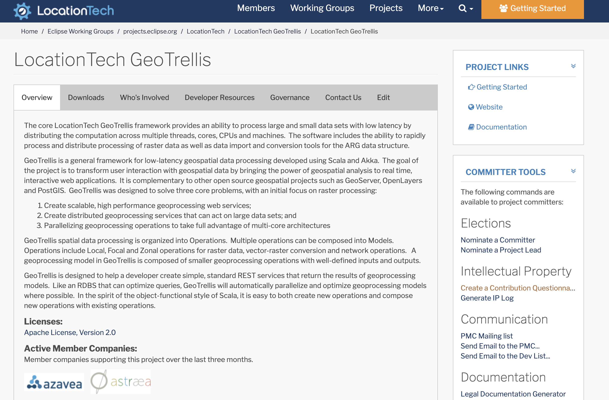
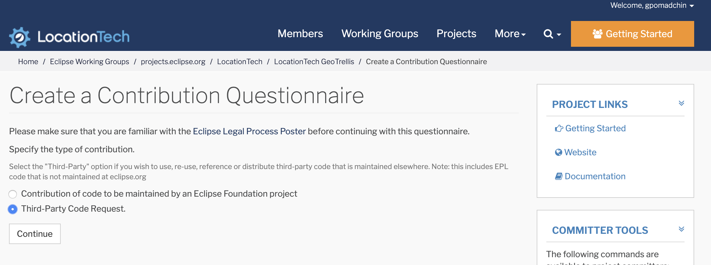
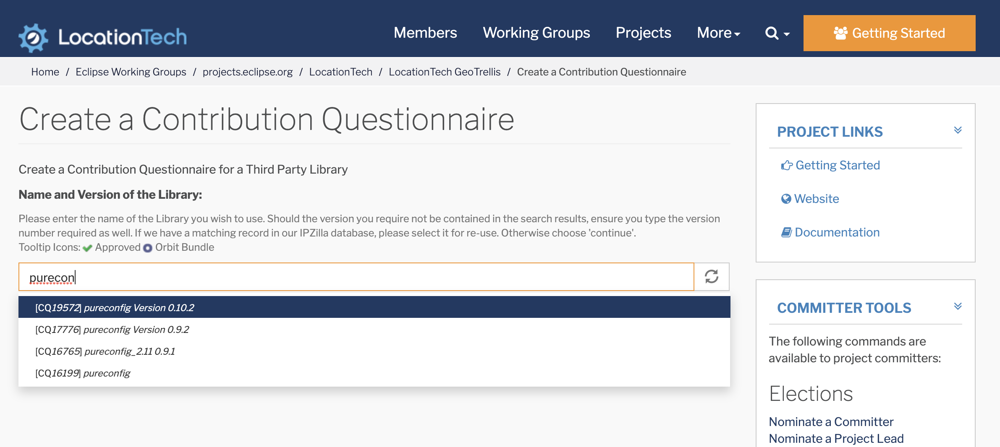
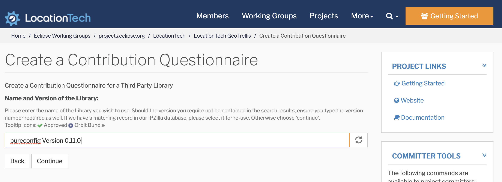
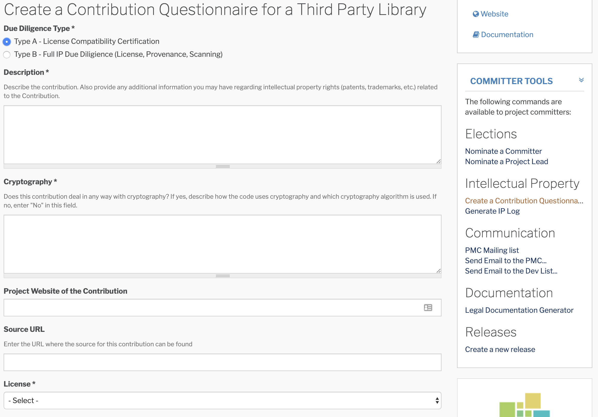
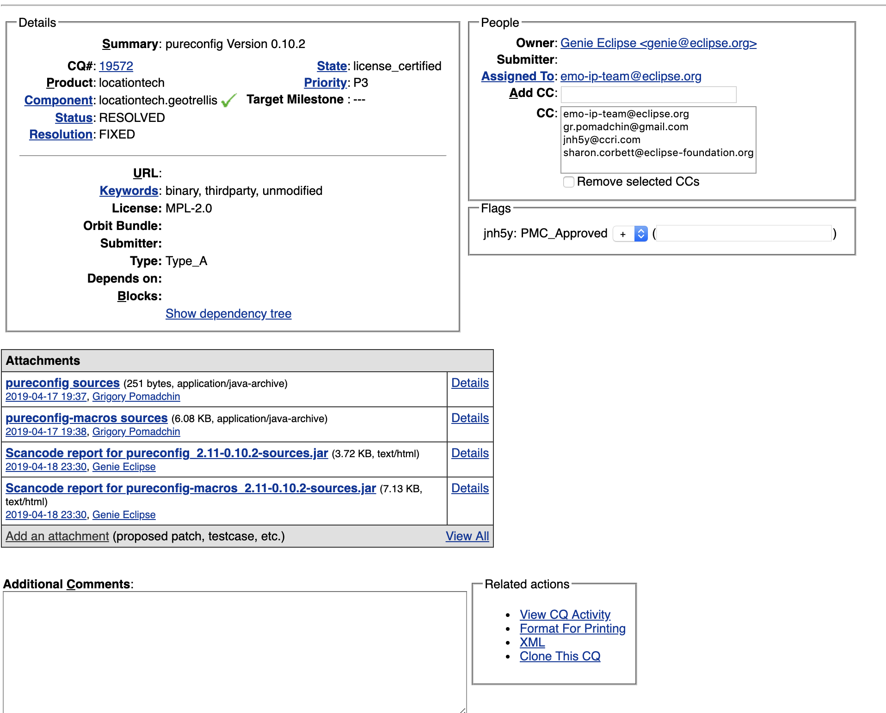
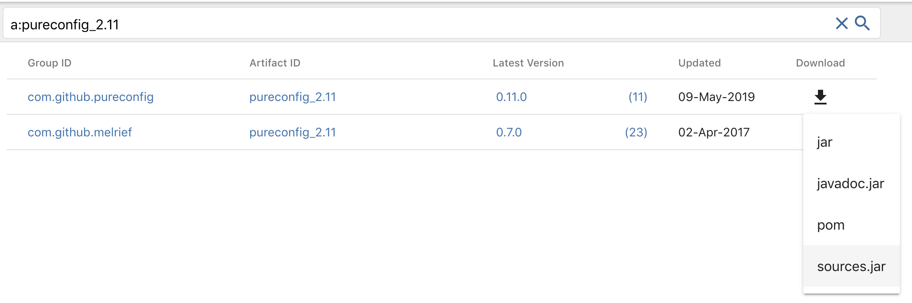

Contributing
============

We value all kinds of contributions from the community, not just actual
code. Perhaps the easiest and yet one of the most valuable ways of
helping us improve GeoTrellis is to ask questions, voice concerns or
propose improvements on the `Mailing
List <https://locationtech.org/mailman/listinfo/geotrellis-user>`__.

If you do like to contribute actual code in the form of bug fixes, new
features or other patches this page gives you more info on how to do it.

Building GeoTrellis
-------------------

1. Install SBT (the master branch is currently built with SBT 0.13.12).
2. Check out this repository.
3. Pick the branch corresponding to the version you are targeting
4. Run ``sbt test`` to compile the suite and run all tests.

Style Guide
-----------

We try to follow the `Scala Style
Guide <(http://docs.scala-lang.org/style/)>`__ as closely as possible,
although you will see some variations throughout the codebase. When in
doubt, follow that guide.

Git Branching Model
-------------------

The GeoTrellis team follows the standard practice of using the
``master`` branch as main integration branch.

Git Commit Messages
-------------------

We follow the 'imperative present tense' style for commit messages.
(e.g. "Add new EnterpriseWidgetLoader instance")

Issue Tracking
--------------

If you find a bug and would like to report it please go there and create
an issue. As always, if you need some help join us on
`Gitter <https://gitter.im/locationtech/geotrellis>`__ to chat with a
developer.

Pull Requests
-------------

If you'd like to submit a code contribution please fork GeoTrellis and
send us pull request against the ``master`` branch. Like any other open
source project, we might ask you to go through some iterations of
discussion and refinement before merging.

As part of the Eclipse IP Due Diligence process, you'll need to do some
extra work to contribute. This is part of the requirement for Eclipse
Foundation projects (`see this page in the Eclipse
wiki <https://wiki.eclipse.org/Development_Resources/Handling_Git_Contributions#Git>`__
You'll need to sign up for an Eclipse account **with the same email you
commit to github with**. See the ``Eclipse Contributor Agreement`` text
below. Also, you'll need to signoff on your commits, using the
``git commit -s`` flag. See
https://help.github.com/articles/signing-tags-using-gpg/ for more info.

Eclipse Contributor Agreement (ECA)
-----------------------------------

Contributions to the project, no matter what kind, are always very
welcome. Everyone who contributes code to GeoTrellis will be asked to
sign the Eclipse Contributor Agreement. You can electronically sign the
`Eclipse Contributor Agreement
here <https://www.eclipse.org/legal/ECA.php>`__.

Contribution Questionnaire
--------------------------

Any dependency changes made to GeoTrellis should be submitted as a new Contribution Questionnaire (CQ) into the
`ECLIPSE IP Zilla <https://dev.eclipse.org/ipzilla/query.cgi>`__.

Visit `https://projects.eclipse.org/projects/locationtech.geotrellis/ <https://projects.eclipse.org/projects/locationtech.geotrellis/>`__
and log into the system.

On the right, in the ``COMMITTER TOOLS`` side bar, you can find a link `Create a Contribution Questionnaire <https://projects.eclipse.org/projects/locationtech.geotrellis/cq/create>`__

Next, we need to create a Third-Party Code Quest. For this example, we'll be creating a CQ for ``pureconfig v0.10.2``:

When typing in the name/version of the dependency, it may appear in the search bar.
If that's the case, then that means someone else has already sent this dependency to Eclipse's IP team.
Therefore, the CR could be instantly approved if the IP team has already approved of the given dependency.

Let's create a CQ for ``pureconfig v0.11.0``. There is no such a library, so we'll have to fill the page manually:

The next step would be to fill in information about it:

If the library was already submitted but a new version is being requested, you can look at what was already submitted for that library to use as an example.
In our case we can use a `Pureconfig Version 0.10.2 <https://dev.eclipse.org/ipzilla/show_bug.cgi?id=19572>`__

In the case that the dependency is completely new and has never been validated by the IP team, then one will need to fill in the
fields from scratch. However, if there is any uncertainty when filling out the forum, please feel free to contact the GeoTrellis
team for help.

Next, you'll need to go the CQ page and submit any source code released to this CQ (``pureconfig v0.10.2`` for this example):

One can find source code for their target library in a number of different locations.
The first and probably best place to check is `Maven Central search <https://search.maven.org/search?q=a:pureconfig_2.11>`__:

You may upload multiple sources, in case they are all in the same repository.
An example of such a CQ is `AWS SDK CQ <https://dev.eclipse.org/ipzilla/show_bug.cgi?id=19560>`__.

After you uploaded all ``sources``, the next step would be to submit a PMC approval request.
To do that, you need to subscribe to the `Technology PMC mailing list <https://dev.locationtech.org/mailman/listinfo/technology-pmc>`__ and to send a request
to them for approval. An example of such a request can be found in the `Technology PMC mailing list archive <https://dev.locationtech.org/mhonarc/lists/technology-pmc/msg01954.html>`__.
If things are not moving, you can leave your request in the `Locationtech Gitter lobby channel <https://gitter.im/locationtech/discuss>`__ and it will be looked at.

Editing these Docs
------------------

Contributions to these docs are welcome as well. To build them on your own
machine, ensure that ``sphinx`` and ``make`` are installed.

Installing Dependencies
^^^^^^^^^^^^^^^^^^^^^^^

Ubuntu 16.04
''''''''''''

.. code:: console

   > sudo apt-get install python-sphinx python-sphinx-rtd-theme

Arch Linux
''''''''''

.. code:: console

   > sudo pacman -S python-sphinx python-sphinx_rtd_theme

MacOS
'''''

``brew`` doesn't supply the sphinx binaries, so use ``pip`` here.

Pip
'''

.. code:: console

   > pip install sphinx sphinx_rtd_theme

Building the Docs
^^^^^^^^^^^^^^^^^

Assuming you've cloned the `GeoTrellis repo
<https://github.com/locationtech/geotrellis>`__, you can now build the docs
yourself. Steps:

1. Navigate to the ``docs/`` directory
2. Run ``make html``
3. View the docs in your browser by opening ``_build/html/index.html``

.. note:: Changes you make will not be automatically applied; you will have
          to rebuild the docs yourself. Luckily the docs build in about a second.

File Structure
^^^^^^^^^^^^^^

When adding or editing documentation, keep in mind the following file
structure:

-  ``docs/tutorials/`` contains simple beginner tutorials with concrete
   goals
-  ``docs/guide/`` contains detailed explanations of GeoTrellis concepts
-  ``docs/architecture`` contains in-depth discussion on GeoTrellis
   implementation details
