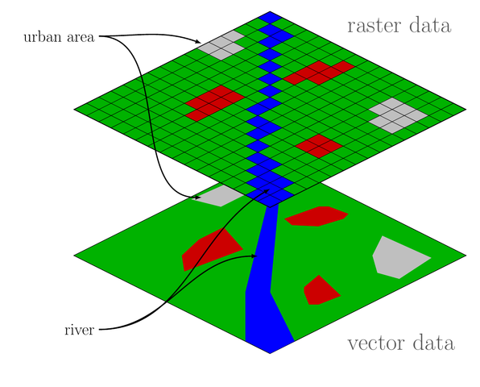

# Geotrellis Markdown Index

Getting started with any library is a frustrating — often intimidating —
experience. GeoTrellis is not an exception: perhaps you're not a Scala
developer (or a developer at all) or maybe you know your way around code
but are new to the specific domain of GIS software. Whatever the case,
the collected notes, use-cases, and examples in this folder are intended
to help you grapple with the various components which make up
GeoTrellis.

## Index of package-specific documentation

- [geotrellis.etl](etl/etl-intro.md)
- [geotrellis.proj4](proj4/proj4-intro.md) // incomplete
- [geotrellis.macros](macros/macros-intro.md)
- [geotrellis.raster](raster/raster-intro.md)
  - [cell types](raster/celltype.md)
  - [cloud removal](raster/cloud-removal.md)
  - [map algebra](raster/map-algebra.md)
  - [raster input/output](raster/raster-io.md) // planned
  - [rendering](raster/rendering.md)
  - [resampling](raster/resampling.md)
- [geotrellis.slick](spark/slick-intro.md)
- [geotrellis.spark](spark/spark-intro.md)
  - [notes on the hilbert curve index](spark/hilbert-index.md)
  - [working with joins](spark/spark-joins.md)
  - [spark layer keys](spark/spark-keys.md) // incomplete
  - [spark layer values](spark/spark-values.md)
  - [spark layer metadata](spark/spark-metadata.md) // planned
  - [spark input/output](spark/spark-io.md) // planned
- [geotrellis.cassandra](cassandra/)
  - [geotrellis.cassandra.test](cassandra/cassandra-test.md)
- [geotrellis.hbase](hbase/)
  - [geotrellis.hbase.test](hbase/hbase-test.md)
- [geotrellis.spark-etl](spark-etl/spark-etl-intro.md)
  - [geotrellis.spark-etl.run-examples](spark-etl/spark-etl-run-examples.md)
- [geotrellis.util](util/util-intro.md)
- [geotrellis.vector](vector/vector-intro.md)
  - [geojson support](vector/geojson-support.md)
  - [kriging interpolation](vector/kriging-interpolation.md)
