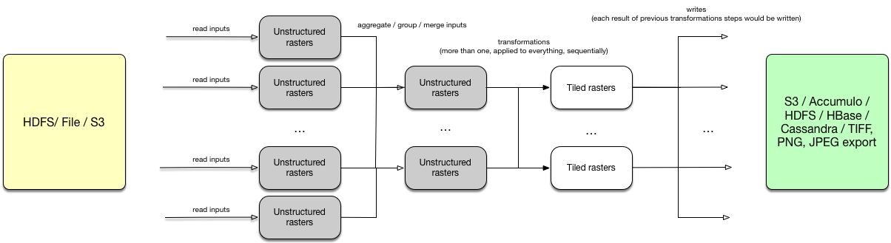

0004 - ETL Pipelne
------------------

Context
^^^^^^^

The current GeoTrellis ETL does not allow us to determine ETL as a pipeline of transformations / actions.
This document describes a new approach (inspired by [PDAL Pipeline](https://www.pdal.io/pipeline.html))
with a new ETL JSON description.

The new ETL would be in fact a Pipeline, which would allow flexible input sources / transofrmations / write
steps definitions, in addition a flexible way to apply user defined functions would be introduced.

The motivation to write this ADR appeared since there are much more common and generic things to do during the ingest process,
and it is possible to cover them all. That would help to reduce unnecessary code writing, would allow to provide a
flexible GeoTrellis CLI tool (it's not very convenient and obvious how to use current ETL definitions).

Decision
^^^^^^^^

We can divide the Pipeline steps into three categories:

* Read
* Transform
* Write

And steps which can be done during the steps above are the following (it's a rough list):

* Read input from a backend (```read.{file | hadoop | s3}```)
* Group input sources (```read.group```)
* Reproject buffered (```transform.reproject.buffered```)
* Reproject per-tile (```transform.reproject.per-tile```)
* Tile to layout (```transform.tile```)
* Write to a backend (```write.{file | hadoop | s3 | accumulo | cassandra | hbase}.{save | update | reindex}```)
* Write into tiff / png / jps (```write.render```)
* Save

It is possible to represent all these steps as JSON objects, and an array of these objects would be instructions Pipeline.
There still would be two different json inputs: ``pipeline.json`` and ``backend-profiles.json`` as it seems to be
a reasonable way to divide parameters semantically. ``backend-profiles.json`` is an optional file, as some times it can be
useful to setup credentials as ENV variables.

backend-profiles.json
^^^^^^^^^^^^^^^^^^^^^

Without significant changes, as it already provides minimal information about backends credentials.
However this file can be optional, as in some cases credentials can be setuped as ENV variables.

pipeline.json
^^^^^^^^^^^^^

This file would be a set of sequential instructions, to read input data, transform it, and to write.
Each transformation can be applied to a previous transformation result type and in some cases can rename / change number
of separate sources to which functions would be applied.

Scheme with Pipeline work description (arrows are actions):



**Read steps**

*Read definition:*

.. code:: javascript

  {
    "type": "read.{hadoop | s3 | file}",
    "profile": "credentials profile name",
    "path": "{uri-path}",
    "crs": "input source CRS",
    "tag": "tag-name" // tag means current layer name
  }

Each input can be corresponded with some input alias tag, after the sequence of read steps,
should be applied a step which would define transformation functions applications behaviour
(should all transformations be applied per each input or inputs would be grouped somehow)

**Transformation steps**

Transformations can be applied to the data of different types. Accoridng to
GeoTrellis type system we can divide rasters into

1. Unstructured rasters (```RDD[({ProjectedExtent | TemporalProjectedExtent}, {Tile | MultibandTile})]```)
1. Tiled rasters (```RDD[({SpatialKey | SpaceTimeKey}, {Tile | MultibandTile})]```)

*Group / Aggregate definition:*

.. code:: javascript

  {
    "type": "transform.group",
    "tags": ["{tags array}"],
    "tag": "tag-name" // in fact renames inputs into a new name
  }

Can be done several group functions, all further transformation steps would be applied to
all inputs (by default), or to a specified tag.

*Merge definition:*

.. code:: javascript

  {
    "type": "transform.merge",
    "tags": ["{tags array}"],
    "tag": "tag-name"
  }

Merges input into one multiband rdd.

*Map definition:*

.. code:: javascript

  {
    "type": "transform.map",
    "function": "org.azavea.custommap"
    "tags": ["{tags array}"],
    "tag": "tag-name"
  }

Map values function, can be applied to input and to tiled (K, V) pairs.

* *function* — path to a user defined or inbuilt function

*Reproject definition:*

Buffered reproject can be applied only to tiled rasters:

.. code:: javascript

  {
    "type": "transform.reproject.buffered",
    "crs": "{EPSG code | EPSG name | proj4 string}"
  }

Per-tile reproject can be applied only to unstructured rasters:

.. code:: javascript

  {
    "type": "transform.reproject.per-tile",
    "crs": "{EPSG code | EPSG name | proj4 string}"
  }

* *crs* — ``{EPSG code | EPSG name | proj4 string}`` destination CRS

*Tile to layout:*

.. code:: javascript

 {
    "type": "transform.tile",
    "resampleMethod": "{nearest-neighbor | bilinear | cubic-convolution | cubic-spline | lanczos}",
    "layoutScheme": "zoomed",
    "tileSize": 256,
    "cellSize": {
      "width": 0.5,
      "height": 0.5
    },
    "partitions": 5000
  }

* *tileSize* — destination tile size [optional field]
* *resampleMethod* — ``{nearest-neighbor | bilinear | cubic-convolution | cubic-spline | lanczos}`` methods are possible
* *cellSize* — cellSize [optional field]
* *partitions* — partitions number after tiling [optional field]

**Write steps**

*Render definition:*

.. code:: javascript

  {
    "type": "write.render",
    "format": "{tiff | png}",
    "path": "{path | pattern}"
  }

* *format* — ``{tiff | png}`` supported formats
* *path* — ``{path | pattern}`` output path, can be specified as a pattern

*{Save | Update | Reindex} definition:*

.. code:: javascript

  {
    "type": "write.{file | hadoop | s3 | accumulo | cassandra | hbase}.{save | update | reindex}",
    "name": "layer name",
    "profile": "credentials profile name",
    "uri": "uri with or without credentials",
    "pyramid": "{true | false}",
    "maxZoom": 19,
    "keyIndexMethod": {
      "type": "{zorder | hilbert}",
      "temporalResolution": 86400000
    }
  }

* *name* — layer name, all inputs would be saved / updated / reindexed with that name
* *profile* — profile name, can be specified in the ``backend-profiles.json``, default profiles available: ``{file | hadoop | s3}``
* *uri* — path or table name
* *maxZoom* — max zoom level [optional field]
* *keyIndexMethod:*
    * *type* — ``{zorder | hilbert}``
    * *temporalResolution* — temporal resolution in ms, if specified it would be a temporal index [optional field]

*Pipeline example:*

.. code:: javascript

  [
    {
      "type": "read.hadoop",
      "profile": "credentials profile name",
      "path": "{uri-path}",
      "crs": "input source CRS",
      "tag": "A"
    },
    {
      "type": "read.s3",
      "profile": "credentials profile name",
      "path": "{uri-path}",
      "crs": "input source CRS",
      "tag": "B"
    },
    {
      "type": "read.s3",
      "profile": "credentials profile name",
      "path": "{uri-path}",
      "crs": "input source CRS",
      "tag": "С"
    },
    {
      "type": "transform.group",
      "tags": ["A", "B"], // no more tags A and B in the context of this pipeline
      "tag": "D"
    },
    {
      "type": "transform.reproject.buffered",
      "crs": "{EPSG code | EPSG name | proj4 string}"
    },
    {
      "type": "transform.tile",
      "resampleMethod": "{nearest-neighbor | bilinear | cubic-convolution | cubic-spline | lanczos}",
      "layoutScheme": "zoomed",
      "tileSize": 256,
      "cellSize": {
        "width": 0.5,
        "height": 0.5
      },
      "partitions": 5000
    },
    {
      "type": "write.render",
      "format": "{tiff | png}",
      "path": "{path | pattern}"
    },
    {
      "type": "write.{save | update | reindex}",
      "name": "layer name",
      "profile": "credentials profile name",
      "uri": "uri with or without credentials",
      "pyramid": "{true | false}",
      "keyIndexMethod": {
        "type": "{zorder | hilbert}",
        "temporalResolution": 86400000
      },
      "maxZoom": 19
    },
    {
      "type": "write.{save | update | reindex}",
      "name": "layer name",
      "profile": "credentials profile name",
      "uri": "uri with or without credentials",
      "pyramid": "{true | false}",
      "keyIndexMethod": {
        "type": "{zorder | hilbert}",
        "temporalResolution": 86400000
      },
      "maxZoom": 19
    }
  ]

Conclusion
^^^^^^^^^^

The current ``input.json`` and ``output.json`` files were unified into ``pipeline.json`` and ``backend-profiles.json``
seems to be already fine.A new ``pipeline.json`` would allow us to construct Pipelines similar to what PDAL allows.
In addition, such an approach allows us to not have complicated API extensions (aka user defined steps),
which can be implemented not only be implementing separate steps itself, but just by implementing necessary functions for
the ``transform.map`` instruction.
