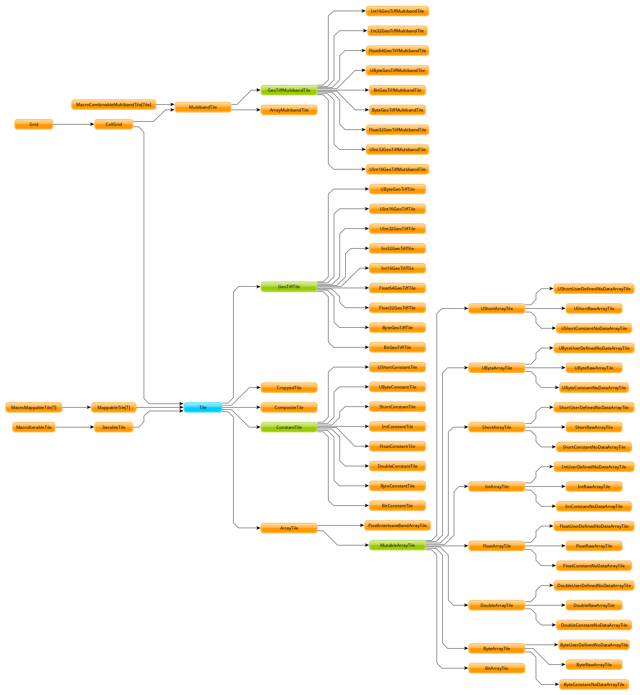
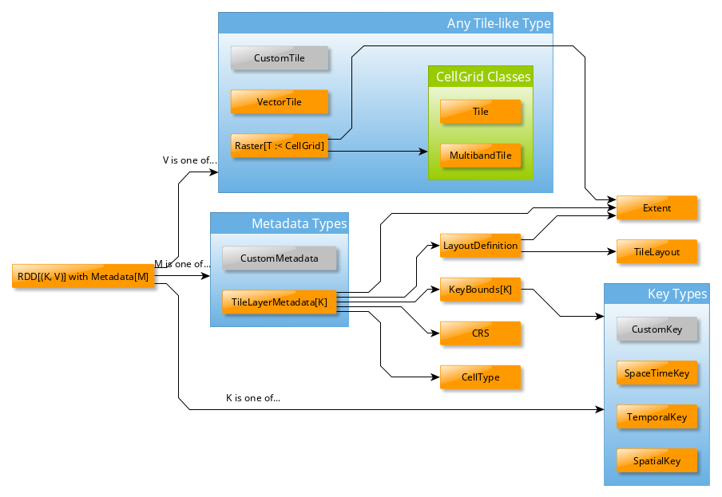
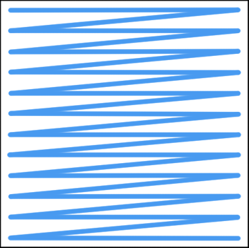
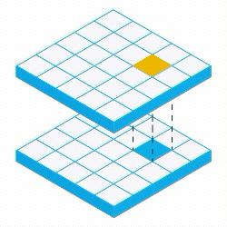

===============
 Core Concepts
===============

Geographical Information Systems (GIS), like any specialized field, has
a wealth of jargon and unique concepts. When represented in software,
these concepts can sometimes be skewed or expanded from their original
forms. We give a thorough definition of many of the core concepts here,
while referencing the Geotrellis objects and source files backing them.

This document aims to be informative to new and experienced GIS users
alike. If GIS is brand, brand new to you, `this
document <https://www.gislounge.com/what-is-gis/>`__ is a useful high
level overview.

Glossary
========

The following is a non-exhaustive list of fundamental terms and their
definitions that are important to understanding the function of Geotrellis.
These definitions will be expanded upon in other sections of this document.

- `Vector <#geometries>`_ or **Geometry**: Structures built up by
  connecting Points in space; includes ``Point``\s, ``Line``\s,
  ``Polygon``\s.
- `Extent <#extents>`_ or **Bounding Box**: An axis aligned, rectangular
  region.
- `Feature <#features>`_: A *Geometry* with some associated metadata.
- `Cell <#working-with-cell-values>`_: A single unit of data in some
  grid.
- `Tile <#tiles-and-rasters>`_: A grid of numeric *cell*\s that represent
  some data on the Earth.
- `Raster <#rasters>`_: A *Tile* with an *Extent*; places data over a specific
  region of the Earth.
- **RDD:** "Resilient Distributed Datasets" from `Apache Spark <http://spark.apache.org/>`__. Can be thought of as a distributed Scala ``Seq``.
- `Key <#keys>`_: Used to index into a grid of *tiles*.
- `Layout Definition <#layouts-and-tile-layers>`_ or **Layout**: A structure that
  relates *keys* to geographic locations and vice versa.
- `Metadata <#layouts-and-tile-layers>`_ or **Layer Metadata**: A
  descriptive structure that defines how to interpret a key-value store as a
  coherent single raster.
- `Layer <#layouts-and-tile-layers>`_ or **Tile Layer**: A combined structure
  of *tiles* and *keys* in an ``RDD`` with *metadata*.  Represents a very
  large *raster* in a distributed computing context.
- `Pyramid <#pyramids>`_: A collection of layers, indexed by a `zoom level
  <#zoom-levels-and-layout-schemes>`_, where each layer represents the same
  raster data at a different resolution.  Essentially a quad tree of raster
  data where child nodes cover the same area at higher resolution as their parents.
- `Catalog <#catalogs-tile-layer-io>`_: A persistent store for *tile layers*
  and/or *pyramids*, storing both *tiles* and *metadata*.

.. raw:: html

   

System Organization
===================

Core
----

The fundamental components of the Geotrellis system are *rasters* and
*vectors*.  Rasters are 2-dimensional, discrete grids of numerical data,
much like matrices.  Vectors are 2- (or sometimes 3-) dimensional collections
of points that are connected together to form piecewise linear linestrings,
polygons, and other compound structures.

Geotrellis is also tied to geographical application domains, and so these
fundamental objects can be placed in a geographical context.  Specifically, we
can ascribe *projections* to the points in a geometry, and we can apply an
*extent* to raster data to indicate the position and scope of the raster data.

Geotrellis provides a number of operations on these basic data types.  One may
reproject, resample, crop, merge, combine, and render raster data; vector data
may be manipulated in some limited ways, but is mostly used to generate raster
data.

The following packages contain the relevant code:

- |geotrellis.proj4|_
- |geotrellis.raster|_
- |geotrellis.vector|_

.. |geotrellis.proj4| replace:: ``geotrellis.proj4``
.. _geotrellis.proj4: https://geotrellis.github.io/scaladocs/latest/#geotrellis.proj4.package
.. |geotrellis.raster| replace:: ``geotrellis.raster``
.. _geotrellis.raster: https://geotrellis.github.io/scaladocs/latest/#geotrellis.raster.package
.. |geotrellis.vector| replace:: ``geotrellis.vector``
.. _geotrellis.vector: https://geotrellis.github.io/scaladocs/latest/#geotrellis.vector.package

Distributed Processing
----------------------

High resolution imagery on global, national, regional, or even local levels
(depending on just how high of a resolution is used) is big.  It's too big to
work with effectively on a single machine.  Thus, Geotrellis provides the
means to use rasters and vectors in a distributed context using `Apache Spark
<http://spark.apache.org/>`__.

To distribute data, it is necessary to supply some structure over which we can
organize smaller units of raster or vector data.  Geotrellis leans on the
``LayoutDefinition`` class to provide this structure.  The idea is that a
region on the globe is specified (along with a projection), and a regular,
rectangular grid is overlaid on that region.  Each grid cell is given a
spatial key, and so it is possible to associate a raster or vector to a given
grid cell.  (Note that we may also use keys with a temporal component.)  This
induces a tiled representation of an arbitrarily large layer of data.

Geotrellis provides utilities for coercing data into this gridded
representation, for manipulating data within a tiled layer, and for storing
processed layers to a variety of backends.  Find implementations of these
features in this package:

- |geotrellis.spark|_

.. |geotrellis.spark| replace:: ``geotrellis.spark``
.. _geotrellis.spark: https://geotrellis.github.io/scaladocs/latest/#geotrellis.spark.package

Storage Backends
^^^^^^^^^^^^^^^^

Computations over large data are time consuming, so storage of results is
important.  Geotrellis mostly relies on distributed key-value stores.  Once a
layer is built (a set of uniform chunks of raster data keyed to a layout, with
some additional metadata), it is possible to write these tiles out to a
*catalog*.  These preprocessed layers can then be read back rapidly, and used
to support any number of applications.

The necessary componenents for storing and reading layers can be found in the
following packages:

- |geotrellis.spark.io|_
- |geotrellis.accumulo|_
- |geotrellis.cassandra|_
- |geotrellis.geomesa|_
- |geotrellis.hbase|_
- |geotrellis.s3|_

.. |geotrellis.spark.io| replace:: ``geotrellis.spark.io``
.. _geotrellis.spark.io: https://geotrellis.github.io/scaladocs/latest/#geotrellis.spark.io.package
.. |geotrellis.accumulo| replace:: ``geotrellis.accumulo``
.. _geotrellis.accumulo: https://geotrellis.github.io/scaladocs/latest/#geotrellis.accumulo.package
.. |geotrellis.cassandra| replace:: ``geotrellis.cassandra``
.. _geotrellis.cassandra: https://geotrellis.github.io/scaladocs/latest/#geotrellis.cassandra.package
.. |geotrellis.geomesa| replace:: ``geotrellis.geomesa``
.. _geotrellis.geomesa: https://geotrellis.github.io/scaladocs/latest/#geotrellis.geomesa.package
.. |geotrellis.hbase| replace:: ``geotrellis.hbase``
.. _geotrellis.hbase: https://geotrellis.github.io/scaladocs/latest/#geotrellis.hbase.package
.. |geotrellis.s3| replace:: ``geotrellis.s3``
.. _geotrellis.s3: https://geotrellis.github.io/scaladocs/latest/#geotrellis.s3.package

Method Extensions
-----------------

Geotrellis utilizes a design pattern called *method extensions* wherein
Scala's implicits system is used to patch additional functionality onto
existing classes.  For example, for a raster value ``r``, one may call
``r.reproject(srcCRS, destCRS)``, even though the ``Raster`` class does not
define ``reproject`` directly.

Files in the source tree that have names of the form ``XxxxxMethods.scala``
define capabilities that should be implemented by an implicit class, usually
found in the ``Implicits.scala`` file in the same directory.  For a
``MethodExtension[T]`` subclass implementing the ``foo()`` method, an object of type
``T`` should be able to have ``foo()`` called on it.

Unfortunately, discoverability of valid method extensions is an ongoing
problem for Geotrellis as a whole.  We are currently seeking better means for
documenting these features.  In the meantime, perusing the source tree, and
using tab-completion in the REPL are workable solutions.  Bear in mind,
however, that availability of method extensions is contingent on having
types that match the ``T`` parameter of the desired ``MethodExtension[T]``
implementation.

.. raw:: html

   

Projections and Coordinate Systems
==================================

A fundamental component of a GIS system is the ability to specify projections
and perform transformations of points between various coordinate systems.
Contained in the ``geotrellis.proj4`` package are the means to perform these
tasks.

Coordinate Reference Systems
----------------------------

As a means of describing geodetic coordinate systems, the
|geotrellis.proj4.CRS|_ class is provided.  CRSs can be constructed by either
indicating the EPSG code using the ``CRS.fromEpsgCode`` object method, or by the
``proj4`` string using the ``CRS.fromString`` object method.

There are also a set of predefined CRS objects provided in
``geotrellis.proj4``.  These include the standard |WebMercator|_ and |LatLng|_
CRSs.  Also included is |ConusAlbers|_, giving the Albers equal area
projection for the continental United States (EPSG code 5070).  Finally, UTM
zone CRS objects can be produced using the |getZoneCrs|_ method.

.. |geotrellis.proj4.CRS| replace:: ``geotrellis.proj4.CRS``
.. _geotrellis.proj4.CRS: https://geotrellis.github.io/scaladocs/latest/#geotrellis.proj4.CRS
.. |WebMercator| replace:: ``WebMercator``
.. _WebMercator: https://geotrellis.github.io/scaladocs/latest/#geotrellis.proj4.WebMercator$
.. |LatLng| replace:: ``LatLng``
.. _LatLng: https://geotrellis.github.io/scaladocs/latest/#geotrellis.proj4.LatLng$
.. |ConusAlbers| replace:: ``ConusAlbers``
.. _ConusAlbers: https://geotrellis.github.io/scaladocs/latest/#geotrellis.proj4.ConusAlbers$
.. |getZoneCrs| replace:: ``geotrellis.proj4.util.UTM.getZoneCrs``
.. _getZoneCrs: https://geotrellis.github.io/scaladocs/latest/#geotrellis.proj4.util.UTM$

Transformations
---------------

To move coordinates between coordinate systems, it is necessary to build a
|geotrellis.proj4.Transform|_ object.  These are built simply by supplying
the source CRS and the destination CRS.  The result is a transformation
function with type ``(Double, Double) => (Double, Double)``.

.. raw:: html

   

.. |geotrellis.proj4.Transform| replace:: ``geotrellis.proj4.Transform``
.. _geotrellis.proj4.Transform: https://geotrellis.github.io/scaladocs/latest/#geotrellis.proj4.Transform$

Vector Data
===========

Data in GIS applications often come in a geometric form.  That is, one might
encounter data describing, say, population by census region, or road networks.
These are termed *vector* data sources.  Geotrellis wraps `JTS
<http://github.com/locationtech/jts>`__ geometries in a Scala interface and
then provides the tools to produce raster data from that vector data, or
simply to work directly with the vector data itself.  Vector data comes either
as raw geometry, or as *feature data*—that is, geometry with associated
data—and can be read from a variety of sources.

Geometries
----------

Geometries in Geotrellis are exclusively point sets and piecewise linear
representations.  A collection of points may be connected by a chain of linear
segments into more complex shapes, and then aggregated into collections.  All
such classes derive from the base |geotrellis.vector.Geometry|_ class.  The
geometry subclasses are as follows:

- |geotrellis.vector.Point|_

  Representation of a 2-dimensional point in space.

- |geotrellis.vector.Line|_

  More appropriately termed a *polyline*.  A sequence of linear segments
  formed from a sequence of points, :math:`[p_1, p_2, ..., p_n]`, where the
  :math:`i^\mathrm{th}` line segment is the segment between :math:`p_i` and
  :math:`p_{i+1}`.  May be self-intersecting.  May be open or closed (the
  latter meaning that :math:`p_1 = p_n`).

- |geotrellis.vector.Polygon|_

  A polygonal shape, possibly with holes.  Formed from a single closed, simple
  (non-self-intersecting) polyline exterior, and zero or more closed, simple,
  mutually non-intersecting interior rings.  Proper construction can be
  verified through the use of the ``isValid()`` method.

- |geotrellis.vector.MultiPoint|_
- |geotrellis.vector.MultiLine|_
- |geotrellis.vector.MultiPolygon|_

  The three preceding classes aggregate points, lines, and polygons, respectively.

- |geotrellis.vector.GeometryCollection|_

  A container class for aggregating dissimilar geometries.

Geometries have a standard interface for typical operations such as
finding the convex hull, affine transformation (rotation, scaling,
translating, and shearing), determining if one geometry is contained within
another, and finding intersections.

.. |geotrellis.vector.Geometry| replace:: ``geotrellis.vector.Geometry``
.. _geotrellis.vector.Geometry: https://geotrellis.github.io/scaladocs/latest/geotrellis/vector/Geometry.html
.. |geotrellis.vector.Point| replace:: ``geotrellis.vector.Point``
.. _geotrellis.vector.Point: https://geotrellis.github.io/scaladocs/latest/geotrellis/vector/Point.html
.. |geotrellis.vector.Line| replace:: ``geotrellis.vector.Line``
.. _geotrellis.vector.Line: https://geotrellis.github.io/scaladocs/latest/geotrellis/vector/Line.html
.. |geotrellis.vector.Polygon| replace:: ``geotrellis.vector.Polygon``
.. _geotrellis.vector.Polygon: https://geotrellis.github.io/scaladocs/latest/geotrellis/vector/Polygon.html
.. |geotrellis.vector.MultiPoint| replace:: ``geotrellis.vector.MultiPoint``
.. _geotrellis.vector.MultiPoint: https://geotrellis.github.io/scaladocs/latest/geotrellis/vector/MultiPoint.html
.. |geotrellis.vector.MultiLine| replace:: ``geotrellis.vector.MultiLine``
.. _geotrellis.vector.MultiLine: https://geotrellis.github.io/scaladocs/latest/geotrellis/vector/MultiLine.html
.. |geotrellis.vector.MultiPolygon| replace::
                                    ``geotrellis.vector.MultiPolygon``
.. _geotrellis.vector.MultiPolygon: https://geotrellis.github.io/scaladocs/latest/geotrellis/vector/MultiPolygon.html
.. |geotrellis.vector.GeometryCollection| replace:: ``geotrellis.vector.GeometryCollection``
.. _geotrellis.vector.GeometryCollection: https://geotrellis.github.io/scaladocs/latest/geotrellis/vector/GeometryCollection.html

The following is a simple example of working with intersections:

.. code-block:: scala

    import geotrellis.vector._

    /** First, let's create a Point. Then, we'll use its intersection method.
      * Note: we are also using intersection's alias '&'.
      */
    val myPoint = Point(1.0, 1.1) // Create a point
    // Intersection method
    val selfIntersection = myPoint intersection Point(1.0, 1.1)
    // Intersection alias
    val nonIntersection = myPoint & Point(200, 300)

Upon execution, the values ``selfIntersection`` and ``nonIntersection`` are
``GeometryResult`` containers, which is a common return type for geometric
operations.  To extract results from these wrappers, use the ``as[G <:
Geometry]`` function which either returns ``Some(G)`` or ``None``:

.. code-block:: scala

    val pointIntersection = (Point(1.0, 2.0) & Point(1.0, 2.0)).as[Point]
    val pointNonIntersection = (Point(1.0, 2.0) & Point(12.0, 4.0)).as[Point]

    assert(pointIntersection == Some(Point(1.0, 2.0)))  // Either some point
    assert(pointNonIntersection == None)                // Or nothing at all

When using ``as[G <: Geometry]``, be aware that it isn't necessarily the case
that the ``GeometryResult`` object may not be convertable to the chosen
``G``. For example, a ``PointGeometryIntersectionResult.as[Polygon]`` will
*always* return ``None``.

Alternatively, one may use pattern matching to check intersection
results. |geotrellis.vector.GeometryResult|_ contains a large `ADT
<https://en.wikipedia.org/wiki/Algebraic_data_type>`__ which encodes the
possible outcomes for different types of outcomes. The result type of a
JTS-dependent vector operation can be found somewhere on this tree to the
effect that an exhaustive match can be carried out to determine the
``Geometry`` (excepting cases of ``NoResult``, for which there is no
``Geometry``).

.. |geotrellis.vector.GeometryResult| replace:: ``geotrellis.vector.GeometryResult``
.. _geotrellis.vector.GeometryResult: https://geotrellis.github.io/scaladocs/latest/geotrellis/vector/GeometryResult.html

For example, we note that a ``Point``/``Point`` intersection has the
type ``PointOrNoResult``. From this we can deduce that it is either a
``Point`` underneath or else nothing:

.. code::

    val p1: Point = Point(0, 0)
    val p2: Point = p1
    p1 & p2 match {
      case PointResult(_) => println("A Point!")
      case NoResult => println("Sorry, no result.")
    }

yields "A Point!"

There are also implicits in many geotrellis modules which will extend Geometry
capabilities. For instance, after importing ``geotrellis.vector.io._``, it
becomes possible to call the ``toGeoJson`` method on any ``Geometry``:

.. code-block:: scala

    import geotrellis.vector.io._
    assert(Point(1,1).toGeoJson == """{"type":"Point","coordinates":[1.0,1.0]}""")

If you need to move from a geometry to a serialized representation or
vice-versa, take a look at the ``io`` directory's contents. This naming
convention for input and output is common throughout Geotrellis. So if
you're trying to get spatial representations in or out of your program,
spend some time seeing if the problem has already been solved.

Methods which are specific to certain subclasses of ``Geometry`` exist
too. For example, ``geotrellis.vector.MultiLine`` is implicitly extended
by ``geotrellis.vector.op`` such that this becomes possible:

.. code-block:: scala

    import geotrellis.vector.op._
    val myML = MultiLine.EMPTY
    myML.unionGeometries

The following packages extend ``Geometry`` capabilities:

- |geotrellis.vector.io.json|_
- |geotrellis.vector.io.WKT|_
- |geotrellis.vector.io.WKB|_
- |geotrellis.vector.affine|_
- |geotrellis.vector.reproject|_

.. |geotrellis.vector.io.json| replace:: ``geotrellis.vector.io.json``
.. _geotrellis.vector.io.json: https://geotrellis.github.io/scaladocs/latest/#geotrellis.vector.io.json.package
.. |geotrellis.vector.io.wkt| replace:: ``geotrellis.vector.io.wkt``
.. _geotrellis.vector.io.wkt: https://geotrellis.github.io/scaladocs/latest/#geotrellis.vector.io.wkt.package
.. |geotrellis.vector.io.wkb| replace:: ``geotrellis.vector.io.wkb``
.. _geotrellis.vector.io.wkb: https://geotrellis.github.io/scaladocs/latest/#geotrellis.vector.io.wkb.package
.. |geotrellis.vector.affine| replace:: ``geotrellis.vector.affine``
.. _geotrellis.vector.affine: https://geotrellis.github.io/scaladocs/latest/#geotrellis.vector.affine.package
.. |geotrellis.vector.reproject| replace:: ``geotrellis.vector.reproject``
.. _geotrellis.vector.reproject: https://geotrellis.github.io/scaladocs/latest/#geotrellis.vector.reproject.package

Extents
^^^^^^^

Geotrellis makes common use of the ``Extent`` class.  This class represents an
axis-aligned bounding box, where the extreme values are given as
``Extent(min_x, min_y, max_x, max_y)``.  Note that ``Extent``\ s *are not*
``Geometry`` instances.  They can be coerced to a ``Polygon`` using the
``toPolygon`` method, and they can often be used as arguments to geometric
operations such as ``intersection``.

Projected Geometries
^^^^^^^^^^^^^^^^^^^^

Note that there is no generally-accepted means to mark the projection of a
geometry, so it is incumbent on the user to keep track of and properly coerce
geometries into the correct projections.  However, the
``geotrellis.vector.reproject`` package provides the ``reproject`` method
extension for performing this task.

``Extent``\ s, on the other hand, can be wrapped in a ``ProjectedExtent``
instance.  These are useful for designating the geographical scope of a
raster, for example.

Features
--------

To associate some arbitrary data with a vector object, often for use in tasks
such as rasterization, use the ``Feature[G <: Geometry, D]`` container class,
or one of its subclasses.  For example:

.. code-block:: scala

    abstract class Feature[D] {
      type G <: Geometry
      val geom: G ; val data: D
    }

    case class PointFeature[D](geom: Point, data: D) extends Feature[D] {type G = Point}

Implicit method extensions exist that will allow, for instance, ``rasterize``
to be called on a ``Feature`` to create a raster where the pixels covered by
the geometry are assigned the value of of the feature's ``data``.

Further Information
-------------------

Please refer to the `vector documentation <./vectors.rst>`__ for more
detailed information.

.. raw:: html

   

Raster Data
===========

Tiles and Rasters
-----------------

The ``geotrellis.raster`` module provides primitive datatypes to represent two
dimensional, gridded numerical data structures, and the methods to manipulate
them in a GIS context.  These raster objects resemble sequences of numerical
sequences like the following (this array of arrays is like a 3x3 tile):

.. code::

    // not real syntax
    val myFirstTile = [[1,1,1],[1,2,2],[1,2,3]]
    /** It probably looks more like your mental model if we stack them up:
      * [[1,1,1],
      *  [1,2,2],
      *  [1,2,3]]
      */

In the ``raster`` module of GeoTrellis, raster data is not represented by
simple arrays, but rather as subclasses of ``Tile``. That class is more
powerful than a simple array representation, providing many useful
operators. Here's an incomplete list of the types of things on offer:

-  Mapping transformations of arbitrary complexity over the constituent
   cells
-  Carrying out operations (side-effects) for each cell
-  Querying a specific tile value
-  Rescaling, resampling, cropping

Working with Cell Values
------------------------

``Tile``\s contain numerical data.  These can be of the form of integers,
floats, doubles, and so forth.  And even though Scala has generic types,
Geotrellis does not implement ``Tile[V]`` for performance reasons, since the
Java compiler will liberally sprinkle box/unbox commands all through the code
to support the genericity, which greatly increase runtime and space usage.

Instead, Geotrellis uses macros to implement a different system of cell types.
This preserves speed while maintaining flexibility of data types, with only
small compromises in the API.  These cell types may also represent *no data*,
that is, a special value can be assigned to represent a missing value.  This
does require sacrificing a value from the range of possible inputs, but
eliminates the problems of boxed types, such as `Option`.  (Note, this means
that bit-valued cells cannot have no data values.)

The various cell types are defined as follows:

+-------------+--------------------+----------------------------------+-------------------------------------+
|             | No NoData          | Constant NoData                  | User Defined NoData                 |
+=============+====================+==================================+=====================================+
| BitCells    | ``BitCellType``    | N/A                              | N/A                                 |
+-------------+--------------------+----------------------------------+-------------------------------------+
| ByteCells   | ``ByteCellType``   | ``ByteConstantNoDataCellType``   | ``ByteUserDefinedNoDataCellType``   |
+-------------+--------------------+----------------------------------+-------------------------------------+
| UbyteCells  | ``UByteCellType``  | ``UByteConstantNoDataCellType``  | ``UByteUserDefinedNoDataCellType``  |
+-------------+--------------------+----------------------------------+-------------------------------------+
| ShortCells  | ``ShortCellType``  | ``ShortConstantNoDataCellType``  | ``ShortUserDefinedNoDataCellType``  |
+-------------+--------------------+----------------------------------+-------------------------------------+
| UShortCells | ``UShortCellType`` | ``UShortConstantNoDataCellType`` | ``UShortUserDefinedNoDataCellType`` |
+-------------+--------------------+----------------------------------+-------------------------------------+
| IntCells    | ``IntCellType``    | ``IntConstantNoDataCellType``    | ``IntUserDefinedNoDataCellType``    |
+-------------+--------------------+----------------------------------+-------------------------------------+
| FloatCells  | ``FloatCellType``  | ``FloatConstantNoDataCellType``  | ``FloatUserDefinedNoDataCellType``  |
+-------------+--------------------+----------------------------------+-------------------------------------+
| DoubleCells | ``DoubleCellType`` | ``DoubleConstantNoDataCellType`` | ``DoubleUserDefinedNoDataCellType`` |
+-------------+--------------------+----------------------------------+-------------------------------------+

The three rightmost columns give the ``CellType``\s that would be used to
represent (1) data without a ``NoData`` value, (2) data using a default
``NoData`` value, and (3) data where the user specifies the value used for the
``NoData`` value.  User defined NoData CellTypes require a constructor to
provide the NoData value.

**A caveat:** The single most noticeable compromise of this system is that
float- and double-valued cell types must be treated differently using
functions such as ``getDouble``, ``setDouble``, and ``mapDouble``, provided by
the tile classes.

Now, some examples:

.. code-block:: scala

    /** Here's an array we'll use to construct tiles */
    val myData = Array(42, 1, 2, 3)

    /** The GeoTrellis-default integer CellType
     *   Note that it represents `NoData` values with the smallest signed
     *   integer possible with 32 bits (Int.MinValue or -2147483648).
     */
    val defaultCT = IntConstantNoDataCellType
    val normalTile = IntArrayTile(myData, 2, 2, defaultCT)

    /** A custom, 'user defined' NoData CellType for comparison; we will
     *   treat 42 as NoData for this one rather than Int.MinValue
     */
    val customCellType = IntUserDefinedNoDataCellType(42)
    val customTile = IntArrayTile(myData, 2, 2, customCellType)

    /** We should expect that the first (default celltype) tile has the value 42 at (0, 0)
     *   This is because 42 is just a regular value (as opposed to NoData)
     *   which means that the first value will be delivered without surprise
     */
    assert(normalTile.get(0, 0) == 42)
    assert(normalTile.getDouble(0, 0) == 42.0)

    /** Here, the result is less obvious. Under the hood, GeoTrellis is
     *   inspecting the value to be returned at (0, 0) to see if it matches our
     *   `NoData` policy and, if it matches (it does, we defined NoData as
     *   42 above), return Int.MinValue (no matter your underlying type, `get`
     *   on a tile will return an `Int` and `getDouble` will return a `Double`).
     *
     *   The use of Int.MinValue and Double.NaN is a result of those being the
     *   GeoTrellis-blessed values for NoData - below, you'll find a chart that
     *   lists all such values in the rightmost column
     */
    assert(customTile.get(0, 0) == Int.MinValue)
    assert(customTile.getDouble(0, 0) == Double.NaN)

One final point is worth making in the context of ``CellType``
performance: the ``Constant`` types are able to depend upon macros which
inline comparisons and conversions. This minor difference can certainly
be felt while iterating through millions and millions of cells. If
possible, Constant ``NoData`` values are to be preferred. For
convenience' sake, we've attempted to make the GeoTrellis-blessed
``NoData`` values as unobtrusive as possible a priori.

Notes:
  - If attempting to convert between ``CellTypes``, see `this note
    <./faq/#how-do-i-convert-a-tiles-celltype>`__ on ``CellType``
    conversions.)

  - Lower-precision cell types will translate into smaller tiles.  Consider
    the following:

    +---------------+---------------+-----------------------+-----------------------------+----------------------------------+
    |               | Bits / Cell   | 512x512 Raster (mb)   | Range (inclusive)           | GeoTrellis NoData Value          |
    +===============+===============+=======================+=============================+==================================+
    | BitCells      | 1             | 0.032768              | [0, 1]                      | N/A                              |
    +---------------+---------------+-----------------------+-----------------------------+----------------------------------+
    | ByteCells     | 8             | 0.262144              | [-128, 128]                 | -128 (``Byte.MinValue``)         |
    +---------------+---------------+-----------------------+-----------------------------+----------------------------------+
    | UbyteCells    | 8             | 0.262144              | [0, 255]                    | 0                                |
    +---------------+---------------+-----------------------+-----------------------------+----------------------------------+
    | ShortCells    | 16            | 0.524288              | [-32768, 32767]             | -32768 (``Short.MinValue``)      |
    +---------------+---------------+-----------------------+-----------------------------+----------------------------------+
    | UShortCells   | 16            | 0.524288              | [0, 65535]                  | 0                                |
    +---------------+---------------+-----------------------+-----------------------------+----------------------------------+
    | IntCells      | 32            | 1.048576              | [-2147483648, 2147483647]   | -2147483648 (``Int.MinValue``)   |
    +---------------+---------------+-----------------------+-----------------------------+----------------------------------+
    | FloatCells    | 32            | 1.048576              | [-3.40E38, 3.40E38]         | Float.NaN                        |
    +---------------+---------------+-----------------------+-----------------------------+----------------------------------+
    | DoubleCells   | 64            | 2.097152              | [-1.79E308, 1.79E308]       | Double.NaN                       |
    +---------------+---------------+-----------------------+-----------------------------+----------------------------------+

    Also note the range and default no data values (``ConstantNoDataCellType``\ s).

  - The limits of expected return types (see above table) are used by macros
    to squeeze as much speed out of the JVM as possible.  Check out `our
    macros docs <../architecture/high-performance-scala/#macros>`__ for more
    on our use of macros like ``isData`` and ``isNoData``.

Building Your Own Tiles
-----------------------

An easy place to begin with building a tile is through one of the following
two classes:

.. code-block:: scala

    abstract class IntArrayTile(
      val array: Array[Int],
      cols: Int,
      rows: Int
    ) extends MutableArrayTile { ... }

    abstract class DoubleArrayTile(
      val array: Array[Double],
      cols: Int,
      rows: Int
    ) extends MutableArrayTile { ... }

These constructors allow for an ``Int``- or ``Double``-valued tile to be
created with specific content.  However, the object methods associated with
these classes contain most of the useful constructors.  Notably, the ``apply``
method One may also enjoy using the ``empty``, ``fill``, and ``ofDim`` object
methods to create new tiles.  For these methods,

Tile Inheritance Structure
--------------------------

We can consider the inheritance pathway of ``IntArrayTile`` to get a feel for
the class structure.  Note that each listed class is a descendant of the
previous class.

- |Grid|_

  A ``Serializable`` instance giving row and column dimensions.

- |CellGrid|_

  Adds ``cellType`` to Grid.  ``CellGrid`` forms the minimum requirement for
  many algorithms.

- |TileRef|_

  Provides the basic infrastructure for accessing the content of a tile
  (``get`` and ``getDouble``).

- |ArrayTile|_

  Allows conversion from tiles to arrays.

- |MutableArrayTile|_

  Provides the means to change the values in a tile (``set`` and
  ``setDouble``).

- |IntArrayTile|_

  The implementation of ``MutableArrayTile`` for discrete data types.

    **NOTE** There is a long-standing bug in the Tile hierarchy where calling
    ``mutable`` on an ArrayTile instance does not create a copy of the
    original immutable tile, but simply creates a mutable version from the
    same underlying buffer.  Changes to the result of a call to ``mutable``
    will change the original as well.

.. |Grid| replace:: ``Grid``
.. _Grid: https://geotrellis.github.io/scaladocs/latest/#geotrellis.raster.Grid
.. |CellGrid| replace:: ``CellGrid``
.. _CellGrid: https://geotrellis.github.io/scaladocs/latest/#geotrellis.raster.CellGrid
.. |TileRef| replace:: ``Tile``
.. _TileRef: https://geotrellis.github.io/scaladocs/latest/#geotrellis.raster.Tile
.. |ArrayTile| replace:: ``ArrayTile``
.. _ArrayTile: https://geotrellis.github.io/scaladocs/latest/#geotrellis.raster.ArrayTile
.. |MutableArrayTile| replace:: ``MutableArrayTile``
.. _MutableArrayTile: https://geotrellis.github.io/scaladocs/latest/#geotrellis.raster.MutableArrayTile
.. |IntArrayTile| replace:: ``IntArrayTile``
.. _IntArrayTile: https://geotrellis.github.io/scaladocs/latest/#geotrellis.raster.IntArrayTile

Rasters
-------

A raster is a general category of data, consisting of values laid out on a
regular grid, but in GIS, it carries the double meaning of a tile with
location information.  The location information is represented by an Extent.
This is almost always meant when we use the proper term ``Raster`` in the
context of Geotrellis code.

The following REPL session constructs a simple ``Raster``:

.. code::

    import geotrellis.raster._
    import geotrellis.vector._

    scala> IntArrayTile(Array(1,2,3),1,3)
    res0: geotrellis.raster.IntArrayTile = IntArrayTile([S@338514ad,1,3)

    scala> IntArrayTile(Array(1,2,3),3,1)
    res1: geotrellis.raster.IntArrayTile = IntArrayTile([S@736a81de,3,1)

    scala> IntArrayTile(Array(1,2,3,4,5,6,7,8,9),3,3)
    res2: geotrellis.raster.IntArrayTile = IntArrayTile([I@5466441b,3,3)

    scala> Extent(0, 0, 1, 1)
    res4: geotrellis.vector.Extent = Extent(0.0,0.0,1.0,1.0)

    scala> Raster(res2, res4)
    res5: geotrellis.raster.Raster = Raster(IntArrayTile([I@7b47ab7,1,3),Extent(0.0,0.0,1.0,1.0))

    scala> res0.asciiDraw()
    res3: String =
    "    1
         2
         3
    "

    scala> res2.asciiDraw()
    res4: String =
    "    1     2     3
         4     5     6
         7     8     9
    "

Tile Hierarchy
--------------

For the sake of completeness, the following tile hierarchy is presented:

The ``Tile`` trait has operations you'd expect for traversing and
transforming the contents of the tiles, like:

-  ``map: (Int => Int) => Tile``
-  ``foreach: (Int => Unit) => Unit``
-  ``combine: Tile => ((Int, Int) => Int) => Tile``
-  ``color: ColorMap => Tile``

As discussed above, the ``Tile`` interface carries information about how big
it is and what its underlying `Cell Type <#cell-types>`__ is:

-  ``cols: Int``
-  ``rows: Int``
-  ``cellType: CellType``

.. raw:: html

   

Layouts and Tile Layers
=======================

The core vector and raster functionality thus far described stands on its own
for small scale applications.  But, as mentioned, Geotrellis is intended to
work with big data in a distributed context.  For this, we rely on Apache
Spark's resilient distributed dataset (RDD).  RDDs of both raster and vector
data are naturally supported by Geotrellis, but some new concepts are required
to integrate this abstraction for distributed processing.

For most applications, the data of interest must be keyed to a layout to give
the content of an RDD—which is usually a collection of key-value pairs (i.e.,
``RDD[(K, V)]``)—a consistent interpretation as a cohesive raster.  In such an
RDD, the key type, ``K``, is one of ``TemporalKey``, ``SpatialKey``, or
``SpaceTimeKey``.  The latter two key types obviously contain spatial data
(declared in context bounds as ``[K: SpatialComponent]``, where values of such
a type ``K`` can have their spatial component extracted using the
``getComponent[SpatialKey]`` extension method), which is used to identify a
region in space.

The |LayoutDefinition|_ class is used to describe how
``SpatialKey``\ s map to regions in space.  The ``LayoutDefinition`` is a
``GridExtent`` subclass defined with an ``Extent`` and ``CellSize``.  The
``Extent`` is subdivided into a grid of uniform, rectangular regions.  The
size and number of the sub-regions is determined using the ``CellSize`` of the
``LayoutDefinition``, and then the pixel dimensions of the constituent tiles.
The sub-regions are then assigned a ``SpatialKey`` with the ``(0, 0)``
position corresponding to the upper-left corner of the extent; the `x`
coordinate increases toward the right, and the `y` coordinate increases moving
down (into lower latitude values, say).

.. |LayoutDefinition| replace:: ``geotrellis.spark.tiling.LayoutDefinition``
.. _LayoutDefinition: https://geotrellis.github.io/scaladocs/latest/#geotrellis.spark.tiling.LayoutDefinition

Thus far, we've described how an ``RDD[(K, V)]`` plus a ``LayoutDefinition``
can be used to represent a large, distributed raster (when ``[K:
SpatialComponent]``).  To solidify this notion, Geotrellis has a notion of a
*Tile Layer*, which is defined as ``RDD[(K, V)] with Metadata[M]``.  The ``M``
type is usually represented by a |TileLayerMetadata|_ object.  These
metadata, provide a ``LayoutDefinition`` plus a ``CRS``, ``CellType``, and
bounds for the keys found in the ``RDD``.

.. |TileLayerMetadata| replace:: ``TileLayerMetadata[K]``
.. _TileLayerMetadata: https://geotrellis.github.io/scaladocs/latest/#geotrellis.layers.TileLayerMetadata

    Note: The easiest means to represent a tile layer is with a
    ``ContextRDD`` object.

    Note: Geotrellis offers many method extensions that operate on tile layers, but it
    is occasionally necessary to explicitly declare the types of ``V``, ``K``, and
    ``M`` to access those methods.

The following figure summarizes the structure of a tile layer and its
constituent parts:

In this diagram:

-  ``CustomTile``, ``CustomMetadata``, and ``CustomKey`` don't exist,
   they represent types that you could write yourself for your
   application.
-  The ``K`` seen in several places is the same ``K``.
-  The type ``RDD[(K, V)] with Metadata[M]`` is a Scala *Anonymous
   Type*. In this case, it means ``RDD`` from Apache Spark with extra
   methods injected from the ``Metadata`` trait. This type is sometimes
   aliased in GeoTrellis as ``ContextRDD``.
-  ``RDD[(K, V)]`` resembles a Scala ``Seq[(K, V)]``, but also has
   further ``Map``-like methods injected by Spark when it takes this
   shape. See Spark's
   `PairRDDFunctions <http://spark.apache.org/docs/latest/api/scala/index.html#org.apache.spark.rdd.PairRDDFunctions>`__
   Scaladocs for those methods. **Note:** Unlike ``Map``, the ``K``\ s
   here are **not** guaranteed to be unique.

TileLayerRDD
------------

Geotrellis defines a type alias for a common variant of a tile layer,
``RDD[(K, V)] with Metadata[M]``, as follows:

.. code-block:: scala

    type TileLayerRDD[K] = RDD[(K, Tile)] with Metadata[TileLayerMetadata[K]]

This type represents a grid (or cube!) of ``Tile``\ s on the earth,
arranged according to some ``K``. Features of this grid are:

-  Grid location ``(0, 0)`` is the top-leftmost ``Tile``.
-  The ``Tile``\ s exist in *some* CRS. In ``TileLayerMetadata``, this
   is kept track of with an actual ``CRS`` field.
-  In applications, ``K`` is mostly ``SpatialKey`` or ``SpaceTimeKey``.

.. raw:: html

   

Keys and Key Indexes
====================

Keys
----

As mentioned in the `Tile Layers <#layouts-and-tile-layers>`__ section, grids (or
cubes) of ``Tile``\ s on the earth are organized by keys. This key,
often refered to generically as ``K``, is typically a ``SpatialKey`` or
a ``SpaceTimeKey``:

.. code-block:: scala

    case class SpatialKey(col: Int, row: Int)

    case class SpaceTimeKey(col: Int, row: Int, instant: Long)

It is also possible to `define custom key types
<extending-geotrellis.html#custom-keys>`__.

    Reminder: Given a layout over some ``Extent``, ``SpatialKey(0, 0)`` would
    index the top-leftmost ``Tile`` in the grid covering that extent.

When doing Layer IO, certain optimizations can be performed if we know
that ``Tile``\ s stored near each other in a filesystem or database
(like Accumulo or HBase) are also spatially-close in the grid they're
from. To make such a guarantee, we use a ``KeyIndex``.

Key Indexes
-----------

A ``KeyIndex`` is a GeoTrellis ``trait`` that represents `Space Filling
Curves <https://en.wikipedia.org/wiki/Space-filling_curve>`__. They are a
means by which to translate multi-dimensional indices into a
single-dimensional one, while maintaining spatial locality. In GeoTrellis,
we use these chiefly when writing Tile Layers to one of our `Tile Layer
Backends <./tile-backends.html>`__.

Although ``KeyIndex`` is often used in its generic ``trait`` form, we
supply three underlying implementations.

Z-Curve
^^^^^^^

.. figure:: https://upload.wikimedia.org/wikipedia/commons/c/cd/Four-level_Z.svg
   :alt:

The Z-Curve is the simplest ``KeyIndex`` to use (and implement). It can
be used with both ``SpatialKey`` and ``SpaceTimeKey``.

.. code-block:: scala

    val b0: KeyBounds[SpatialKey] = ... /* from `TileLayerRDD.metadata.bounds` */
    val b1: KeyBounds[SpaceTimeKey] = ...

    val i0: KeyIndex[SpatialKey] = ZCurveKeyIndexMethod.createIndex(b0)
    val i1: KeyIndex[SpaceTimeKey] = ZCurveKeyIndexMethod.byDay().createIndex(b1)

    val k: SpatialKey = ...
    val oneD: Long = i0.toIndex(k) /* A SpatialKey's 2D coords mapped to 1D */

Hilbert
~~~~~~~

.. figure:: https://upload.wikimedia.org/wikipedia/commons/a/a5/Hilbert_curve.svg
   :alt:

Another well-known curve, available for both ``SpatialKey`` and
``SpaceTimeKey``.

.. code-block:: scala

    val b: KeyBounds[SpatialKey] = ...

    val index: KeyIndex[SpatialKey] = HilbertKeyIndexMethod.createIndex(b)

Index Resolution Changes Index Order
++++++++++++++++++++++++++++++++++++

Changing the resolution (in bits) of the index causes a rotation and/or
reflection of the points with respect to curve-order. Take, for example
the following code (which is actually derived from the testing
codebase):

.. code-block:: scala

    HilbertSpaceTimeKeyIndex(SpaceTimeKey(0,0,y2k), SpaceTimeKey(2,2,y2k.plusMillis(1)),2,1)

The last two arguments are the index resolutions. If that were changed
to:

.. code-block:: scala

    HilbertSpaceTimeKeyIndex(SpaceTimeKey(0,0,y2k), SpaceTimeKey(2,2,y2k.plusMillis(1)),3,1)

The index-order of the points would be different. The reasons behind
this are ultimately technical, though you can imagine how a naive
implementation of an index for, say, a 10x10 matrix (in terms of 100
numbers) would need to be reworked if you were to change the number of
cells (100 would no longer be enough for an 11x11 matrix and the pattern
for indexing you chose may no longer make sense). Obviously, this is
complex and beyond the scope of GeoTrellis' concerns, which is why we
lean on Google's ``uzaygezen`` library.

Beware the 62-bit Limit
+++++++++++++++++++++++

Currently, the spatial and temporal resolution required to index the
points, expressed in bits, must sum to 62 bits or fewer.

For example, the following code appears in
``HilbertSpaceTimeKeyIndex.scala``:

.. code-block:: scala

    @transient
    lazy val chc = {
      val dimensionSpec =
        new MultiDimensionalSpec(
          List(
            xResolution,
            yResolution,
            temporalResolution
          ).map(new java.lang.Integer(_))
        )
    }

where ``xResolution``, ``yResolution`` and ``temporalResolution`` are
numbers of bits required to express possible locations in each of those
dimensions. If those three integers sum to more than 62 bits, an error
will be thrown at runtime.

Row Major
~~~~~~~~~

Row Major is only available for ``SpatialKey``, but provides the fastest
``toIndex`` lookup of the three curves. It doesn't however, give good
locality guarantees, so should only be used when locality isn't as
important to your application.

.. code-block:: scala

    val b: KeyBounds[SpatialKey] = ...

    val index: KeyIndex[SpatialKey] = RowMajorKeyIndexMethod.createIndex(b)

.. raw:: html

   

Pyramids
========

In practice, many map applications have an interactive component.  Interaction
often takes the form of scrolling around the map to a desired location and
"zooming in".  This usage pattern implies a need for *levels of detail*.  That
is, if we start with a layer with a cell size of 10 meters on a side, say,
then viewing the whole continental US would require a raster in the
neighborhood of 400,000 x 250,000 pixels, and most of that information would
never be seen.

The common solution for this problem is to build a *level of detail pyramid*,
that is, we generate from the base layer a series of less resolute layers,
with larger cell size, but a smaller number of pixels.  Each layer of the
pyramid is called a *zoom level*.

It is typical for web maps to employ *power of two zoom levels*, which is to
say that the map should double its cell size (halve its resolution) at each
successive zoom level.  In terms of tile layers, this means that we will end
up grouping each layer's tiles into 2x2 clusters, and merge these chunks into
a single tile in the successive layer.  In short, we are creating a quad tree
where each interior node has an associated tile formed from the resampled and
merged tiles of its children.

    Note: In a Geotrellis pyramid, each level of the pyramid is a layer with
    its associated metadata.

To build a pyramid, Geotrellis provides the
|geotrellis.spark.pyramid.Pyramid|_ class.  Consult that documentation for
usage.

.. |geotrellis.spark.pyramid.Pyramid| replace:: ``geotrellis.spark.pyramid.Pyramid``
.. _geotrellis.spark.pyramid.Pyramid: https://geotrellis.github.io/scaladocs/latest/#geotrellis.spark.pyramid.Pyramid

Zoom Levels and Layout Schemes
------------------------------

The generation of a pyramid is the generation of a quadtree, but that is not
entirely sufficient, because it is necessary to "contextualize" a tree level.
In some cases, the layer on which the pyramid is based has a well-defined
``LayoutDefinition`` that is significant to the application.  In those cases,
we simply build the pyramid.  In other cases, we need to generate
``LayoutDefinition``\ s that conform to the application's demand.  This is the
job of a |LayoutScheme|_\.

.. |LayoutScheme| replace:: ``geotrellis.spark.tiling.LayoutScheme``
.. _LayoutScheme: https://geotrellis.github.io/scaladocs/latest/#geotrellis.spark.tiling.LayoutScheme

A ``LayoutScheme`` sets the definition of a zoom level.  Given an extent and a
cell size, the ``LayoutScheme`` will provide an integer zoom level and the
layout definition for that canonical zoom level (the ``levelFor()`` method).
Above and beyond that, a ``LayoutScheme`` allows for the navigation between
adjacent zoom levels with the ``zoomIn()`` and ``zoomOut()`` methods.

There are two primary modes of setting zoom levels, which can be thought of as
local and global.  A local method is akin to starting with a
``LayoutDefinition`` and assigning an arbitrary zoom number to it.  The leaf
nodes of the pyramid's quad tree are rooted at this level, and subsequent zoom
levels (lower resolution levels) are generated through power of two
reductions.  Use the |LocalLayoutScheme|_ class for this purpose.

.. |LocalLayoutScheme| replace:: ``geotrellis.spark.tiling.LocalLayoutScheme``
.. _LocalLayoutScheme: https://geotrellis.github.io/scaladocs/latest/#geotrellis.spark.tiling.LocalLayoutScheme

    Note: The user must specify the numerical value of the initial zoom level
    when using a ``LocalLayoutScheme``.

Global layout schemes, on the other hand, have a predefined structure.  These
schemes start with a global extent, which each ``CRS`` defines.  A tile
resolution is set, which defines the cell size at zoom level 0—that is, global
layout schemes are defined by having one tile which covers the world extent
completely at zoom 0.  That cell size is then halved at the next highest (more
resolute) zoom level.  For historical reasons, global schemes are called |ZoomedLayoutScheme|_\s

    Note: the global layout scheme defined here establishes a zoom and spatial
    key layout that is used by many prevalent web map tile serving standards
    such as TMS.

.. |ZoomedLayoutScheme| replace:: ``geotrellis.spark.tiling.ZoomedLayoutScheme``
.. _ZoomedLayoutScheme: https://geotrellis.github.io/scaladocs/latest/#geotrellis.spark.tiling.ZoomedLayoutScheme

.. raw:: html

   

Catalogs & Tile Layer IO
========================

There is a significant amount of embodied effort in any given layer or
pyramid, thus it is a common use case to want to persist these layers to some
storage back end.  A set of saved layers under a common location with some
metadata store is called a *catalog* in Geotrellis parlance.  There can be
multiple different pyramids in a catalog, and the metadata can be extended for
a particular use case.  This section explains the components of a catalog and
how to perform IO between an application and a catalog.

Layer IO requires a `Tile Layer Backend <./tile-backends.html>`__. Each
backend has an ``AttributeStore``, a ``LayerReader``, and a
``LayerWriter``.

An example using the file system backend:

.. code-block:: scala

    import geotrellis.spark._
    import geotrellis.spark.io._
    import geotrellis.spark.io.file._

    val catalogPath: String = ...  /* Some location on your computer */

    val store: AttributeStore = FileAttributeStore(catalogPath)

    val reader = FileLayerReader(store)
    val writer = FileLayerWriter(store)

Writing an entire layer:

.. code-block:: scala

    /* Zoom level 13 */
    val layerId = LayerId("myLayer", 13)

    /* Produced from an ingest, etc. */
    val rdd: TileLayerRDD[SpatialKey] = ...

    /* Order your Tiles according to the Z-Curve Space Filling Curve */
    val index: KeyIndex[SpatialKey] = ZCurveKeyIndexMethod.createIndex(rdd.metadata.bounds)

    /* Returns `Unit` */
    writer.write(layerId, rdd, index)

Reading an entire layer:

.. code-block:: scala

    /* `.read` has many overloads, but this is the simplest */
    val sameLayer: TileLayerRDD[SpatialKey] = reader.read(layerId)

Querying a layer (a "filtered" read):

.. code-block:: scala

    /* Some area on the earth to constrain your query to */
    val extent: Extent = ...

    /* There are more types that can go into `where` */
    val filteredLayer: TileLayerRDD[SpatialKey] =
      reader.query(layerId).where(Intersects(extent)).result

Catalog Organization
--------------------

Our `Landsat Tutorial
<https://github.com/geotrellis/geotrellis-landsat-tutorial>`__ produces a
simple single-pyramid catalog on the filesystem at ``data/catalog/`` which
we can use here as a reference. Running ``tree -L 2`` gives us a view of the
directory layout:

.. code::

   .
   ├── attributes
   │   ├── landsat__.__0__.__metadata.json
   │   ├── landsat__.__10__.__metadata.json
   │   ├── landsat__.__11__.__metadata.json
   │   ├── landsat__.__12__.__metadata.json
   │   ├── landsat__.__13__.__metadata.json
   │   ├── landsat__.__1__.__metadata.json
   │   ├── landsat__.__2__.__metadata.json
   │   ├── landsat__.__3__.__metadata.json
   │   ├── landsat__.__4__.__metadata.json
   │   ├── landsat__.__5__.__metadata.json
   │   ├── landsat__.__6__.__metadata.json
   │   ├── landsat__.__7__.__metadata.json
   │   ├── landsat__.__8__.__metadata.json
   │   └── landsat__.__9__.__metadata.json
   └── landsat
       ├── 0
       ├── 1
       ├── 10
       ├── 11
       ├── 12
       ├── 13
       ├── 2
       ├── 3
       ├── 4
       ├── 5
       ├── 6
       ├── 7
       ├── 8
       └── 9

   16 directories, 14 files

The children of ``landsat/`` are directories, but we used ``-L 2`` to hide
their contents. They actually contain thousands of ``Tile`` files, which are
explained below.

Metadata
--------

The metadata JSON files contain familiar information:

.. code-block:: console

   $ jshon < lansat__.__6__.__metadata.json
     [
       {
         "name": "landsat",
         "zoom": 6
       },
       {
         "header": {
           "format": "file",
           "keyClass": "geotrellis.spark.SpatialKey",
           "valueClass": "geotrellis.raster.MultibandTile",
           "path": "landsat/6"
         },
         "metadata": {
           "extent": {
             "xmin": 15454940.911194608,
             "ymin": 4146935.160646211,
             "xmax": 15762790.223459147,
             "ymax": 4454355.929947533
           },
           "layoutDefinition": { ... }
         },
         ... // more here
         "keyIndex": {
           "type": "zorder",
           "properties": {
             "keyBounds": {
               "minKey": { "col": 56, "row": 24 },
               "maxKey": { "col": 57, "row": 25 }
             }
           }
         },
         ... // more here
       }
     ]

Of note is the ``header`` block, which tells GeoTrellis where to look for
and how to interpret the stored ``Tile``\ s, and the ``keyIndex`` block
which is critical for reading/writing specific ranges of tiles. For more
information, see our `section on Key Indexes <#key-indexes>`__.

As we have multiple storage backends, ``header`` can look different. Here's
an example for a Layer ingested to S3:

.. code-block:: javascript

   ... // more here
   "header": {
      "format": "s3",
      "key": "catalog/nlcd-tms-epsg3857/6",
      "keyClass": "geotrellis.spark.SpatialKey",
      "valueClass": "geotrellis.raster.Tile",
      "bucket": "azavea-datahub"
    },
    ... // more here

Tiles
-----

From above, the numbered directories under ``landsat/`` contain serialized
``Tile`` files.

.. code-block:: console

   $ ls
   attributes/  landsat/
   $ cd landsat/6/
   $ ls
   1984  1985  1986  1987
   $ du -sh *
   12K     1984
   8.0K    1985
   44K     1986
   16K     1987

.. note:: These ``Tile`` files are not images, but can be rendered by
          GeoTrellis into PNGs.

Notice that the four ``Tile`` files here have different sizes. Why might
that be, if ``Tile``\ s are all Rasters of the same dimension? The answer is
that a ``Tile`` file can contain multiple tiles. Specifically, it is a
serialized ``Array[(K, V)]`` of which ``Array[(SpatialKey, Tile)]`` is a
common case. When or why multiple ``Tile``\ s might be grouped into a single
file like this is the result of the `Space Filling Curve <#key-indexes>`__
algorithm applied during ingest.

Separate Stores for Attributes and Tiles
----------------------------------------

The real story here is that layer attributes and the ``Tile``\ s themselves
don't need to be stored via the same `backend <tile-backends.html>`__.
Indeed, when instantiating a Layer IO class like ``S3LayerReader``, we notice
that its ``AttributeStore`` parameter is type-agnostic:

.. code-block:: scala

   class S3LayerReader(val attributeStore: AttributeStore)

So it's entirely possible to store your metadata with one service and your
tiles with another. Due to the ``header`` block in each Layer's metadata,
GeoTrellis will know how to fetch the ``Tile``\ s, no matter how they're
stored. This arrangement could be more performant/convenient for you,
depending on your architecture.

.. raw:: html

   

Map Algebra
===========

Map Algebra is the name given by Dana Tomlin to a method of manipulating and
transforming raster data.  There are many references on map algebra, including
`Tomlin's book
<http://esripress.esri.com/display/index.cfm?fuseaction=display&websiteID=228&moduleID=0>`__,
so we will only give a brief introduction here. GeoTrellis follows Tomlin's
vision of map algebra operations, although there are many operations that fall
outside of the realm of Map Algebra that it also supports.

Map Algebra operations fall into 3 general categories:

Local Operations
----------------

Local operations are ones that only take into account the information of
on cell at a time. In the animation above, we can see that the blue and
the yellow cell are combined, as they are corresponding cells in the two
tiles. It wouldn't matter if the tiles were bigger or smaller - the only
information necessary for that step in the local operation is the cell
values that correspond to each other. A local operation happens for each
cell value, so if the whole bottom tile was blue and the upper tile were
yellow, then the resulting tile of the local operation would be green.

Focal Operations
----------------

.. figure:: images/focal-animations.gif
   :alt: focalops

Focal operations take into account a cell, and a neighborhood around that
cell. A neighborhood can be defined as a square of a specific size, or
include masks so that you can have things like circular or wedge-shaped
neighborhoods. In the above animation, the neighborhood is a 5x5 square
around the focal cell. The focal operation in the animation is a
``focalSum``. The focal value is 0, and all of the other cells in the focal
neighborhood; therefore the cell value of the result tile would be 8 at the
cell corresponding to the focal cell of the input tile. This focal operation
scans through each cell of the raster. You can imagine that along the
border, the focal neighborhood goes outside of the bounds of the tile; in
this case the neighborhood only considers the values that are covered by the
neighborhood. GeoTrellis also supports the idea of an analysis area, which
is the GridBounds that the focal operation carries over, in order to support
composing tiles with border tiles in order to support distributed focal
operation processing.

Zonal Operations
----------------

Zonal operations are ones that operate on two tiles: an input tile, and a
zone tile. The values of the zone tile determine what zone each of the
corresponding cells in the input tile belong to. For example, if you are
doing a ``zonalStatistics`` operation, and the zonal tile has a distribution
of zone 1, zone 2, and zone 3 values, we will get back the statistics such
as mean, median and mode for all cells in the input tile that correspond to
each of those zone values.

Using Map Algebra Operations
----------------------------

Map Algebra operations are defined as implicit methods on ``Tile`` or
``Traversable[Tile]``, which are imported with ``import
geotrellis.raster._``.

.. code-block:: scala

    import geotrellis.raster._

    val tile1: Tile = ???
    val tile2: Tile = ???

    // If tile1 and tile2 are the same dimensions, we can combine
    // them using local operations

    tile1.localAdd(tile2)

    // There are operators for some local operations.
    // This is equivalent to the localAdd call above

    tile1 + tile2

    // There is a local operation called "reclassify" in literature,
    // which transforms each value of the function.
    // We actually have a map method defined on Tile,
    // which serves this purpose.

    tile1.map { z => z + 1 } // Map over integer values.

    tile2.mapDouble { z => z + 1.1 } // Map over double values.

    tile1.dualMap({ z => z + 1 })({ z => z + 1.1 }) // Call either the integer value or double version, depending on cellType.

    // You can also combine values in a generic way with the combine funciton.
    // This is another local operation that is actually defined on Tile directly.

    tile1.combine(tile2) { (z1, z2) => z1 + z2 }

The following packages are where Map Algebra operations are defined in
GeoTrellis:

-  `geotrellis.raster.mapalgebra.local <https://geotrellis.github.io/scaladocs/latest/#geotrellis.raster.mapalgebra.local.package>`__
   defines operations which act on a cell without regard to its spatial
   relations. Need to double every cell on a tile? This is the module
   you'll want to explore.
-  `geotrellis.raster.mapalgebra.focal <https://geotrellis.github.io/scaladocs/latest/#geotrellis.raster.mapalgebra.focal.package>`__
   defines operations which focus on two-dimensional windows (internally
   referred to as neighborhoods) of a raster's values to determine their
   outputs.
-  `geotrellis.raster.mapalgebra.zonal <https://geotrellis.github.io/scaladocs/latest/#geotrellis.raster.mapalgebra.zonal.package>`__
   defines operations which apply over a zones as defined by
   corresponding cell values in the zones raster.

`Conway's Game of Life
<http://en.wikipedia.org/wiki/Conway%27s_Game_of_Life>`__ can be seen as a
focal operation in that each cell's value depends on neighboring cell
values. Though focal operations will tend to look at a local region of this
or that cell, they should not be confused with the operations which live in
``geotrellis.raster.local`` - those operations describe transformations over
tiles which, for any step of the calculation, need only know the input value
of the specific cell for which it is calculating an output (e.g.
incrementing each cell's value by 1).

.. raw:: html

   

Vector Tiles
============

Invented by `Mapbox <https://www.mapbox.com/>`__, VectorTiles are a
combination of the ideas of finite-sized tiles and vector geometries.
Mapbox maintains the official implementation spec for VectorTile codecs.
The specification is free and open source.

VectorTiles are advantageous over raster tiles in that:

-  They are typically smaller to store
-  They can be easily transformed (rotated, etc.) in real time
-  They allow for continuous (as opposed to step-wise) zoom in Slippy
   Maps.

Raw VectorTile data is stored in the protobuf format. Any codec
implementing `the
spec <https://github.com/mapbox/vector-tile-spec/tree/master/2.1>`__
must decode and encode data according to `this .proto
schema <https://github.com/mapbox/vector-tile-spec/blob/master/2.1/vector_tile.proto>`__.

GeoTrellis provides the ``geotrellis-vectortile`` module, a
high-performance implementation of **Version 2.1** of the VectorTile
spec. It features:

-  Decoding of **Version 2** VectorTiles from Protobuf byte data into
   useful Geotrellis types.
-  Lazy decoding of Geometries. Only parse what you need!
-  Read/write VectorTile layers to/from any of our backends.

As of 2016 November, ingests of raw vector data into VectorTile sets
aren't yet possible.

Small Example
-------------

.. code-block:: scala

    import geotrellis.spark.SpatialKey
    import geotrellis.spark.tiling.LayoutDefinition
    import geotrellis.vector.Extent
    import geotrellis.vectortile.VectorTile
    import geotrellis.vectortile.protobuf._

    val bytes: Array[Byte] = ...  // from some `.mvt` file
    val key: SpatialKey = ...  // preknown
    val layout: LayoutDefinition = ...  // preknown
    val tileExtent: Extent = layout.mapTransform(key)

    /* Decode Protobuf bytes. */
    val tile: VectorTile = ProtobufTile.fromBytes(bytes, tileExtent)

    /* Encode a VectorTile back into bytes. */
    val encodedBytes: Array[Byte] = tile match {
      case t: ProtobufTile => t.toBytes
      case _ => ???  // Handle other backends or throw errors.
    }

See `our VectorTile
Scaladocs <https://geotrellis.github.io/scaladocs/latest/#geotrellis.vectortile.package>`__
for detailed usage information.

Implementation Assumptions
--------------------------

This particular implementation of the VectorTile spec makes the
following assumptions:

-  Geometries are implicitly encoded in ''some'' Coordinate Reference
   system. That is, there is no such thing as a "projectionless"
   VectorTile. When decoding a VectorTile, we must provide a Geotrellis
   [[Extent]] that represents the Tile's area on a map. With this, the
   grid coordinates stored in the VectorTile's Geometry are shifted from
   their original [0,4096] range to actual world coordinates in the
   Extent's CRS.
-  The ``id`` field in VectorTile Features doesn't matter.
-  ``UNKNOWN`` geometries are safe to ignore.
-  If a VectorTile ``geometry`` list marked as ``POINT`` has only one
   pair of coordinates, it will be decoded as a Geotrellis ``Point``. If
   it has more than one pair, it will be decoded as a ``MultiPoint``.
   Likewise for the ``LINESTRING`` and ``POLYGON`` types. A complaint
   has been made about the spec regarding this, and future versions may
   include a difference between single and multi geometries.

.. raw:: html

   

GeoTiffs
========

GeoTiffs are a type of Tiff image file that contain image data
pertaining to satellite, aerial, and elevation data among other types of
geospatial information. The additional pieces of metadata that are
needed to store and display this information is what sets GeoTiffs apart
from normal Tiffs. For instance, the positions of geographic features on
the screen and how they are projected are two such pieces of data that
can be found within a GeoTiff, but is absent from a normal Tiff file.

GeoTiff File Format
-------------------

Because GeoTiffs are Tiffs with extended features, they both have the
same file structure. There exist three components that can be found in
all Tiff files: the header, the image file directory, and the actual
image data. Within these files, the directories and image data can be
found at any point within the file; regardless of how the images are
presented when the file is opened and viewed. The header is the only
section which has a constant location, and that is at the begining of
the file.

File Header
-----------

As stated earlier, the header is found at the beginning of every Tiff
file, including GeoTiffs. All Tiff files have the exact same header size
of 8 bytes. The first two bytes of the header are used to determine the
``ByteOrder`` of the file, also known as "Endianness". After these two,
comes the next two bytes which are used to determine the file's magic
number. ``.tif``, ``.txt``, ``.shp``, and all other file types have a
unique identifier number that tells the program kind of file it was
given. For Tiff files, the magic number is 42. Due to how the other
components can be situated anywhere within the file, the last 4 bytes of
the header provide the offset value that points to the first file
directory. Without this offset, it would be impossible to read a Tiff
file.

Image File Directory
--------------------

For every image found in a Tiff file there exists a corresponding image
file directory for that picture. Each property listed in the directory
is referred to as a ``Tag``. ``Tag``\ s contain information on, but not
limited to, the image size, compression types, and the type of color
plan. Since we're working with Geotiffs, geo-spatial information is also
documented within the ``Tag``\ s. These directories can vary in size, as
users can create their own tags and each image in the file does not need
to have exact same tags.

Other than image attributes, the file directory holds two offset values
that play a role in reading the file. One points to where the actual
image itself is located, and the other shows where the the next file
directory can be found.

Image Data
----------

A Tiff file can store any number of images within a single file,
including none at all. In the case of GeoTiffs, the images themselves
are almost always stored as bitmap data. It is important to understand
that there are two ways in which the actual image data is formatted
within the file. The two methods are: Striped and Tiled.

Striped
^^^^^^^

Striped storage breaks the image into segments of long, vertical bands
that stretch the entire width of the picture. Contained within them are
columns of bitmapped image data. If your GeoTiff file was created before
the realse of Tiff 6.0, then this is the data storage method in which it
most likely uses.

If an image has strip storage, then its corresponding file directory
contains the tags: ``RowsPerStrip``, ``StripOffsets``, and
``StripByteCount``. All three of these are needed to read that given
segment. The first one is the number of rows that are contained within
the strips. Every strip within an image must have the same number of
rows within it except for the last one in certain instances.
``StripOffsets`` is an array of offsets that shows where each strip
starts within the file. The last tag, ``ByteSegmentCount``, is also an
array of values that contains the size of each strip in terms of Bytes.

Tiled
~~~~~

Tiff 6.0 introduced a new way to arrange and store data within a Tiff,
tiled storage. These rectangular segments have both a height and a width
that must be divisible by 16. There are instances where the tiled grid
does not fit the image exactly. When this occurs, padding is added
around the image so as to meet the requirement of each tile having
dimensions of a factor of 16.

As with stips, tiles have specific tags that are needed in order to
process each segment. These new tags are: ``TileWidth``, ``TileLength``,
``TileOffsets``, and ``TileByteCounts``. ``TileWidth`` is the number of
columns and ``TileLength`` is the number of rows that are found within
the specified tile. As with striped, ``TileOffsets`` and
``TileByteCounts`` are arrays that contain the begining offset and the
byte count of each tile in the image, respectively.

Layout: Columns and Rows
--------------------------

At a high level, there exist two ways to refer to a location within GeoTiffs.
One is to use Map coordinates which are X and Y values. X's are oriented
along the horizontal axis and run from west to east while Y's are on the
vertical axis and run from south to north. Thus the further east you
are, the larger your X value; and the more north you are the larger
your Y value.

The other method is to use the grid coordinate system. This technique of
measurement uses Cols and Rows to describe the relative location of
things. Cols run east to west whereas Rows run north to south. This then
means that Cols increase as you go east to west, and rows increase as
you go north to south.

Each (X, Y) pair corresponds to some real location on the planet. Cols and
rows, on the other hand, are ways of specifying location *within the image*
rather than by reference to any actual location. For more on coordinate
systems supported by GeoTiffs, check out the relevant parts of the
`spec <http://geotiff.maptools.org/spec/geotiff2.5.html#2.5/>`_.

Big Tiffs
---------

In order to qualify as a BigTiff, your file needs to be **at least 4gb
in size or larger**. At this size, the methods used to store
and find data are different. The accommodation that is made is to
change the size of the various offsets and byte counts of each segment.
For a normal Tiff, this size is 32-bits, but BigTiffs have these sizes
at 64-bit. GeoTrellis transparently supports BigTiffs, so
so you shouldn't need to worry about size.

Cloud Optimized GeoTiffs
------------------------

Just as the GeoTiff is a subset of Tiff meant to convey information not
only about image values but also the spatial extent of that imagery,
Cloud Optimized GeoTiffs (COGs for short) are a nascent subset of GeoTiff
meant to increase their expressiveness, ease of use, and portability through
further standardization. We call these GeoTiffs "cloud optimized" because
the features they add allow for remote access to GeoTiff that, with the help
of HTTP GET range requests, access the parts of a tiff you're interested
without consuming large portions of the image which are irrelevant to your
computation.

COGs are thus capable of serving as a self-describing backing for raster
layers. The only cost associated with the use of COGs over GeoTrellis'
Avro-based layers is the extra effort related to metadata retrieval
and munging (metadata for each individual GeoTiff will need to be collected
as opposed to the monolithic metadata of Avro layers, which is read and
handled once for the entire layer).

The `COG specification <http://www.cogeo.org/>`_ (which is not a 100%
complete as of the writing of this documentation) defines required
tags and means of access (a server accepting GET range requests). These
required features are necessary to even support remotely reading
subsets of the overall image data from some remote Tiff.

COG requirements:
- Tiled storage of image data
- Overviews at different levels of resolution
- Infrastructure capable of handling GET Range requests

.. code-block:: scala

    // Constructing a COG from a non-COG tiff
    val nonCog = SinglebandGeoTiff(path = file:///path/to/my/tiff.tif)
    val almostCog = nonCog.withStorageMethod(Tiled)

    // most likely either NearestNeighbor or BilinearInterpolation; depends on context
    val resampleMethod: ResampleMethod = ???
    val fullCog = almostCog.withOverviews(resampleMethod)

> A note on sidecar files
> The spec seems to indicate that overviews be part of the GeoTiff itself to
> count as a COG. In practice, things are messier than that. Content providers
> aren't always going to want to rewrite their tiffs to stuff generated
> overviews into them. The practical upshot of this is that separate overview
> files should be supported (GDAL will actually inspect some canonical relative
> paths within the directory of the Tiff being read).

.. code-block:: scala

    // Constructing a COG with sidecar overviews
    val mainTile = SinglebandGeoTiff(path = file:///path/to/my/file.tif)
    val overview1 = SinglebandGeoTiff(path = file:///path/to/my/file.tif.ovr1)
    val overview2 = SinglebandGeoTiff(path = file:///path/to/my/file.tif.ovr2)
    val tileWithOverview = mainTile.withOverviews(List(overview1, overview2))

Structured vs Unstructured COGs
-------------------------------

Historically, Geotrellis layers have been backed by specially encoded Avro
layers which are were designed to maximize the performance of distributed
reading and querying. With the advent of the COG and the development of
tooling to support this subset of the GeoTiff spec, however, the advantages
of depending upon a bespoke raster format are less obvious than they once were.
Avro support is likely to continue, but support for applications backed by
COGs are a priority for continued GeoTrellis development.

To this end, GeoTrellis is introducing the notion of a 'structured' COG layer.
Structured COG layers are actually a collection of COGs tiled out in a
consistent manner and described through common (GeoTrellis-specific) metadata
which is designed to enhance query performance for larger layers by allowing
GeoTrellis programs to infer information about underlying, individual COG files
without having to read multiple of them.

Structured COG metadata:
- cellType: Underlying Tiff celltype (width of cell representation and NoData strategy)
- zoomRangeInfos: A map from some range of supported zoom levels to a collection of key extents
- layoutScheme: The scheme by which individual COG tiles are cut for this layer
- extent: The overall extent of all underlying COGs
- crs: The projection of all underlying COGs

.. code-block:: scala

  // We'll need to get a layer from somewhere
  val layer: RDD[(K, V)] with Metadata[TileLayerMetadata[K]] = ???
  // The native resolution for this layer (assumes standard TMS zoom levels)
  val baseZoom = 8

  // With that, we should be able to construct a 'structured' COG layer
  val structured: CogLayer[K, V] = CogLayer.fromLayerRDD(layer, baseZoom)

Further Readings
----------------

-  `For more information on the Tiff file
   format <http://www.fileformat.info/format/tiff/egff.htm>`__
-  `For more information on the GeoTiff file
   format <http://www.gdal.org/frmt_gtiff.html>`__
-  `For more information on the Cloud Optimized GeoTiff file
   format <http://www.cogeo.org/>`__

.. raw:: html

   

Typeclasses
===========

Typeclasses are a common feature of Functional Programming. As stated in
the `FAQ <./faq.html#how-do-i-import-geotrellis-methods>`__, typeclasses
group data types by what they can *do*, as opposed to by what they
*are*. If traditional OO inheritance arranges classes in a tree
hierarchy, typeclasses arrange them in a graph.

Typeclasses are realized in Scala through a combination of ``trait``\ s
and ``implicit`` class wrappings. A typeclass constraint is visible in a
class/method signature like this:

.. code-block:: scala

    class Foo[A: Order](a: A) { ... }

Meaning that ``Foo`` can accept any ``A``, so long as it is "orderable".
In reality, this in syntactic sugar for the following:

.. code-block:: scala

    class Foo[A](a: A)(implicit ev: Order[A]) { ... }

Here's a real-world example from GeoTrellis code:

.. code-block:: scala

    protected def _write[
      K: AvroRecordCodec: JsonFormat: ClassTag,
      V: AvroRecordCodec: ClassTag,
      M: JsonFormat: GetComponent[?, Bounds[K]]
    ](layerId: LayerId, rdd: RDD[(K, V)] with Metadata[M], keyIndex: KeyIndex[K]): Unit = { ... }

A few things to notice:

-  Multiple constraints can be given to a single type variable:
   ``K: Foo: Bar: Baz``
-  ``?`` refers to ``M``, helping the compiler with type inference.
   Unfortunately ``M: GetComponent[M, Bounds[K]]`` is not syntactically
   possible

Below is a description of the most-used typeclasses used in GeoTrellis.
All are written by us, unless otherwise stated.

ClassTag
--------

Built-in from ``scala.reflect``. This allows classes to maintain some
type information at runtime, which in GeoTrellis is important for
serialization. You will never need to use this directly, but may have to
annotate your methods with it (the compiler will let you know).

JsonFormat
----------

From the ``spray`` library. This constraint says that its type can be
converted to and from JSON, like this:

.. code-block:: scala

    def toJsonAndBack[A: JsonFormat](a: A): A = {
      val json: Value = a.toJson

      json.convertTo[A]
    }

AvroRecordCodec
---------------

Any type that can be serialized by `Apache
Avro <https://avro.apache.org/>`__. While references to
``AvroRecordCodec`` appear frequently through GeoTrellis code, you will
never need to use its methods. They are used internally by our Tile
Layer Backends and Spark.

Boundable
---------

Always used on ``K``, ``Boundable`` means your key type has a finite
bound.

.. code-block:: scala

    trait Boundable[K] extends Serializable {
      def minBound(p1: K, p2: K): K

      def maxBound(p1: K, p2: K): K
    ...  // etc
    }

Component
---------

``Component`` is a bare-bones ``Lens``. A ``Lens`` is a pair of
functions that allow one to generically get and set values in a data
structure. They are particularly useful for nested data structures.
``Component`` looks like this:

.. code-block:: scala

    trait Component[T, C] extends GetComponent[T, C] with SetComponent[T, C]

Which reads as "if I have a ``T``, I can read a ``C`` out of it" and "if
I have a ``T``, I can write some ``C`` back into it". The lenses we
provide are as follows:

-  ``SpatialComponent[T]`` - read a ``SpatialKey`` out of a some ``T``
   (usually ``SpatialKey`` or ``SpaceTimeKey``)
-  ``TemporalComponent[T]`` - read a ``TemporalKey`` of some ``T``
   (usually ``SpaceTimeKey``)

Cats
----

There is a wide variety of standard typeclasses employed by the functional
programming community.  Rather than implement them ourselves, we have elected
to depend on the `Cats project <http://typelevel.org/cats/>`__ to provide this
extra functionality.  We intend to provide as much compatibility with Cats as
is reasonable without sacrificing readability for users who are not functional
programming mavens.  Initially, we rely on `Functor`s, `Semigroup`s, and
`Monoid`s, but there is some use of the `IO` monad in limited parts of the
code base.  Please see the documentation for Cats for more information.
