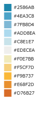
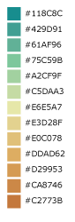
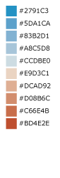
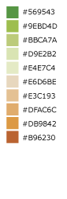
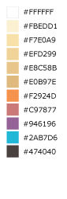
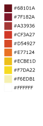
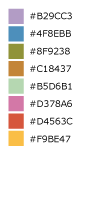
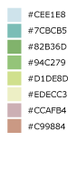

This document serves as a complete guide to using `Raster`s in GeoTrellis.

Raster Rendering
================

<h3>Rendering Common Image Formats</h3>

At some point, you'll want to output a visual representation of the tiles
you're processing. Likely, that's why you're reading this bit of
documentation. Luckily enough, geotrellis provides some methods which make
the process as painless as possible. Currently, both PNG and JPG formats are
supported.

To begin writing your tiles out as PNGs and JPGs, there are just a few
things to keep in mind. As elsewhere throughout geotrellis, the
functionality in this module is added through implicit class extension.
`import geotrellis.raster._` will import the necessary methods off of the
core types like `renderToPng`, and the the types like `ColorRamp` and
`ColorMap` live in `geotrellis.raster.render`.

**First Steps**

Let's say that the tile you've got is an integer tile and that the
integers in it are all *actually* hex codes for RGBA colors. In this
case, your task is nearly complete. The following code should be
sufficient:

```scala
import geotrellis.raster._

// Generate the tile - let's paint it red with #FF0000FF
// (red = 0xFF or 255; green = 0x00 or 0; blue = 0x00 or 0; and alpha = 0xFF or 255, which is completely opaque)
val hexColored: IntArrayTile = IntArrayTile.fill(0xFF0000FF, 100, 100)

// Making a PNG
val png: Png = hexColored.renderPng

// JPG variation
val jpg: Jpg = hexColorsHere.renderJpg
```

A `Png` and `Jpg` type represent the `Array[Byte]` that is the binary
encoding of the image. You can get to the bytes by calling the
`bytes` property, e.g. `png.bytes` or `jpg.bytes`. It's useful to use
the bytes directly if you are, say, returning PNG data from a web service.
These image format types also have a `write` method that can be called
to write that array of bytes to the file system, therefore writing out
a `PNG` or `JPG` representation of our `Tile` to the filesystem.

Clearly this won't suffice for the majority of use-cases. In general,
you're more likely to be working on tiles whose cells encode information
having only an incidental relation to human vision. In these cases,
you'll need to tell `renderPng` and `renderJpg` how the values in your
tile relate to the colors you'd like in your image. To this end, there
are arguments you can provide to the render method which
will tell geotrellis how to color cells for your tile.

<h2>ColorRamp</h2>

A ColorRamp describes a range of colors that can be used to paint values of
a tile. You can use a built-in color ramp, or construct one with your own
palette with the API described below.

<h3>Built-in color ramps</h3>

GeoTrellis provides built-in color ramps in the `ColorRamps` object. These
are provided to ease the transition from developer to cartographer. However,
you need not feel constrained by these and can use your own color palettes
as well. There are many good resources online for selecting color ramps.

<h4>Color Schemes</h4>

   

_From left to right_

<h5> Blue to Orange</h5>
An 11-step diverging color ramp from blue to gray to orange. The gray
critical class in the middle clearly shows a median or zero value. Example
uses include temperature, climate, elevation, or other color ranges where it
is necessary to distinguish categories with multiple hues.

<h5> Blue to Red</h5>
A 10-step diverging color ramp from blue to red. Example uses include
elections and politics, voter swing, climate or temperature, or other color
ranges where it is necessary to distinguish categories with multiple hues.

<h5> Green to Red-Orange</h5>
A 10-step diverging color ramp from green to red-orange. Example uses
include elections and politics, voter swing, climate or temperature, or
other color ranges where it is necessary to distinguish categories with
multiple hues.

<h5> Green to Orange</h5>
A 13-step diverging color ramp from green to orange. Example uses include
elevation, relief maps, topography, or other color ranges where it is
necessary to distinguish categories with multiple hues.

<h4>Sequential Color Schemes</h4>

     

_From left to right_

<h5> Light to Dark - Sunset</h5>
An 11-step sequential color ramp showing intensity from light to dark. This
color ramp is perfect for showing density where it is critical to highlight
very different values with bold colors at the higher, darker end of the
ramp. Example uses include population density, accessibility, or ranking.

<h5> Light to Dark - Green</h5>
A basic 8-step sequential color ramp showing light to dark in shades of
green. Example uses include density, ordered data, ranking, or any map where
darker colors represent higher data values and lighter colors represent
lower data values, generally.

<h5> Yellow to Red - Heatmap</h5>
An 8-step sequential heatmap from yellow to dark red. Great for heatmaps on
a light basemap where the hottest values are more opaque or dark. Also
useful for sequential color ranges where the lowest value is the median or
zero value.

<h5> Blue to Yellow to Red Spectrum - Heatmap</h5>
An 11-step heatmap from blue to yellow to red. Great for showing a wide
range of values with clear differences in hue.

<h5> Dark Red to Yellow-White - Heatmap</h5>
A 10-step sequential heatmap from dark red to yellow to white. Great for
heatmaps where the hottest values should look more vibrant or intense.

<h5> Light Purple to Dark Purple to White</h5>
An 8-step sequential heatmap to show intensity with shades of purple with
white as the "hottest" value. Great for light or gray basemaps, or where the
highest value needs to be called out visually.

<h4>Qualitative or Categorical Schemes</h4>

 

_From left to right_

<h5> Bold Land Use</h5>
An 8-hue qualitative scheme used to show a clear difference in categories
that are unordered or very different. Example uses include zoning, land use,
land cover, or maps where all categories or groups are equal in visual
strength/magnitude.

<h5> Muted Terrain</h5>
An 8-hue qualitative scheme used to show different kinds of map topology or
features. This is generally used to show landforms, terrain, and topology.

<h3>Custom Color Ramps</h3>

You can create your own color ramp with a list of integar values,
constructed using our RBG or RGBA helper objects.

```scala
val colorRamp =
  ColorRamp(
    RGB(0,255,0),
    RGB(63, 255 ,51),
    RGB(102,255,102),
    RGB(178, 255,102),
    RGB(255,255,0),
    RGB(255,255,51),
    RGB(255,153, 51),
    RGB(255,128,0),
    RGB(255,51,51),
    RGB(255,0,0)
  )
```

You can also do things like set the number of stops in a gradient between
colors, and set an alpha gradient. This example sets a 100 color stops that
interpolates colors between red and blue, with an alpha value that starts at
totally opaque for the red values, and ends at 0xAA alpha for blue values:

```scala
val colorRamp =
      ColorRamp(0xFF0000FF, 0x0000FFFF)
        .stops(100)
        .setAlphaGradient(0xFF, 0xAA)
```

There are many online and offline resources for generating color palettes
for cartography including:

- [ColorBrewer 2.0](http://colorbrewer2.org/js/)
- [Cartographer’s Toolkit: Colors, Typography, Patterns](http://www.amazon.com/Cartographers-Toolkit-Colors-Typography-Patterns/dp/0615467946), by Gretchen N. Peterson
- [Designing Better Maps](http://www.amazon.com/Designing-Better-Maps-Guide-Users/dp/1589480899/), by Cynthia A. Brewer
- [Designed Maps: A Sourcebook](http://www.amazon.com/Designed-Maps-Sourcebook-GIS-Users/dp/1589481607/), by Cynthia A. Brewer

<h2>RGBA vs RGB values</h2>

One way to represent a color is as an RGB hex value, as often seen in CSS or
graphics programs. For example, the color red is represented by #FF0000 (or,
in scala, 0xFF0000).

Internally to GeoTrellis, colors are represented as RGBA values, which
includes a value for transparency. These can be represented with 8 instead
of 6 hex characters (with the alpha opacity value being the last two
charcters) such as 0xFF0000FF for opaque red. When using the programming
interface, just be sure to keep the distinction in mind.

You can create RGB and RGBA colors in a variety of ways:

```scala
import geotrellis.raster.render._

val color1: Int = RGB(r = 255, g = 170, b = 85)
val color2: Int = RGBA(0xFF, 0xAA, 0x55, 0xFF)
val color3: Int = 0xFFAA55FF
assert(color1 == color2 && color2 == color3)
```

<h2>ColorMap</h2>

A `ColorMap` is what actually determines how the values of a tile to colors.
It constitutes a mapping between class break values and color stops, as well
as some options that determine how to color raster values.

<h3>ColorMap Options</h3>
The options available for a ColorMap are a class boundary type, which
determines how those class break values (one of `GreaterThan`,
`GreaterThanOrEqualTo`, `LessThan`, `LessThanOrEqualTo`, or `Exact`), an
option that defines what color NoData values should be colored, as well as
an option for a "fallback" color, which determines the color of any value
that doesn't fit to the color map. Also, if the `strict` option is true,
then no fallback color is used, and the code will throw an exception if a
value does not fit the color map. The default values of these options are:

```scala
val colorMapDefaultOptions =
  ColorMap.Options(
    classBoundaryType = LessThan,
    noDataColor = 0x00000000, // transparent
    fallbackColor = 0x00000000, // transparent
    strict = false
  )
```

To examplify the options, let's look at how two different color ramps will
color values.

```scala
import geotrellis.render._

// Constructs a ColorMap with default options,
// and a set of mapped values to color stops.
val colorMap1 =
  ColorMap(
    Map(
      3.5 -> RGB(0,255,0),
      7.5 -> RGB(63,255,51),
      11.5 -> RGB(102,255,102),
      15.5 -> RGB(178,255,102),
      19.5 -> RGB(255,255,0),
      23.5 -> RGB(255,255,51),
      26.5 -> RGB(255,153,51),
      31.5 -> RGB(255,128,0),
      35.0 -> RGB(255,51,51),
      40.0 -> RGB(255,0,0)
    )
  )

// The same color map, but this time considering the class boundary type
// as GreaterThanOrEqualTo, and with a fallback and nodata color.
val colorMap2 =
  ColorMap(
    Map(
      3.5 -> RGB(0,255,0),
      7.5 -> RGB(63,255,51),
      11.5 -> RGB(102,255,102),
      15.5 -> RGB(178,255,102),
      19.5 -> RGB(255,255,0),
      23.5 -> RGB(255,255,51),
      26.5 -> RGB(255,153,51),
      31.5 -> RGB(255,128,0),
      35.0 -> RGB(255,51,51),
      40.0 -> RGB(255,0,0)
    ),
  ColorMap.Options(
    classBoundaryType = GreaterThanOrEqualTo,
    noDataColor = 0xFFFFFFFF,
    fallbackColor = 0xFFFFFFFF
  )
)
```

If we were to use the `mapDouble` method of the color maps to find color
values of the following points, we'd see the following:

```scala
scala> colorMap1.mapDouble(2.0) == RGB(0, 255, 0)
res1: Boolean = true

scala> colorMap2.mapDouble(2.0) == 0xFFFFFFFF
res2: Boolean = true
```

Because `colorMap1` has the `LessThan` class boundary type, `2.0` will map
to the color value of `3.5`. However, because `colorMap2` is based on the
`GreaterThanOrEqualTo` class boundary type, and `2.0` is not greater than or
equal to any of the mapped values, it maps `2.0` to the `fallbackColor`.

```scala
scala> colorMap1.mapDouble(23.5) == RGB(255,153,51)
res4: Boolean = true

scala> colorMap2.mapDouble(23.5) == RGB(255,255,51)
res5: Boolean = true
```

If we map a value that is on a class border, we can see that the `LessThan`
color map maps the to the lowest class break value that our value is still
less than (`26.5`), and for the `GreaterThanOrEqualTo` color map, since our
value is equal to a class break value, we return the color associated with
that value.

<h3>Creating a ColorMap based on Histograms</h3>

One useful way to create ColorMaps is based on a `Histogram` of a tile.
Using a histogram, we can compute the quantile breaks that match up to the
color stops of a `ColorRamp`, and therefore paint a tile based on quantiles
instead of something like equal intervals. You can use the
`fromQuantileBreaks` method to create a `ColorMap` from both a
`Histogram[Int]` and `Histogram[Double]`

Here is an example of creating a `ColorMap` from a `ColorRamp` and a
`Histogram[Int]`, in which we define a ramp from red to blue, set the number
of stops to 10, and convert it to a color map based on quantile breaks:

```scala
val tile: Tile = ???

val colorMap = ColorMap.fromQuantileBreaks(tile.histogram, ColorRamp(0xFF0000FF, 0x0000FFFF).stops(10))
```

Here is another way to do the same thing, using the `ColorRamp.toColorMap`:

```scala
val tile: Tile = ???

val colorMap: ColorMap =
  ColorRamp(0xFF0000FF, 0x0000FFFF)
    .stops(10)
    .toColorMap(tile.histogram)
```

<h2>PNG and JPG Settings</h2>

It might be useful to tweak the rendering of images for some use cases. In
light of this fact, both png and jpg expose a `Settings` classes
(`geotrellis.raster.render.jpg.Settings` and
`geotrellis.raster.render.png.Settings`) which provide a means to tune image
encoding.

In general, messing with this just isn't necessary. If you're unsure,
there's a good chance this featureset isn't for you.

<h3>PNG Settings</h3>
`png.Settings` allows you to specify a `ColorType` (bit depth and masks)
and a `Filter`. These can both be read about on the W3 specification and
[png Wikipedia
page]('https://en.wikipedia.org/wiki/Portable_Network_Graphics').

<h3>JPEG Settings</h3>
`jpg.Settings` allow specification of the compressionQuality (a Double
from 0 to 1.0) and whether or not Huffman tables are to be computed on
each run - often referred to as 'optimized' rendering. By default, a
compressionQuality of 0.7 is used and Huffman table optimization is not used.

<hr>

Resampling
==========
Often, when working with raster data, it is useful to change the resolution,
crop the data, transform the data to a different projection, or to do all of
that at once. This all relies on our ability to resample, which is the act
of changing the spatial resolution and layout of the raster cells, and
interpolating the values of the modified cells from the original cells. For
everything there is a price, however, and changing the resolution of a tile
is no exception: there will (almost) always be a loss of information (or
representativeness) when conducting an operation which changes the number of
cells on a tile.

<h3>Upsampling vs Downsampling</h3>
Intuitively, there are two ways that you might resample a tile. You might:

1. increase the number of cells
2. decrease the number of cells

Increasing the number of cells produces more information at the cost of
being only probabilistically representative of the underlying data whose
points are being used to generate new values. We can call this upsampling
(because we're increasing the samples for a given representation of this or
that state of affairs). Typically, upsampling is handled through
interpolation of new values based on the old ones.

The opposite, downsampling, involves a loss of information. Fewer points of
data are tasked with representing the same states of affair as the tile on
which the downsampling is carried out. Downsampling is a common strategy in
digital compression.

<h3>Aggregate vs Point-Based Resampling</h3>
In geotrellis, `ResampleMethod` is an ADT (through a sealed trait in
`Resample.scala`) which branches into `PointResampleMethod` and
`AggregateResampleMethod`. The aggregate methods of resampling are all
suited for downsampling only. For every extra cell created by upsampling
with an `AggregateResampleMethod`, the resulting tile is **absolutely
certain** to contain a `NODATA` cell. This is because for each additional
cell produced in an aggregated resampling of a tile, a bounding box is
generated which determines the output cell's value on the basis of an
aggregate of the data captured within said bounding box. The more cells
produced through resampling, the smaller an aggregate bounding box. The more
cells produced through resampling, the less likely it is that this box will
capture any values to aggregate over.

What we call 'point' resampling doesn't necessarily require a box within
which data is aggregated. Rather, a point is specified for which a value is
calculated on the basis of nearby value(s). Those nearby values may or may
not be weighted by their distance from the point in question. These methods
are suitable for both upsampling and downsampling.

<h3>Remember What Your Data Represents</h3>
Along with the formal characteristics of these methods, it is important to
keep in mind the specific character of the data that you're working with.
After all, it doesn't make sense to use a method like `Bilinear` resampling
if you're dealing primarily with categorical data. In this instance, your
best bet is to choose an aggregate method (and keep in mind that the values
generated don't necessarily mean the same thing as the data being operated
on) or a forgiving (though unsophisticated) method like `NearestNeighbor`.

<hr>

Histograms
==========

It's often useful to derive a histogram from rasters, which represents a
distribution of the values of the raster in a more compact form. In
GeoTrellis, we differentiate between a `Histogram[Int]`, which represents
the exact counts of integer values, and a `Histogram[Double]`, which
represents a grouping of values into a discrete number of buckets. These
types are in the `geotrellis.raster.histogram` package.

The default implementation of `Histogram[Int]` is the `FastMapHistogram`,
developed by Erik Osheim, which utilizes a growable array structure for
keeping track of the values and counts.

The default implementation of `Histogram[Double]` is the
`StreamingHistogram`, developed by James McClain and based on the paper
`Ben-Haim, Yael, and Elad Tom-Tov. "A streaming parallel decision tree
algorithm."  The Journal of Machine Learning Research 11 (2010): 849-872.`.

Histograms can give statistics such as min, max, median, mode and median. It
also can derive quantile breaks, as dsecribed in the next section.

<h3>Quantile Breaks</h3>

Dividing a histogram distribution into quantile breaks attempts to classify
values into some number of buckets, where the number of values classified
into each bucket are generally equal. This can be useful in representing the
distribution of the values of a raster.

For instance, say we had a tile with mostly values between 1 and 100, but
there were a few values that were 255. We want to color the raster with 3
values: low values with red, middle values with green, and high values with
blue. In other words, we want to classify each of the raster values into one
of three categories: red, green and blue. One technique, called equal
interval classification, consists of splitting up the range of values (1 -
255) into the number of equal intervals as target classifications (3). This
would give us a range intervals of 1 - 85 for red, 86 - 170 for green, and
171 - 255 for blue. This corresponds to "breaks" values of 85, 170, and 255.
Because the values are mostly between 1 and 100, most of our raster would be
colored red. This may not show the contrast of the dataset that we would
like.

Another technique for doing this is called quantile break classification;
this makes use of the quantile breaks we can derive from our histogram. The
quantile breaks will concentrate on making the number of values per "bin"
equal, instead of the range of the interval. With this method, we might end
up seeing breaks more like 15, 75, 255, depending on the distribution of the
values.

For a code example, this is how we would do exactly what we talked about:
color a raster tile into red, green and blue values based on it's quantile
breaks:

```scala
import geotrellis.raster.histogram._
import geotrellis.raster.render._

val tile: Tile = ???  // Some raster tile
val histogram: Histogram[Int] = tile.histogram

val colorRamp: ColorRamp =
  ColorRamp(
    RGB(r=0xFF, b=0x00, g=0x00),
    RGB(r=0x00, b=0xFF, g=0x00),
    RGB(r=0x00, b=0x00, g=0xFF)
  )

val colorMap = ColorMap.fromQuantileBreaks(histogram, colorRamp)

val coloredTile: Tile = tile.color(colorMap)
```

<hr>

[Kriging Interpolation](https://en.wikipedia.org/wiki/Kriging)
==============================================================
These docs are about **Raster** Kriging interpolation.

The process of Kriging interpolation for point interpolation is explained in
the [geotrellis.vector.interpolation](./vectors.md#kriging-interpolation)
package documnetation.

<h2>Kriging Methods</h2>
The Kriging methods are largely classified into different types in the way
the mean(mu) and the covariance values of the object are dealt with.

``` scala
    // Array of sample points with given data
    val points: Array[PointFeature[Double]] = ...
    /** Supported is also present for
      * val points: Traversable[PointFeature[D]] = ... //where D <% Double
      */

    // The raster extent to be kriged
    val extent = Extent(xMin, yMin, xMax, yMax)
    val cols: Int = ...
    val rows: Int = ...
    val rasterExtent = RasterExtent(extent, cols, rows)
```

There exist four major kinds of Kriging interpolation techniques, namely:

<h4>Simple Kriging</h4>

``` scala
    // Simple kriging, a tile  set with the Kriging prediction per cell is returned
    val sv: Semivariogram = NonLinearSemivariogram(points, 30000, 0, Spherical)

    val krigingVal: Tile =
        points.simpleKriging(rasterExtent, 5000, sv)

    /**
      * The user can also do Simple Kriging using :
      * points.simpleKriging(rasterExtent)
      * points.simpleKriging(rasterExtent, bandwidth)
      * points.simpleKriging(rasterExtent, Semivariogram)
      * points.simpleKriging(rasterExtent, bandwidth, Semivariogram)
      */
```

It belong to the class of Simple Spatial Prediction Models.

The simple kriging is based on the assumption that the underlying stochastic
process is entirely _known_ and the spatial trend is constant, viz. the mean
and covariance values of the entire interpolation set is constant (using
solely the sample points)

    mu(s) = mu              known; s belongs to R
    cov[eps(s), eps(s')]    known; s, s' belongs to R

<h4>Ordinary Kriging</h4>

``` scala
    // Ordinary kriging, a tile  set with the Kriging prediction per cell is returned
    val sv: Semivariogram = NonLinearSemivariogram(points, 30000, 0, Spherical)

    val krigingVal: Tile =
        points.ordinaryKriging(rasterExtent, 5000, sv)

    /**
      * The user can also do Ordinary Kriging using :
      * points.ordinaryKriging(rasterExtent)
      * points.ordinaryKriging(rasterExtent, bandwidth)
      * points.ordinaryKriging(rasterExtent, Semivariogram)
      * points.ordinaryKriging(rasterExtent, bandwidth, Semivariogram)
      */
```

It belong to the class of Simple Spatial Prediction Models.

This method differs from the Simple Kriging appraoch in that, the constant
mean is assumed to be unknown and is estimated within the model.

    mu(s) = mu              unknown; s belongs to R
    cov[eps(s), eps(s')]    known; s, s' belongs to R

<h4>Universal Kriging</h4>

``` scala
    // Universal kriging, a tile  set with the Kriging prediction per cell is returned
    val attrFunc: (Double, Double) => Array[Double] = {
      (x, y) => Array(x, y, x * x, x * y, y * y)
    }

    val krigingVal: Tile =
        points.universalKriging(rasterExtent, attrFunc, 50, Spherical)

    /**
      * The user can also do Universal Kriging using :
      * points.universalKriging(rasterExtent)
      * points.universalKriging(rasterExtent, bandwidth)
      * points.universalKriging(rasterExtent, model)
      * points.universalKriging(rasterExtent, bandwidth, model)
      * points.universalKriging(rasterExtent, attrFunc)
      * points.universalKriging(rasterExtent, attrFunc, bandwidth)
      * points.universalKriging(rasterExtent, attrFunc, model)
      * points.universalKriging(rasterExtent, attrFunc, bandwidth, model)
      */
```

It belongs to the class of General Spatial Prediction Models.

This model allows for explicit variation in the trend function (mean
function) constructed as a linear function of spatial attributes; with the
covariance values assumed to be known. This model computes the prediction
using

For example if:

    x(s) = [1, s1, s2, s1 * s1, s2 * s2, s1 * s2]'
    mu(s) = beta0 + beta1*s1 + beta2*s2 + beta3*s1*s1 + beta4*s2*s2 + beta5*s1*s2

Here, the "linear" refers to the linearity in parameters (beta).

    mu(s) = x(s)' * beta,   beta unknown; s belongs to R
    cov[eps(s), eps(s')]    known; s, s' belongs to R

<h4>Geostatistical Kriging</h4>

``` scala
    // Geostatistical kriging, a tile  set with the Kriging prediction per cell is returned
    val attrFunc: (Double, Double) => Array[Double] = {
      (x, y) => Array(x, y, x * x, x * y, y * y)
    }

    val krigingVal: Tile =
        points.geoKriging(rasterExtent, attrFunc, 50, Spherical)

    /**
      * The user can also do Universal Kriging using :
      * points.geoKriging(rasterExtent)
      * points.geoKriging(rasterExtent, bandwidth)
      * points.geoKriging(rasterExtent, model)
      * points.geoKriging(rasterExtent, bandwidth, model)
      * points.geoKriging(rasterExtent, attrFunc)
      * points.geoKriging(rasterExtent, attrFunc, bandwidth)
      * points.geoKriging(rasterExtent, attrFunc, model)
      * points.geoKriging(rasterExtent, attrFunc, bandwidth, model)
      */
```

It belong to the class of General Spatial Prediction Models.

This model relaxes the assumption that the covariance is known. Thus, the
beta values and covariances are simultaneously evaluated and is
computationally more intensive.

    mu(s) = x(s)' * beta,   beta unknown; s belongs to R
    cov[eps(s), eps(s')]    unknown; s, s' belongs to R


<h3>attribute Functions (Universal, Geostatistical Kriging):</h3>

The `attrFunc` function is the attribute function, which is used for
evaluating non-constant spatial trend structures. Unlike the Simple and
Ordinary Kriging models which rely only on the residual values for
evaluating the spatial structures, the General Spatial Models may be
modelled by the user based on the data (viz. evaluating the beta variable to
be used for interpolation).

In case the user does not specify an attribute function, by default the
function used is a quadratic trend function for `Point(s1, s2)` :

```mu(s) = beta0 + beta1*s1 + beta2*s2 + beta3*s1*s1 + beta4*s2*s2 + beta5*s1*s2```

General example of a trend function is :

```mu(s) = beta0 + Sigma[ beta_j * (s1^n_j) * (s2^m_j) ]```

<h3>Example to understand the attribute Functions</h3>

Consider a problem statement of interpolating the ground water levels of
Venice. It is easy to arrive at the conclusion that it depends on three
major factors; namely, the elevation from the ground, the industries' water
intake, the island's water consumption. First of all, we would like to map
the coordinate system into another coordinate system such that generation of
the relevant attributes becomes easier (please note that the user may use
any method for generating the set of attribute functions; in this case we
have used coordinate transformation before the actual calculation).

``` scala
    val c1: Double = 0.01 * (0.873 * (x - 418) - 0.488 * (y - 458))
    val c2: Double = 0.01 * (0.488 * (x - 418) + 0.873 * (y - 458))
```


Image taken from `Smith, T.E., (2014) Notebook on Spatial Data Analysis
[online]  http://www.seas.upenn.edu/~ese502/#notebook`

<h4> Elevation</h4>

``` scala
    /** Estimate of the elevation's contribution to groundwater level
      * [10 * exp(-c1)]
      */
    val elevation: Double = math.exp(-1 * c1)
```

<h4> Industry draw down (water usage of industry)</h4>


Image taken from `Smith, T.E., (2014) Notebook on Spatial Data Analysis
[online]  http://www.seas.upenn.edu/~ese502/#notebook`

``` scala
    /** Estimate of the industries' contribution to groundwater level
      * exp{ -1.0 * [(1.5)*c1^2 - c2^2]}
      */
    val industryDrawDown: Double = math.exp(-1.5 * c1 * c1 - c2 * c2)
```

<h4> Island draw down (water usage of Venice)</h4>


Image taken from `Smith, T.E., (2014) Notebook on Spatial Data Analysis
[online]  http://www.seas.upenn.edu/~ese502/#notebook`

``` scala
    /** Estimate of the island's contribution to groundwater level
      * //exp{-1.0 * (sqrt((s1-560)^2 + (s2-390)^2) / 35)^8 }
      */
    val islandDrawDown: Double =
        math.exp(-1 * math.pow(math.sqrt(math.pow(x - 560, 2) + math.pow(y - 390, 2)) / 35, 8))
```

<h4> The final attribute Function</h4>

Thus for a `Point(s1, s2)` :

`Array(elevation, industryDrawDown, islandDrawDown)` is the set of attributes.

In case the intuition for a relevant `attrFunc` is not clear; the user need
not supply an `attrFunc`, by default the following attribute Function is
used :

``` scala
    // For a Point(x, y), the set of default attributes is :
    Array(x, y, x * x, x * y, y * y)
```

The default function would use the data values of the given sample points
and construct a spatial structure trying to mirror the actual attribute
characteristics.
