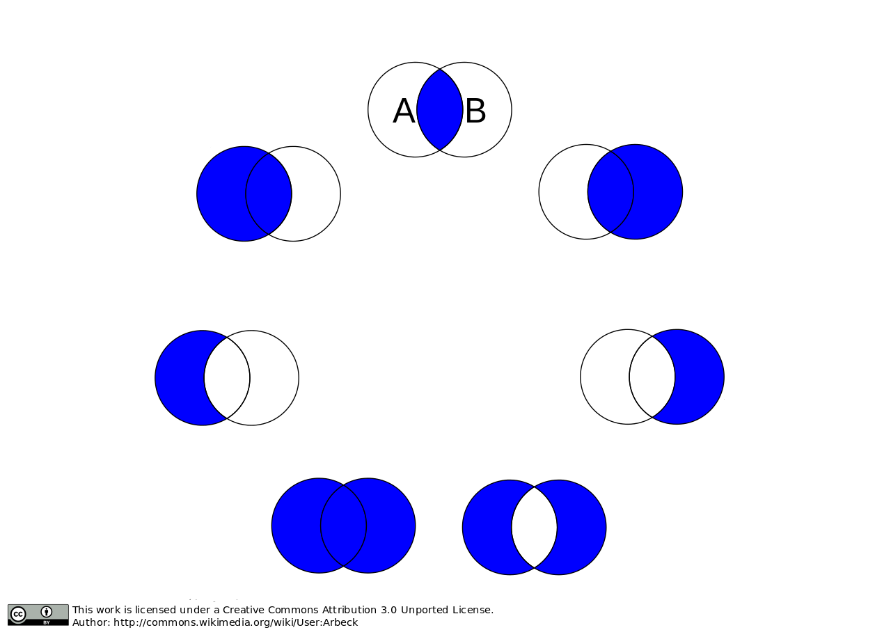

Spark and GeoTrellis
********************

This documentation series describes the use of the vast
``geotrellis.spark`` module.

On Distributed Computation
==========================

.. note:: Distributed computing is difficult to get right. Luckily, we
          are able to lean on the ``RDD`` abstraction provided by Apache Spark
          to simplify matters somewhat. Still, the conceptual difficulties in
          ``geotrellis.spark`` are arguably as great as can be found in any
          part of the GeoTrellis library. As such, the discussion in this
          portion of the documentation assumes a passing familiarity with the
          key concepts of ``geotrellis.raster``. If this is a difficulty,
          please refer to the documentation for `the
          geotrellis.raster package <./core-concepts.html#raster-data>`__.

Consider the (relatively) simple case of carrying out local addition on
two raster tiles. In the abstract, this merely involves adding together
corresponding values from two different ``Tile``\ s. Practically, things
can quickly become more complex: what if one ``Tile``'s data covers a
larger extent than the other? In general, how do we determine what
'corresponding values' means in such a context? (Some specifics related
to this question are covered in the ``geotrellis.spark`` `documentation
on joins <#rdd-joins>`__)

What we need, then, is to pass around tiles as well as some kind of
associated data. In addition, the ``Tile`` abstraction makes sense only
in a particular place (in space and/or time) - the data in my ``Tile``
represents the elevation of terrain in this or that actual place which
has such and such spatial relations to other ``Tile``\ s that represent
neighboring terrain elevations. If your application for finding
directions displayed street data for Beijing in the middle of downtown
Philadelphia, it would be extremely difficult to actually use. From the
perspective of application performance during spatially-aware
computations (say, for instance, that I want to compute the average
elevation for every ``Tile``'s cell within a five mile radius of a
target location) it is also useful to have an index which provides a
sort of shortcut for tracking down the relevant information.

The need for intelligently indexed tiles is especially great when
thinking about distributing work over those tiles across multiple
computers. The tightest bottleneck in such a configuration is the
communication between different nodes in the network. What follows is
that reducing the likelihood of communication between nodes is one of
the best ways to improve performance. Having intelligently indexed
tilesets allows us to partition data according to expectations about
which ``Tile``\ s each node will require to calculate its results.

Hopefully you're convinced that for a wide variety of GeoTrellis
use-cases it makes sense to pass around tiles with indices to which they
correspond as well as metadata. This set of concerns is encoded in the
type system as ``RDD[(K, V)] with Metadata[M]``.

For more information on this type, see `Tile
Layers <./core-concepts.html#tile-layers>`__.

.. raw:: html

   

Writing Layers
==============

The underlying purpose of ``geotrellis.spark.io`` is to provide reading
and writing capability for instances of ``RDD[(K, V)] with Metadata[M]``
into one of the distributed storage formats.

GeoTrellis provides an abstraction for writing layers, ``LayerWriter``,
that the various backends implement. There are a set of overloads that
you can call when writing layers, but generally you need to have the
target ``LayerId`` that you will be writing to, and the
``RDD[(K, V)] with Metadata[M]`` that you want to write. Note that the
``K``, ``V``, and ``M`` concrete types need to have all of the context
bounds satisfied; see the method signature in code or look to the
implicit argument list in the ScalaDocs to find what the context bounds
are (although if you are not using custom types, on the required imports
should be necessary to satisfy these conditions). The overloaded methods
allow you to optionally specify how the key index will be created, or to
supply your own ``KeyIndex``.

Key Index
---------

A ``KeyIndex`` determines how your N-dimensional key (the ``K`` in
``RDD[(K, V)] with Metadtaa[M]``) will be translated to a space filling
curve index, represented by a ``Long``. It also determines how
N-dimensional queries (represented by ``KeyBounds`` with some minimum
key and maximum key) will translate to a set of ranges of ``Long`` index
values.

There are two types of key indexes that GeoTrellis supports, which
represent the two types of space filling curves supported: Z-order
Curves and Hilbert Curves. The Z-order curves can be used for 2 and 3
dimensional spaces (e.g. those represented by ``SpatialKey``\ s or
``SpaceTimeKey``\ s). Hilbert curves can represent N-dimensions,
although there is currently a limitation in place that requires the
index to fit into a single ``Long`` value.

In order to index the space of an ``RDD[(K, V)] with Metadata[M]``, we
need to know the bounds of the space, as well as the index method to
use.

The LayerWriter methods that do not take a ``KeyIndex`` will derive the
bounds of the layer to be written by the layer itself. This is fine if
the layer elements span the entire space that the layer will ever need
to write to. If you have a larger space that represents the layer, for
instance if you want to write elements to the layer that will be outside
the bounds of the original layer RDD, you will need to create a
``KeyIndex`` manually that represents the entire area of the space.

For example, say we have a spatio-temporal raster layer that only
contains elements that partially inhabit the date range for which we
will want the layer to encompass. We can use the ``TileLayout`` from the
layer in combination with a date range that we know to be sufficient,
and create a key index.

.. code:: scala

      import geotrellis.raster.Tile
      import geotrellis.spark._
      import geotrellis.spark.io._
      import geotrellis.spark.io.index.ZCurveKeyIndexMethod
      import geotrellis.util._
      import org.apache.spark.rdd.RDD
      import org.joda.time.DateTime

      val layer: RDD[(SpaceTimeKey, Tile)] with Metadata[TileLayerMetadata[SpaceTimeKey]] = ???

      // Create the key index with our date range
      val minDate: DateTime = new DateTime(2010, 12, 1, 0, 0)
      val maxDate: DateTime = new DateTime(2010, 12, 1, 0, 0)

      val indexKeyBounds: KeyBounds[SpaceTimeKey] = {
        val KeyBounds(minKey, maxKey) = layer.metadata.bounds.get // assuming non-empty layer
        KeyBounds(
          minKey.setComponent[TemporalKey](minDate),
          maxKey.setComponent[TemporalKey](maxDate)
        )
      }

      val keyIndex =
        ZCurveKeyIndexMethod.byMonth
          .createIndex(indexKeyBounds)

      val writer: LayerWriter[LayerId] = ???
      val layerId: LayerId = ???

      writer.write(layerId, layer, keyIndex)

Reindexing Layers
=================

If a layer was written with bounds on a key index that needs to be
expanded, you can reindex that layer. The ``LayerReindexer``
implementation of the backend you are using can be passed in a
``KeyIndex``, which can be constructed similarly to the example above.

Reading Layers
==============

Layer readers read all or part of a persisted layer back into ``RDD[(K, V)]
with Metadata[M]``. All layer readers extend the `FilteringLayerReader
<https://geotrellis.github.io/scaladocs/latest/#geotrellis.spark.io.FilteringLayerReader>`__
trait which in turn extends `LayerReader
<https://geotrellis.github.io/scaladocs/latest/#geotrellis.spark.io.LayerReader>`__.
The former type should be used when abstracting over the specific back-end
implementation of a reader with region query support, and the latter when
referring to a reader that may only read the layers fully.

In order to read a layer correctly some metadata regarding the type and
format of the values must be stored as well as metadata regarding layer
properties. All layer readers lean on instances of `AttributeStore
<https://geotrellis.github.io/scaladocs/latest/#geotrellis.spark.io.AttributeStore>`__
to provide this functionality. As a convenience each concrete type of a
``LayerReader`` will provide a constructor that will instantiate an
``AttributeStore`` of the same type with reasonable defaults. For instance
``S3LayerReader`` constructor, which requires S3 bucket and prefix
parameters, would instantiate an ``S3AttributeStore`` with the bucket and
prefix.

LayerReader
-----------

.. code:: scala

    import geotrellis.raster._
    import geotrellis.spark._
    import geotrellis.spark.io._
    import geotrellis.spark.io.s3._

    val reader: FilteringLayerReader[LayerId] = S3LayerReader("my-bucket", "catalog-prefix")

    val rdd: RDD[(SpatialKey, Tile)] with Metadata[TileLayerMetadata[SpatialKey]] =
      reader.read[SpatialKey, Tile, TileLayerMetadata[SpatialKey]](LayerId("NLCD", 10))

Type signature of ``rdd`` variable can be inferred from the assignment
and may be omitted but the type parameters for the ``read`` method can
not be inferred and are required. Furthermore, the ``reader.read``
method will use these explicitly provided type parameters to find
implicit type class instances that will allow it to read records of that
format.

It's important to note that as a result of call to ``reader.read`` some
IO will happen right away in order to read the layer attributes from the
``AttributeStore``. However, the result of the call is an RDD, a
description of the distributed collection at some point in the future.
Consequently the distributed store (like HDFS or S3) will not touched
until some spark "action" is called on either ``rdd`` or one of its
descendants.

But what happens when IO gremlins strike and the type of the record
stored does not match the type parameter? It depends. The layer reader
will do its best to read the layer as instructed, possibly failing. Most
likely this effort will result in ``org.apache.avro.AvroTypeException``
if the Avro schema of the specified value does not match the schema of
the stored value or a ``spray.json.DeserializationException`` if the
JSON format of the metadata does not match the JSON value stored in the
``AttributeStore``. This behavior is somewhat unhelpful but it future
proofs the persisted data in so far that records may be reified into
types that differ from their original implementations and names, as long
as correct their formats are specified correctly for the records
written.

If the type of the layer can not be assumed to be known it is possible
to inspect the layer through ``reader.attributeStore`` field.

.. code:: scala

    val header = reader.attributeStore.readHeader[LayerHeader]
    assert(header.keyClass == "geotrellis.spark.SpatialKey")
    assert(header.valueClass == "geotrellis.raster.Tile")

LayerReader.reader
^^^^^^^^^^^^^^^^^^

In addition to ``reader.read`` there exists a ``reader.reader`` method
defined as follows:

.. code:: scala

    def reader[
      K: AvroRecordCodec: Boundable: JsonFormat: ClassTag,
      V: AvroRecordCodec: ClassTag,
      M: JsonFormat: GetComponent[?, Bounds[K]]
    ]: Reader[ID, RDD[(K, V)] with Metadata[M]] =
      new Reader[ID, RDD[(K, V)] with Metadata[M]] {
        def read(id: ID): RDD[(K, V)] with Metadata[M] =
          LayerReader.this.read[K, V, M](id)
      }

In effect we would be using a reader to produce a reader, but critically
the ``read`` method on the constructed reader does not have any type
class parameters. This is essentially a way to close over all of the
formats for ``K``, ``V``, and ``M`` such that a "clean" reader can be
passed to modules where those formats are not available in the implicit
scope.

FilteringLayerReader
--------------------

.. code:: scala

    import geotrellis.vector._
    import geotrellis.spark.io._
    import geotrellis.spark.io.s3._

    val reader: FilteringLayerReader[LayerId] = S3LayerReader("my-bucket", "catalog-prefix")
    val layerId = LayerId("NLCD", 10)

    val rdd: RDD[(SpatialKey, Tile)] with Metadata[TileLayerMetadata[SpatialKey]] =
      reader
        .query[SpatialKey, Tile, TileLayerMetadata[SpatialKey]](LayerId("NLCD", 10))

        .result

When using the ``.query`` method the expected return types must still be
provided just like we did when calling ``.read``, however instead of
producing an ``RDD`` it produced an instance of `LayerQuery
<https://geotrellis.github.io/scaladocs/latest/#geotrellis.spark.io.LayerQuery>`__
which is essentially a query builder in a fluent style, allowing for
multiple '.where' clauses to be specified. Only when ``.result`` is called
will an ``RDD`` object be produced. When multiple ``.where`` clauses are
used, the query specified their intersection.

This behavior allows us to build queries that filter on space and time
independently.

.. code:: scala

    import org.joda.time.DateTime

    val time1: DateTime = ???
    val time2: DateTime = ???

    val rdd: RDD[(SpaceTimeKey, Tile)] with Metadata[TileLayerMetadata[SpaceTimeKey]] =
      reader
        .query[SpaceTimeKey, Tile, TileLayerMetadata[SpaceTimeKey]](LayerId("Climate_CCSM4-RCP45-Temperature-Max", 8))
        .where(Intersects(Extent(-85.32,41.27,-80.79,43.42)))
        .where(Between(time1, time2))
        .result

Other query filters are supported through the
`LayerFilter <https://geotrellis.github.io/scaladocs/latest/#geotrellis.spark.io.LayerFilter>`__
type class. Implemented instances include:

-  ``Contains``: Tile which contains a point
-  ``Between``: Tiles between two dates
-  ``At``: Tiles at a a specific date
-  ``Intersects``: Tiles intersecting ...
-  ``KeyBounds``
-  ``GridBounds``
-  ``Extent``
-  ``Polygon``

Value Readers
=============

Unlike layer readers, which produce a future distributed collection, an
``RDD``, a tile reader for a layer is essentially a reader provider. The
provided reader is able to read a single value from a specified layer.

.. code:: scala

    import geotrellis.raster._
    import geotrellis.spark._
    import geotrellis.spark.io.s3._

    val attributeStore = S3AttributeStore("my-bucket", "catalog-prefix")
    val nlcdReader: Reader[SpatialKey, Tile] = S3ValueReader[SpatialKey, Tile](attributeStore, LayerId("NLCD", 10))
    val tile: Tile = nlcdReader.read(SpatialKey(1,2))

``ValueReader`` class is very useful for creating an endpoint for a tile
server because it both provides a cheap low latency access to saved
tiles and does not require an instance of ``SparkContext`` to operate.

If you wish to abstract over the backend specific arguments but delay
specification of the key and value types you may use an alternative
constructor like os:

.. code:: scala

    val attributeStore = S3AttributeStore("my-bucket", "catalog-prefix")
    val readerProvider: ValueReader[LayerId] = S3ValueReader(attributeStore)
    val nlcdReader: Reader[SpatialKey, Tile] = readerProvider.reader[SpatialKey, Tile](LayerId("NLCD", 10))
    val tile: Tile = nlcdReader.read(SpatialKey(1,2))

The idea is similar to the ``LayerReader.reader`` method except in this
case we're producing a reader for single tiles. Additionally it must be
noted that the layer metadata is accessed during the construction of the
``Reader[SpatialKey, Tile]`` and saved for all future calls to read a
tile.

Reader Threads
--------------

Cassandra and S3 Layer RDDReaders / RDDWriters are configurable by threads
amount. It's a programm setting, that can be different for a certain machine
(depends on resources available). Configuration could be set in the
``reference.conf`` / ``application.conf`` file of your app, default settings
available in a ``reference.conf`` file of each backend subproject (we use
`TypeSafe Config <https://github.com/typesafehub/config>`__). For a File
backend only RDDReader is configurable, For Accumulo - only RDDWriter
(Socket Strategy). For all backends CollectionReaders are configurable as
well. By default thread pool size per each configurable reader / writer
equals by virtual machine cpu cores available. Word ``default`` means thread
per cpu core, it can be changed to any integer value.

Default configuration example:

.. code:: javascript

    geotrellis.accumulo.threads {
      collection.read = default
      rdd.write       = default
    }
    geotrellis.file.threads {
      collection.read = default
      rdd.read        = default
    }
    geotrellis.hadoop.threads {
      collection.read = default
    }
    geotrellis.cassandra.threads {
      collection.read = default
      rdd {
        write = default
        read  = default
      }
    }
    geotrellis.s3.threads {
      collection.read = default
      rdd {
        write = default
        read  = default
      }
    }

Cassandra has additional configuration settings:

And additional connections parameters for ``Cassandra``:

.. code:: javascript

    geotrellis.cassandra {
      keyspace             = "geotrellis"
      replicationStrategy  = "SimpleStrategy"
      replicationFactor    = 1
      localDc              = "datacenter1"
      usedHostsPerRemoteDc = 0
      allowRemoteDCsForLocalConsistencyLevel = false
    }

Consider using ``hbase.client.scanner.caching`` parameter for ``HBase``
as it may increase scan performance.

.. raw:: html

   

RDD Joins
=========

In ``geotrellis.spark`` we represent a raster layer as a distributed
collection of non-overlapping tiles indexed by keys according to some
``TileLayout``. For instance a raster layer is represented as
``RDD[(SpatialKey, Tile)]``. With this setup, we can represent certain
decisions about how operations between layers should be performed in
terms of the sort of 'join' to be performed.

   visualized joins

First, we'll set the stage for a discussion of joins in
``geotrellis.spark`` with a discussion of how metadata is used in this
context.

Metadata
--------

A previously tiled and saved ``RasterRDD`` read in through an instance
of ``geotrellis.spark.io.LayerReader`` will be mixed in with the
``Metadata[RasterMetaData]`` trait. This metadata describes the
TileLayout used by the layer, the extent it covers, the CRS of its
projection, and what the CellType of each tile is. This metadata allows
us to verify that we're working with compatible layers.

.. code:: scala

    import org.apache.spark._
    import org.apache.spark.rdd._

    import geotrellis.raster._
    import geotrellis.spark.io._
    import geotrellis.spark.io.s3._

    implicit val sc: SparkContext = ???

    val reader : S3LayerReader[SpatialKey, Tile, TileLayerMetadata[SpatialKey]] =
      S3LayerReader.spatial("bucket", "prefix")

    def getLayerId(idx: Int): LayerId = ???

    val rdd1 =
      reader.read(getLayerId(1))

    val rdd2: RDD[(SpatialKey, Tile)] with Metadata[TileLayerMetadata] =
      reader.read(getLayerId(2))

    val rdd3: TileLayerRDD[SpatialKey] =
      reader.read(getLayerId(3))

Default Joins
-------------

GeoTrellis provides an API for interaction with RDDs of tiles as a
single unit. Where possible, we attempt to provide symbolic methods
where their meaning is obvious and explicit method names in *all* cases.

.. code:: scala

    import geotrellis.spark.mapalgebra.local._

     rdd1 + 1           // add 1 to every cell in the tiled raster
     rdd1 localAdd 1    // explicit method name for above operation
     rdd1 + rdd2        // do a cell wise local addition between two rasters
     rdd1 localAdd rdd2 // explicit method name for above operation
     List(rdd1, rdd2, rdd3).localAdd
     // all results are of type RDD[(SpatialKey, Tile)]

Other supported operations can been found in the
``geotrellis.spark.mapalgebra`` package and its sub-packages.

In order to provide this concise and intuitive syntax for map algebra
operations between two layers some assumptions need to be made regarding
the mechanics of the join. So, by default, GeoTrellis will use the spark
implementation of inner join deferring to spark for the production of an
appropriate partitioner for the result. Thus, if two layers being
operated on are not aligned the result of the operation will contain
**only** the intersecting tiles.

Explicit Joins
--------------

In cases where it is important to control the type of join a more
explicit method is required. We make a direct call to
``geotrellis.raster.mapalgebra.local.Add.apply`` to perform per tile
operations.

Because all binary operations must have the shape of ``(V, V) => R`` we
provide an extension method on ``RDD[(K, (V, V))]`` that decomposes the
tuple resulting from the join and uses it to call a function taking two
arguments.

.. code:: scala

    import geotrellis.raster.mapalgebra.local._

    // using spark API
    rdd1.join(rdd2).mapValues { case (tile1: Tile, tile2: Tile) => Add(tile1, tile2) }

    // using GeoTrellis method extensions
    rdd1.join(rdd2).combineValues(Add(_, _))

Left Join
^^^^^^^^^

Another reason to want to control a join is to perform an update of a
larger layer with a smaller layer, performing an operation where two
intersect and capturing resulting values.

This case is captured by a left outer join. If the right-side of the
join row tuple is ``None`` we return the left-side tile unchanged.
Consequently the extension method ``updateValues`` will only accept
operations with signature of ``(V, V) => V``.

.. code:: scala

    // using spark API
    rdd1.leftOuterJoin(rdd2).mapValues { case (tile1: Tile, optionTile: Option[Tile]) =>
      optionTile.fold(tile1)(Add(tile1, _))
    }

    // using GeoTrellis method extensions
    rdd1.leftOuterJoin(rdd2).updateValues(Add(_, _))

Spatial Join
^^^^^^^^^^^^

Given that we know the key bounds of our RDD, from accompanying
``TileLayerMetadata``, before performing the join we may use a spark
``Partitioner`` that performs space partitioning. Such a partitioner has
a number of benefits over standard ``HashPartitioner``:

-  Scales the number of partitions with the number of records in the RDD
-  Produces partitions with spatial locality which allow:

   -  Faster focal operations
   -  Shuffle free joins with other spatially partitioned RDDs
   -  Efficient spatial region filtering

Because the partitioner requires ability to extract ``Bounds`` of the
original RDD from it's ``Metadata`` it is able to provide the ``Bounds``
of the join result. Since the result of a join may be empty the user
must match on the resulting ``Bounds`` object to find out if it's
``EmptyBounds`` or ``KeyBounds[SpatialKey]``.

.. code:: scala

    import geotrellis.spark.partitioner._

    val joinRes: RDD[(SpatialKey, (Tile, Tile))] with Metadata[Bounds[SpatialKey]] =
      rdd1.spatialJoin(rdd2)

    val leftJoinRes: RDD[(SpatialKey, (Tile, Option[Tile])] with Metadata[Bounds[SpatialKey]] =
      rdd1.spatialLeftOuterJoin(rdd2)

Manipulating Metadata
---------------------

Metadata is provided when loading a layer from a GeoTrellis layer reader
and is required when writing a layer through a GeoTrellis layer writer.
The user bears responsibility that it is preserved and remains
consistent through transformations if such behavior is desired.

The concrete implementation of ``RDD[(K, V)] with Metadata[M]``
signature in GeoTrellis is ``ContextRDD[K, V, M]``

.. code:: scala

    val rdd: RDD[(SpatialKey, Tile)] = rdd1 localAdd rdd2
    val rddWithContext: RDD[(SpatialKey, Tile)] with Metadata[TileLayerMetadata] =
      ContextRDD(rdd, rdd1.metadata)

Preserving Metadata Through Operations
^^^^^^^^^^^^^^^^^^^^^^^^^^^^^^^^^^^^^^

There are extension methods in ``RDD[(K, V]] with Metadata[M]`` that
allow either changing rdd while preserving metadata or changing metadata
while preserving the rdd.

.. code:: scala

    // .withContext preserves the RDD context, the Metadata
    val rddWithContext1: RDD[(SpatialKey, Tile)] with Metadata[TileLayerMetadata] =
      rdd1.withContext { _ localAdd rdd2 }

    val rddWithContext2: RDD[(SpatialKey, Tile)] with Metadata[TileLayerMetadata] =
      rdd1.withContext { _ localAdd rdd2 localAdd rdd3 }

    // .mapContext allows to chain changing Metadata after an operation
    // example: localEqual will produce tiles with CellType of TypeBit
    val rddWithContext3: RDD[(SpatialKey, Tile)] with Metadata[TileLayerMetadata] =
      rdd1
        .withContext { _ localEqual 123 }
        .mapContext { metadata: TileLayerMetadata => metadata.copy(cellType = TypeBit) }

Preserving Metadata Through Spatial Joins
^^^^^^^^^^^^^^^^^^^^^^^^^^^^^^^^^^^^^^^^^

Since spatial joins produce metadata, in contrast to vanilla spark
joins, we must use ``.withContext`` wrapper at every transformation in
order to allow the updated ``Bounds`` to flow to the end where they can
be used.

For instance lets assume we wrote ``updateLayout`` that combines
``Bounds[SpatialKey]`` and ``LayoutDefinition`` from
``TileLayerMetadata`` to produce an RDD with updated, smaller
``TileLayout``.

.. code:: scala

    def updateLayout(md: TileLayerMetadata, bounds: Bounds[SpatialKey]): TileLayerMetadata = ???

    val rddWithContext: RDD[(SpatialKey, Tile)] with Metadata[TileLayerMetadata] =
      rdd1
        .spatialJoin(rdd2).withContext { _.combineValues(Add(_, _)) }
        .spatialJoin(rdd3).withContext { _.combineValues(Add(_, _)) }
        .mapContext{ bounds => updateLayout(rdd1.metadata, bounds) }

.. raw:: html

   

Example Use Cases
=================

Summaries from Temporal Overlap of Tiles
----------------------------------------

Sometimes you'd like to take a layer that has multiple tiles over the
same spatial area through time, and reduce it down to a layer that has
only value per pixel, using some method of combining overlapping pixels.
For instance, you might want to find the maximum values of a pixel over
time.

The following example shows an example of taking temperature data over
time, and calculating the maximum temperature per pixel for the layer:

.. code:: scala

    import geotrellis.raster._
    import geotrellis.spark._
    import geotrellis.util._

    import org.apache.spark.rdd.RDD

    val temperaturePerMonth: TileLayerRDD[SpaceTimeKey] = ???

    val maximumTemperature: RDD[(SpatialKey, Tile)] =
      temperaturePerMonth
        .map { case (key, tile) =>
          // Get the spatial component of the SpaceTimeKey, which turns it into SpatialKey
          (key.getComponent[SpatialKey], tile)
        }
        // Now we have all the tiles that cover the same area with the same key.
        // Simply reduce by the key with a localMax
        .reduceByKey(_.localMax(_))

Stiching Tiles into a single GeoTiff
------------------------------------

This example will show how to start with an
``RDD[(ProjectedExtent, Tile)]`` and end with a stitched together
GeoTiff.

.. note:: Stitching together an RDD can produce a tile that is far
          bigger than the driver program's memory can handle. You should only do
          this with small layers, or a filtered RDD.

.. code:: scala

    import geotrellis.raster._
    import geotrellis.raster.io.geotiff._
    import geotrellis.raster.resample._
    import geotrellis.spark._
    import geotrellis.spark.io._
    import geotrellis.spark.tiling._
    import geotrellis.vector._
    import org.apache.spark.HashPartitioner
    import org.apache.spark.rdd.RDD

    val rdd: RDD[(ProjectedExtent, Tile)] = ???

    // Tile this RDD to a grid layout. This will transform our raster data into a
    // common grid format, and merge any overlapping data.

    // We'll be tiling to a 512 x 512 tile size, and using the RDD's bounds as the tile bounds.
    val layoutScheme = FloatingLayoutScheme(512)

    // We gather the metadata that we will be targeting with the tiling here.
    // The return also gives us a zoom level, which we ignore.
    val (_: Int, metadata: TileLayerMetadata[SpatialKey]) =
      rdd.collectMetadata[SpatialKey](layoutScheme)

    // Here we set some options for our tiling.
    // For this example, we will set the target partitioner to one
    // that has the same number of partitions as our original RDD.
    val tilerOptions =
      Tiler.Options(
        resampleMethod = Bilinear,
        partitioner = new HashPartitioner(rdd.partitions.length)
      )

    // Now we tile to an RDD with a SpaceTimeKey.

    val tiledRdd =
      rdd.tileToLayout[SpatialKey](metadata, tilerOptions)

    // At this point, we want to combine our RDD and our Metadata to get a TileLayerRDD[SpatialKey]

    val layerRdd: TileLayerRDD[SpatialKey] =
      ContextRDD(tiledRdd, metadata)

    // Now we can save this layer off to a GeoTrellis backend (Accumulo, HDFS, S3, etc)
    // In this example, though, we're going to just filter it by some bounding box
    // and then save the result as a GeoTiff.

    val areaOfInterest: Extent = ???

    val raster: Raster[Tile] =
      layerRdd
        .filter()                            // Use the filter/query API to
        .where(Intersects(areaOfInterest))   // filter so that only tiles intersecting
        .result                              // the Extent are contained in the result
        .stitch                 // Stitch together this RDD into a Raster[Tile]

    GeoTiff(raster, metadata.crs).write("/some/path/result.tif")

Median Filter over Multiband Imagery
------------------------------------

This example shows how to take some multiband imagery that exists in a
layer, filter it with some upper bound threshold, and then apply a 5x5
median filter.

.. code:: scala

    import geotrellis.spark._
    import geotrellis.raster._
    import geotrellis.raster.mapalgebra.focal.Square

    val imageLayer: MultibandTileLayerRDD[SpaceTimeKey] = ???
    val neighborhood = Square(2)

    val resultLayer: MultibandTileLayerRDD[SpaceTimeKey] =
      imageLayer
        .withContext { rdd =>
          rdd.mapValues { tile =>
            tile.map { (band, z) =>
              if(z > 10000) NODATA
              else z
            }
          }
          .bufferTiles(neighborhood.extent)
          .mapValues { bufferedTile =>
            bufferedTile.tile.mapBands { case (_, band) =>
              band.focalMedian(neighborhood, Some(bufferedTile.targetArea))
            }
          }
        }

Region Query and NDVI Calculation
---------------------------------

.. code:: scala

    import geotrellis.raster._
    import geotrellis.raster.io.geotiff._
    import geotrellis.spark._
    import geotrellis.spark.io._
    import geotrellis.util._
    import geotrellis.vector._
    import org.joda.time.DateTime

    val region: MultiPolygon = ???
    val layerReader: FilteringLayerReader[LayerId] = ???
    val layerId: LayerId = LayerId("layerName", 18) // Querying zoom 18 data

    val queryResult: MultibandTileLayerRDD[SpaceTimeKey] =
      layerReader.query[SpaceTimeKey, MultibandTile, TileLayerMetadata[SpaceTimeKey]](layerId)
        .where(Intersects(region))
        .where(Between(new DateTime(2016, 3, 1, 0, 0, 0), new DateTime(2016, 4, 1, 0, 0)))
        .result

    val raster: Raster[Tile] =
      queryResult
        .mask(region)
        .withContext { rdd =>
          rdd
            .mapValues { tile =>
              // Assume band band 4 is red and band 5 is NIR
              tile.convert(DoubleConstantNoDataCellType).combine(4, 5) { (r, nir) =>
                (nir - r) / (nir + r)
              }
            }
            .map { case (key, tile) => (key.getComponent[SpatialKey], tile) }
            .reduceByKey(_.localMax(_))
        }
        .stitch

    GeoTiff(raster, queryResult.metadata.crs).write("/path/to/result.tif")
