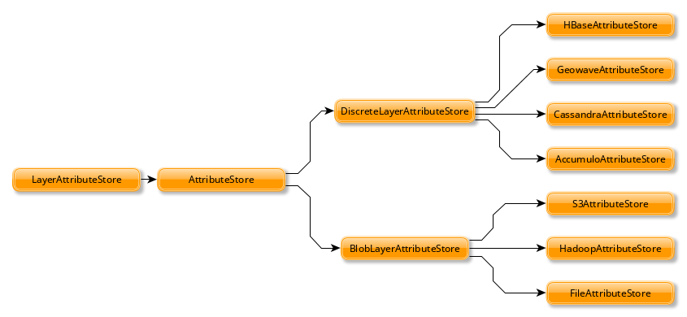

Tile Layer Backends
*******************

GeoTrellis isn't picky about how you store your data. This guide
describes the various tile layer backends we support, how to use them,
and why you might choose one over the other.

To Be or not to Be a Backend
============================

The Scala classes that underpin each backend all inherit from the same
group of traits, meaning they agree on behaviour:

-  ``AttributeStore`` - save and access layer attributes (metadata,
   etc.)
-  ``LayerReader`` - read ``RDD[(K, V)] with Metadata[M]``
-  ``LayerWriter`` - write ``RDD[(K, V)] with Metadata[M]``
-  ``LayerReindexer``
-  ``LayerCopier``
-  ``LayerDeleter``
-  ``LayerMover``
-  ``LayerManager``

The top three are used most often, with the ``AttributeStore`` being a
key piece to every other class.



By default, the stored attributes are:

-  Metadata
-  Header (different per backend)
-  Key Index
-  Schema

``BlobLayerAttributeStore`` stores all attributes in a single JSON
object. ``DiscreteLayerAttributeStore`` stores each attribute as a
seperate object (say, a column in the case of databases).

Backend URI
===========

Instances of ``AttributeStore``, ``LayerWriter``, and ```LayerReader`` can be created from a URI.

.. code:: scala

   val uri = new URI(""s3://bucket/catalog")
   val store = AttributeStore(uri)
   val reader = LayerReader(uri)
   val writer = LayerWriter(uri)
   val values = ValueReader(uri)

The backends are identified by the scheme portion of the URI.
The address and path is used to identify the resource and query parameters are used to configure it.

=============  ============
Backend        URI
=============  ============
``Hadoop``     ``hdfs://path/to/catalog``
``S3``.        ``s3://bucket/catalog-key``
``File``       ``file://tmp/local-catalog``
``Accumulo``   ``accumulo://[user[:password]@]zookeeper/instance-name[?attributes=table1[&layers=table2]]``
``Cassandra``  ``cassandra://[user:password@]zookeeper[:port][/keyspace][?attributes=table1[&layers=table2]]``
``HBase``      ``hbase://zookeeper[:port][?master=host][?attributes=table1[&layers=table2]]``
=============  ============

Backends that use a database need two extra settings:
``attributes`` specifies which table is used for storing layer attributes. It is optional with a default value.
``layers`` specifies which table to write values to. It is required when creating a ``LayerWriter``.

.. note:: When building an assembly make sure to define a merge strategy for concatenating service files


.. code:: scala

       assemblyMergeStrategy in assembly := {
          case s if x.startsWith("META-INF/services") => MergeStrategy.concat
          case "reference.conf" => MergeStrategy.concat
          case "META-INF/MANIFEST.MF" => MergeStrategy.discard
          case "META-INF/ECLIPSEF.RSA" => MergeStrategy.discard
          case "META-INF/ECLIPSEF.SF" => MergeStrategy.discard
          case _ => MergeStrategy.first
       }

File System
===========

**Choose your file system if:** you want to perform tests, data ingests,
or data processing locally on your computer.

This is the simplest backend, only requiring a path to read and write
tiles to:

.. code:: scala

    import geotrellis.spark._
    import geotrellis.spark.io._
    import geotrellis.spark.io.file._

    val catalogPath: String = ...

    val store: AttributeStore = FileAttributeStore(catalogPath)

    val reader = FileLayerReader(store)
    val writer = FileLayerWriter(store)

**PROs:**

-  Simple
-  Built in: available from the ``geotrellis-spark`` package

**CONs:**

-  Not suitable for use in Production.

HDFS
====

**Choose HDFS if:** you want a simple setup and fast write speed or the
ability to write and read from Microsoft Azure's Blob storage.

The `Hadoop Distributed File System <https://hadoop.apache.org/>`__ (HDFS), as
the name implies, presents a view to the programmer as if their
entire cluster were one giant file system.

.. code:: scala

    import geotrellis.spark._
    import geotrellis.spark.io._
    import geotrellis.spark.io.hadoop._

    val rootPath: Path = ...
    val config: Configuration = ...

    /* The `config` argument is optional */
    val store: AttributeStore = HadoopAttributeStore(rootPath, config)

    val reader = HadoopLayerReader(store)
    val writer = HadoopLayerWriter(rootPath, store)

Additionally, HDFS provides the ability to connect to Azure Blob storage
through the use of the Hadoop Azure connector. Similar to S3 this allows you
to leverage cloud storage as a backend. This capability requires
addition configuration to use that is outlined in the `Hadoop Azure Support <https://hadoop.apache.org/docs/stable/hadoop-azure/index.html>`__
documentation. Notably you will need to:

-  Provide Azure credentials in Hadoop's `core-site.xml`.
-  [Optional] Configure the Hadoop's `fs.defaultFS` to use your `wasb` or
   `wasbs` url. This allows for bare paths to the configured location to
   be used.
-  Provide additional dependencies, including the `hadoop-azure` module
   and the Azure Storage SDK for Java.

**PROs:**

-  Built in: available from the ``geotrellis-spark`` package
-  Simple production environment
-  Fast writes
-  Can also be used locally (good for testing)
-  Supports ``hadoop >= 2.6``
-  Supports Microsoft Azure's Blob Storage

**CONs**

-  Slower read speed than alternatives
-  Inefficient layer update functionality

S3
==

**Choose S3 if:** you have large amounts of data to store, can pay for
external storage, and want to access the data from anywhere.

`Amazon S3 <https://aws.amazon.com/s3/>`__. Provided you can pay for
their service, S3 is the simplest backend to put into production. There
are no external processes, and it allows your data and application to
live on different clusters. Data replication is handled automatically.
If your application runs on AWS, it can also access S3 data for free.

The GeoTrellis team recommends the S3 backend as the first consideration
when putting a system into production.

.. code:: scala

    import geotrellis.spark._
    import geotrellis.spark.io._
    import geotrellis.spark.io.s3._  /* from the `geotrellis-s3 package */

    val bucket: String = ...
    val prefix: String = ...

    implicit val sc: SparkContext = ...

    val store: AttributeStore = S3AttributeStore(bucket, prefix)

    val reader = S3LayerReader(store) /* Needs the implicit SparkContext */
    val writer = S3LayerWriter(store)

**PROs:**

-  Your application can access your data from anywhere in the world
-  Simple production environment; no external processes
-  Fast enough to back a real-time tile server

**CONs:**

-  May be cost-prohibitive, depending on your usage

Accumulo
========

**Choose Accumulo if:** you want fast reads and are willing to put in
the setup effort.

`Apache Accumulo <https://accumulo.apache.org/>`__. This is a popular
choice in the GIS world, and is the most battle-tested backend within
GeoTrellis. It requires more mental and physical overhead to put into
production, but is quite performant and provides unique features. To
work with GeoTrellis, it requires an external Accumulo process to be
running.

.. code:: scala

    import geotrellis.spark._
    import geotrellis.spark.io._
    import geotrellis.spark.io.accumulo._  /* from the `geotrellis-accumulo` package */
    import org.apache.accumulo.core.client.security.tokens._

    val instanceName: String = ...
    val zookeeper: String = ...
    val user: String = ...
    val token: AuthenticationToken = new PasswordToken(pwd)

    val dataTable: String = ...

    val strat: AccumuloWriteStrategy = HdfsWriteStrategy()  /* Or SocketWriteStrategy */
    val opts: AccumuloLayerWriter.Options = AccumuloLayerWriter.Options(strat)

    implicit val sc: SparkContext = ...
    implicit val instance = AccumuloInstance(
      instanceName,
      zookeeper,
      user,
      token
    )

    val store: AttributeStore = AccumuloAttributeStore(instance)

    val reader = AccumuloLayerReader(instance)
    val writer = AccumuloLayerWriter(instance, dataTable, opts)

**PROs:**

-  Fast reads
-  Popular in GIS
-  Fine-grained field access authentication support
-  Supports 1 Exobyte cell size
-  Supports ``accumulo >= 1.7``

**CONs:**

-  Complex production environment
-  Requires external processes

Cassandra
=========

**Choose Cassandra if:** you want a simple(r) production environment, or
already have a Cassandra cluster.

`Apache Cassandra <http://cassandra.apache.org/>`__. Cassandra is a
fast, column-based NoSQL database. It is likely the most performant of
our backends, although this has yet to be confirmed. To work with
GeoTrellis, it requires an external Cassandra process to be running.

.. note:: As of 2016 October 26, our Cassandra support is still relatively new.

.. code:: scala

    import geotrellis.spark._
    import geotrellis.spark.io._
    import geotrellis.spark.io.cassandra._ /* from the `geotrellis-cassandra package */

    val instance: CassandraInstance = ...
    val keyspace: String = ...
    val attrTable: String = ...
    val dataTable: String = ...

    implicit val sc: SparkContext = ...

    val store: AttributeStore = CassandraAttributeStore(instance, keyspace, attrTable)

    val reader = CassandraLayerReader(store) /* Needs the implicit SparkContext */
    val writer = CassandraLayerWriter(store, instance, keyspace, dataTable)

**PROs:**

-  Simple(r) production environment; no HDFS, zookeepers, etc.
-  Popular as a NoSQL database
-  Supports ``cassandra >= 3``

**CONs:**

-  Requires external processes

HBase
=====

**Choose HBase if:** you have a pre-existing HBase cluster.

`Apache HBase <http://hbase.apache.org/>`__, a "Big Table"
implementation based on HDFS. To work with GeoTrellis, HBase requires
external processes much like Accumulo.

.. note:: As of 2016 October 26, our HBase support is still relatively new.

.. code:: scala

    import geotrellis.spark._
    import geotrellis.spark.io._
    import geotrellis.spark.io.hbase._ /* from the `geotrellis-hbase package */

    val instance: HBaseInstance = ...
    val attrTable: String = ...
    val dataTable: String = ...

    implicit val sc: SparkContext = ...

    val store: AttributeStore = HBaseAttributeStore(instance, attrTable)

    val reader = HBaseLayerReader(store) /* Needs the implicit SparkContext */
    val writer = HBaseLayerWriter(store, dataTable)

**PROs:**

-  More user friendly than Accumulo
-  Supports ``hbase >= 1.2``

**CONs:**

-  Slower than Cassandra
-  Requires external processes
