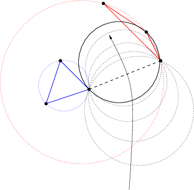

Parsing GeoJson
===============

GeoTrellis includes good support for serializing and deserializing geometry
to/from GeoJson within the `geotrellis.vector.io.json` package.  Utilizing
these features requires some instruction, however, since the interface may
not be immediately apparent from the type signatures.

<h3>Serializing to GeoJson</h3>

All `Geometry` and `Feature` objects in `geotrellis.vector` have a method
extension providing a `toGeoJson` method.  This means that:

```scala
import geotrellis.vector.io._

Polygon((10.0, 10.0), (10.0, 20.0), (30.0, 30.0), (10.0, 10.0)).toGeoJson
```

is valid, in this case yielding:

```
{"type":"Polygon","coordinates":[[[10.0,10.0],[10.0,20.0],[30.0,30.0],[10.0,10.0]]]}
```

Issuing `.toGeoJson` on `Feature` instances, requires that the type
parameter supplied to the feature meets certain requirements.  For example,
`PointFeature(Point(0,0), 3)` will succeed, but to tag a Feature with
arbitrary data, that data must be encapsulated in a case class.  That class
must also be registered with the Json reading infrastructure provided by
`spray`.  The following example achieves these goals:

```scala
import geotrellis.vector.io.json._

case class UserData(data: Int)
implicit val boxedValue = jsonFormat1(UserData)

PointFeature(Point(0,0), UserData(13))
```

Case classes with more than one argument would require the variants of
`jsonFormat1` for classes of higher arity.  The output of the above snippet
is:

```
{"type":"Feature","geometry":{"type":"Point","coordinates":[0.0,0.0]},"properties":{"data":13}}
```

where the property has a single field named `data`.  Upon deserialization,
it will be necessary for the data member of the feature to have fields with
names that are compatible with the members of the feature's data type.

This is all necessary underpinning, but note that it is generally desirable
to (de)serialize collections of features.  The serialization can be achieved
by calling `.toGeoJson` on a `Seq[Feature[G, T]]`.  The result is a Json
representation of a FeatureCollection.

<h3>Deserializing from GeoJson</h3>

The return trip from a string representation can be accomplished by another
method extension provided for strings: `parseGeoJson[T]`.  The only
requirement for using this method is that the type of `T` must match the
contents of the Json string.  If the Json string represents some `Geometry`
subclass (i.e., `Point`, `MultiPolygon`, etc), then that type should be
supplied to `parseGeoJson`.  This will work to make the return trip from any
of the Json strings produced above.

Again, it is generally more interesting to consider Json strings that
contain `FeatureCollection` structures.  These require more complex code.
Consider the following Json string:

```scala
val fc: String = """{
                   |  "type": "FeatureCollection",
                   |  "features": [
                   |    {
                   |      "type": "Feature",
                   |      "geometry": { "type": "Point", "coordinates": [1.0, 2.0] },
                   |      "properties": { "someProp": 14 },
                   |      "id": "target_12a53e"
                   |    }, {
                   |      "type": "Feature",
                   |      "geometry": { "type": "Point", "coordinates": [2.0, 7.0] },
                   |      "properties": { "someProp": 5 },
                   |      "id": "target_32a63e"
                   |    }
                   |  ]
                   |}""".stripMargin
```

Decoding this structure will require the use of either
`JsonFeatureCollection` or `JsonFeatureCollectionMap`; the former will
return queries as a `Seq[Feature[G, T]]`, while the latter will return a
`Map[String, Feature[G, T]]` where the key is the `id` field of each
feature.  After calling:

```scala
val collection = fc.parseGeoJson[JsonFeatureCollectionMap]
```

it will be necessary to extract the desired features from `collection`.  In
order to maintain type safety, these results are pulled using accessors such
as `.getAllPoints`, `.getAllMultiLineFeatures`, and so on.  Each geometry
and feature type requires the use of a different method call.

As in the case of serialization, to extract the feature data from this
example string, we must create a case class with an integer member named
`someProp` and register it using `jsonFormat1`.

```scala
case class SomeProp(someProp: Int)
implicit val boxedToRead = jsonFormat1(SomeProp)

collection.getAllPointFeatures[SomeProp]
```

<h3>A Note on Creating JsonFeatureCollectionMaps</h3>

It is straightforward to create FeatureCollection representations, as
illustrated above.  Simply package your features into a `Seq` and call
`toGeoJson`.  In order to name those features, however, it requires that a
JsonFeatureCollectionMap be explicitly created.  For instance:

```scala
val fcMap = JsonFeatureCollectionMap(Seq("bob" -> Feature(Point(0,0), UserData(13))))
```

Unfortunately, the `toGeoJson` method is not extended to
`JsonFeatureCollectionMap`, so we are forced to call `fcMap.toJson.toString`
to get the same functionality.  The return of that call is:

```json
{
  "type": "FeatureCollection",
  "features": [{
    "type": "Feature",
    "geometry": {
      "type": "Point",
      "coordinates": [0.0, 0.0]
    },
    "properties": {
      "data": 13
    },
    "id": "bob"
  }]
}
```

<hr>

[Kriging Interpolation](https://en.wikipedia.org/wiki/Kriging)
==============================================================


<h2>Semivariograms</h2>

This method of interpolation is based on constructing Semivariograms. For
grasping the structure of spatial dependencies of the known data-points,
semivariograms are constructed.

First, the sample data-points' spatial structure to be captured is converted
to an empirical semivariogram, which is then fit to explicit/theoretical
semivariogram models.

Two types of Semivariograms are developed :

- Linear Semivariogram
- Non-Linear Semivariograms

<h3>Empirical Semivariogram</h3>

```scala
//(The array of sample points)
val points: Array[PointFeature[Double]] = ???

/** The empirical semivariogram generation
  * "maxDistanceBandwidth" denotes the maximum inter-point distance relationship
  * that one wants to capture in the empirical semivariogram.
  */
val es: EmpiricalVariogram = EmpiricalVariogram.nonlinear(points, maxDistanceBandwidth, binMaxCount)
```

The sample-data point used for training the Kriging Models are clustered
into groups(aka bins) and the data-values associated with each of the
data-points are aggregated into the bin's value. There are various ways of
constructing the bins, i.e. equal bin-size(same number of points in each of
the bins); or equal lag-size(the bins are separated from each other by a
certain fixed separation, and the samples with the inter-points separation
fall into the corresponding bins).

In case, there are outlier points in the sample data, the equal bin-size
approach assures that the points' influence is tamed down; however in the
second approach, the outliers would have to be associated with weights
(which is computationally more intensive).

The final structure of the empirical variogram has an array of tuples :

    (h, k)
    where h => Inter-point distance separation
          k => The variogram's data-value (used for covariogram construction)

Once the empirical semivariograms have been evaluated, these are fitted into
the theoretical semivariogram models (the fitting is carried out into those
models which best resemble the empirical semivariogram's curve generate).

<h3>Linear Semivariogram</h3>

```
/** "radius" denotes the maximum inter-point distance to be
  * captured into the semivariogram
  * "lag" denotes the inter-bin distance
  */
val points: Array[PointFeature[Double]] = ...
val linearSV = LinearSemivariogram(points, radius, lag)
```

This is the simplest of all types of explicit semivariogram models and does
not very accurately capture the spatial structure, since the data is rarely
linearly changing. This consists of the points' being modelled using simple
regression into a straight line. The linear semivariogram has linear
dependency on the free variable (inter-point distance) and is represented
by:

```f(x) = slope * x + intercept```

<h3>Non-Linear Semivariogram</h3>

```scala
/**
  * ModelType can be any of the models from
  * "Gaussian", "Circular", "Spherical", "Exponential" and "Wave"
  */
val points: Array[PointFeature[Double]] = ...
val nonLinearSV: Semivariogram =
    NonLinearSemivariogram(points, 30000, 0, [[ModelType]])
```

Most often the empirical variograms can not be adequately represented by the
use of linear variograms. The non-linear variograms are then used to model
the empirical semivariograms for use in Kriging intepolations. These have
non-linear dependencies on the free variable (inter-point distance).

In case the empirical semivariogram has been previously constructed, it can
be fitted into the semivariogram models by :

```scala
val svSpherical: Semivariogram =
    Semivariogram.fit(empiricalSemivariogram, Spherical)
```

The popular types of Non-Linear Semivariograms are :

```(h in each of the function definition denotes the inter-point distances)```

<h4>Gaussian Semivariogram</h4>

```scala
// For explicit/theoretical Gaussian Semivariogram
val gaussianSV: Semivariogram =
    NonLinearSemivariogram(range, sill, nugget, Gaussian)
```
The formulation of the Gaussian model is :

                        | 0                                 , h = 0
    gamma(h; r, s, a) = |
                        | a + (s - a) {1 - e^(-h^2 / r^2)}  , h > 0


<h4>Circular Semivariogram</h4>

```scala
//For explicit/theoretical Circular Semivariogram
val circularSV: Semivariogram =
    NonLinearSemivariogram(range, sill, nugget, Circular)
```
                          | 0                                                                        , h = 0
                          |
                          |               |                                              _________ |
                          |               |      2                | h |      2h         /    h^2   |
      gamme(h; r, s, a) = | a + (s - a) * |1 - ----- * cos_inverse|---| + -------- *   /1 - -----  | , 0 < h <= r
                          |               |      pi               | r |    pi * r    \/      r^2   |
                          |               |                                                        |
                          |
                          | s                                                                        , h > r
<h4>Spherical Semivariogram</h4>

```scala
//For explicit/theoretical Spherical Semivariogram
val sphericalSV: Semivariogram =
    NonLinearSemivariogram(range, sill, nugget, Spherical)
```
                        | 0                             , h = 0
                        |             | 3h      h^3   |
    gamma(h; r, s, a) = | a + (s - a) |---- - ------- | , 0 < h <= r
                        |             | 2r     2r^3   |
                        | s                             , h > r

<h4>Exponential Semivariogram</h4>

```scala
//For explicit/theoretical Exponential Semivariogram
val exponentialSV: Semivariogram =
    NonLinearSemivariogram(range, sill, nugget, Exponential)
```
                        | 0                                  , h = 0
    gamma(h; r, s, a) = |
                        | a + (s - a) {1 - e^(-3 * h / r)}   , h > 0

<h4>Wave Semivariogram</h4>

```scala
//For explicit/theoretical Exponential Semivariogram
//For wave, range (viz. r) = wave (viz. w)
val waveSV: Semivariogram =
    NonLinearSemivariogram(range, sill, nugget, Wave)
```
                         | 0                                 , h = 0
                         |
     gamma(h; w, s, a) = |             |       sin(h / w)  |
                         | a + (s - a) |1 - w ------------ | , h > 0
                         |             |           h       |

<h4> Notes on Semivariogram fitting</h4>

The empirical semivariogram tuples generated are fitted into the
semivariogram models using [Levenberg Marquardt
Optimization](https://en.wikipedia.org/wiki/Levenberg%E2%80%93Marquardt_algorithm).
This internally uses jacobian (differential) functions corresponding to each
of the individual models for finding the optimum range, sill and nugget
values of the fitted semivariogram.

```scala
// For the Spherical model
val model: ModelType = Spherical
valueFunc(r: Double, s: Double, a: Double): (Double) => Double =
    NonLinearSemivariogram.explicitModel(r, s, a, model)
```

The Levenberg Optimizer uses this to reach to the global minima much faster
as compared to unguided optimization.

In case, the initial fitting of the empirical semivariogram generates a
negative nugget value, then the process is re-run after forcing the nugget
value to go to zero (since mathematically, a negative nugget value is
absurd).

<h2>Kriging Methods</h2>

Once the semivariograms have been constructed using the known point's
values, the kriging methods can be invoked.

The methods are largely classified into different types in the way the
mean(mu) and the covariance values of the object are dealt with.

    //Array of sample points with given data
    val points: Array[PointFeature[Double]] = ...

    //Array of points to be kriged
    val location: Array[Point] = ...

There exist four major kinds of Kriging interpolation techniques, namely :

<h4>Simple Kriging</h4>

```scala
//Simple kriging, tuples of (prediction, variance) per prediction point
val sv: Semivariogram = NonLinearSemivariogram(points, 30000, 0, Spherical)

val krigingVal: Array[(Double, Double)] =
    new SimpleKriging(points, 5000, sv)
      .predict(location)
/**
  * The user can also do Simple Kriging using :
  * new SimpleKriging(points).predict(location)
  * new SimpleKriging(points, bandwidth).predict(location)
  * new SimpleKriging(points, sv).predict(location)
  * new SimpleKriging(points, bandwidth, sv).predict(location)
  */
```

It belongs to the class of Simple Spatial Prediction Models.

The simple kriging is based on the assumption that the underlying stochastic
process is entirely _known_ and the spatial trend is constant, viz. the mean
and covariance values of the entire interpolation set is constant (using
solely the sample points)

    mu(s) = mu              known; s belongs to R
    cov[eps(s), eps(s')]    known; s, s' belongs to R

<h4>Ordinary Kriging</h4>

```scala
//Ordinary kriging, tuples of (prediction, variance) per prediction point
val sv: Semivariogram = NonLinearSemivariogram(points, 30000, 0, Spherical)

val krigingVal: Array[(Double, Double)] =
    new OrdinaryKriging(points, 5000, sv)
      .predict(location)
/**
  * The user can also do Ordinary Kriging using :
  * new OrdinaryKriging(points).predict(location)
  * new OrdinaryKriging(points, bandwidth).predict(location)
  * new OrdinaryKriging(points, sv).predict(location)
  * new OrdinaryKriging(points, bandwidth, sv).predict(location)
  */
```

It belongs to the class of Simple Spatial Prediction Models.

This method differs from the Simple Kriging appraoch in that, the constant
mean is assumed to be unknown and is estimated within the model.

    mu(s) = mu              unknown; s belongs to R
    cov[eps(s), eps(s')]    known; s, s' belongs to R

<h4>Universal Kriging</h4>

```scala
//Universal kriging, tuples of (prediction, variance) per prediction point

val attrFunc: (Double, Double) => Array[Double] = {
  (x, y) => Array(x, y, x * x, x * y, y * y)
}

val krigingVal: Array[(Double, Double)] =
    new UniversalKriging(points, attrFunc, 50, Spherical)
      .predict(location)
/**
  * The user can also do Universal Kriging using :
  * new UniversalKriging(points).predict(location)
  * new UniversalKriging(points, bandwidth).predict(location)
  * new UniversalKriging(points, model).predict(location)
  * new UniversalKriging(points, bandwidth, model).predict(location)
  * new UniversalKriging(points, attrFunc).predict(location)
  * new UniversalKriging(points, attrFunc, bandwidth).predict(location)
  * new UniversalKriging(points, attrFunc, model).predict(location)
  * new UniversalKriging(points, attrFunc, bandwidth, model).predict(location)
  */
```

It belongs to the class of General Spatial Prediction Models.

This model allows for explicit variation in the trend function (mean
function) constructed as a linear function of spatial attributes; with the
covariance values assumed to be known.

For example if :

    x(s) = [1, s1, s2, s1 * s1, s2 * s2, s1 * s2]'
    mu(s) = beta0 + beta1*s1 + beta2*s2 + beta3*s1*s1 + beta4*s2*s2 + beta5*s1*s2

Here, the "linear" refers to the linearity in parameters (beta).

    mu(s) = x(s)' * beta,   beta unknown; s belongs to R
    cov[eps(s), eps(s')]    known; s, s' belongs to R

The `attrFunc` function is the attribute function, which is used for
evaluating non-constant spatial trend structures. Unlike the Simple and
Ordinary Kriging models which rely only on the residual values for
evaluating the spatial structures, the General Spatial Models may be
modelled by the user based on the data (viz. evaluating the beta variable to
be used for interpolation).

In case the user does not specify an attribute function, by default the
function used is a quadratic trend function for Point(s1, s2) :

```mu(s) = beta0 + beta1*s1 + beta2*s2 + beta3*s1*s1 + beta4*s2*s2 + beta5*s1*s2```

General example of a trend function is :

```mu(s) = beta0 + Sigma[ beta_j * (s1^n_j) * (s2^m_j) ]```

An elaborate example for understanding the `attrFunc` is mentioned in the
readme file in `geotrellis.raster.interpolation` along with detailed
illustrations.

<h4>Geostatistical Kriging</h4>

```scala
//Geostatistical kriging, tuples of (prediction, variance) per prediction point
val attrFunc: (Double, Double) => Array[Double] = {
  (x, y) => Array(x, y, x * x, x * y, y * y)
}

val krigingVal: Array[(Double, Double)] =
    new GeoKriging(points, attrFunc, 50, Spherical)
      .predict(location)
/**
  * Geostatistical Kriging can also be done using:
  * new GeoKriging(points).predict(location)
  * new GeoKriging(points, bandwidth).predict(location)
  * new GeoKriging(points, model).predict(location)
  * new GeoKriging(points, bandwidth, model).predict(location)
  * new GeoKriging(points, attrFunc).predict(location)
  * new GeoKriging(points, attrFunc, bandwidth).predict(location)
  * new GeoKriging(points, attrFunc, model).predict(location)
  * new GeoKriging(points, attrFunc, bandwidth, model).predict(location)
  */
```

It belongs to the class of General Spatial Prediction Models.

This model relaxes the assumption that the covariance is known.
Thus, the beta values and covariances are simultaneously
evaluated and is computationally more intensive.

    mu(s) = x(s)' * beta,   beta unknown; s belongs to R
    cov[eps(s), eps(s')]    unknown; s, s' belongs to R

<hr>

Voronoi Diagrams
================

Voronoi diagrams specify a partitioning of the plane into convex polygonal
regions based on an input set of points, with the points being in one-to-one
correspondence with the polygons.  Given the set of points `P`, let `p` be a
point in that set; then `V(p)` is the Voronoi polygon corresponding to `p`.
The interior of `V(p)` contains the part of the plane closer to `p` than any
other point in `P`.

To compute the Voronoi diagram, one actually goes about creating a
triangulation of the input points called the _Delaunay triangulation_.  In
this structure, all the points in `P` are vertices of a set of
non-overlapping triangles that comprise the set `T(P)`.  Each triangle `t`
in `T(P)` has the property that the unique circle passing through the
vertices of `t` has no points of `P` in its interior.

`T(P)` and `V(P)` (with the latter defined as `{V(p) | p in P}`) are _dual_
to each other in the following sense.  Each triangle in `T(P)` corresponds
to a vertex in `V(P)` (a corner of some `V(p)`), each vertex in `T(P)`
(which is just a point in `P`) corresponds to a polygon in `V(P)`, and each
edge in `T(P)` corresponds to an edge in `V(P)`.  The vertices of `V(P)` are
defined as the centers of the circumscribing circles of the triangles in
`T(P)`.  These vertices are connected by edges such that if `t(p1)` and
`t(p2)` share an edge, then the Voronoi vertices corresponding to those two
triangles are connected in `V(P)`.  This duality between structures is
important because it is much easier to compute the Delaunay triangulation
and to take its dual than it is to directly compute the Voronoi diagram.

This PR provides a divide-and-conquer approach to computing the Delaunay
triangulation based on Guibas and Stolfi's 1985 ACM Transactions on Graphics
paper.  In this case, the oldies are still the goodies, since only minor
performance increases have been achieved over this baseline result---hardly
worth the increase in complexity.

The triangulation algorithm starts by ordering vertices according to
(ascending) x-coordinate, breaking ties with the y-coordinate.  Duplicate
vertices are ignored.  Then, the right and left halves of the vertices are
recursively triangulated.  To stitch the resulting triangulations, we find a
vertex from each of the left and right results so that the connecting edge
is guaranteed to be in the convex hull of the merged triangulations; call
this edge `base`.  Now, consider a circle that floats upwards and comes into
contact with the endpoints of `base`.  This bubble will, by changing its
radius, squeeze through the gap between the endpoints of `base`, and rise
until it encounters another vertex.  By definition, this ball has no
vertices of `P` in its interior, and so the three points on its boundary are
the vertices of a Delaunay triangle.  See the following image for
clarification:

<center>
  
</center>

Here, we note that the red triangle's circumscribing ball contains vertices
of the blue triangle, and so we will expect that the red triangle will not
be part of the final triangulation.  As such the leftmost edge of the red
triangle be deleted before the triangulation can be updated to include the
triangle circumscribed by the solid black circle.

This process continues, with the newly created edge serving as the new
`base`, and the ball rising through until another vertex is encountered and
so on, until the ball exits out the top and the triangulation is complete.

<h3>Mesh Representation</h3>

The output of Delaunay triangulation and Voronoi diagrams are in the form of
meshes represented by the half-edge structure.  These structures can be
thought of as directed edges between points in space, where an edge needs
two half-edges to complete its representation.  A half-edge, `e`, has three
vital pieces of information: a vertex to which it points, `e.vert`; a
pointer to its complementary half-edge, `e.flip`; and a pointer to the next
half-edge in the polygon, `e.next`.  The following image might be useful:

<center>
    
</center>

Note that half-edges are only useful for representing orientable manifolds
with boundary.  As such, half edge structures couldn't be used to represent
a Moebius strip, nor could they be used for meshes where two polygons share
a vertex without sharing an edge.  Furthermore, by convention, polygon edges
are wound in counter-clockwise order.  We also allow each half-edge to point
to an attribute structure for the face that it bounds.  In the case of a
Delaunay triangle, that face attribute would be the circumscribing circle's
center; edges on the boundary of a mesh have no face attribute (they are
stored as `Option[F]` where `F` is the type of the face attribute).
