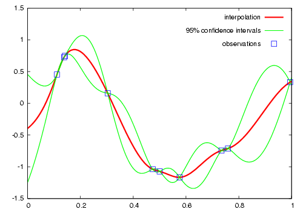
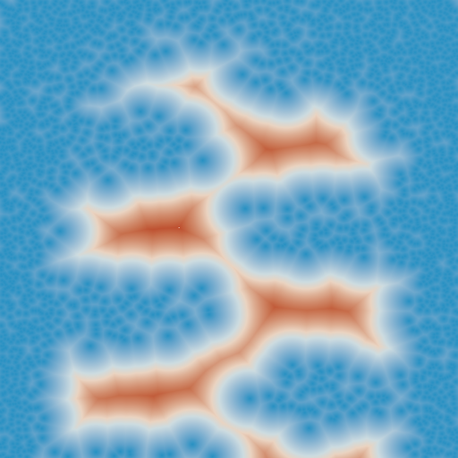
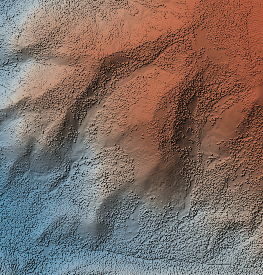
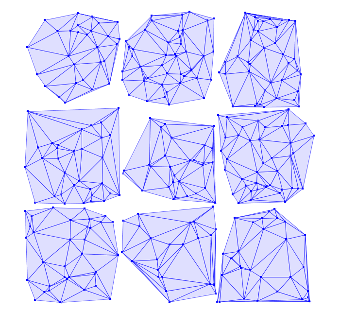
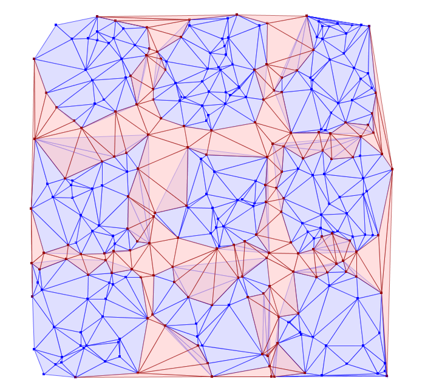
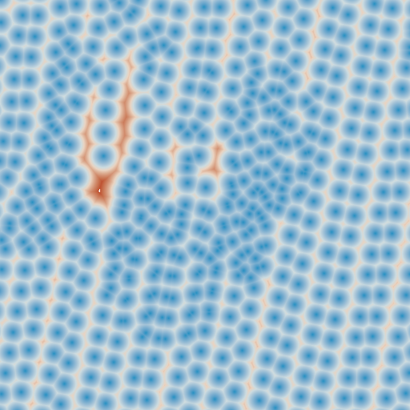
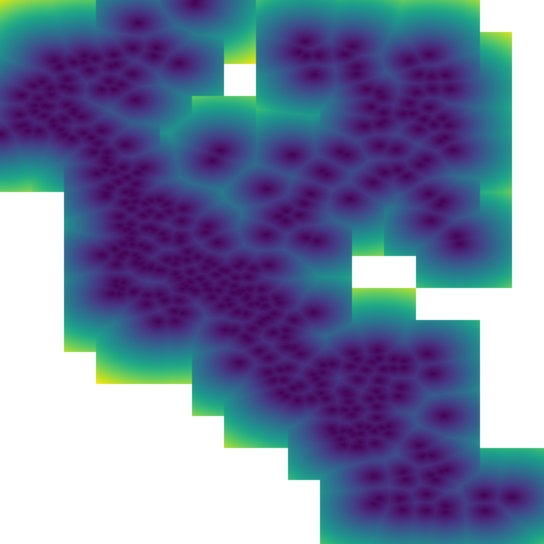

Using Vectors
*************

Numerical Precision and Topology Exceptions
===========================================

When doing any significant amount of geometric computation, there is the
potential of encountering JTS TopologyExceptions or other numerical hiccups
that arise, essentially, from asking too much of floating point numerical
representations.  JTS offers the ability to snap coordinates to a grid, the
scale of whose cells may be specified by the user.  This can often fix
problems stemming from numerical error which makes two points that should be
the same appear different due to miniscule rounding errors.

However, GeoTrellis defaults to allowing the full floating point
representation of coordinates.  To enable the fixed precision scheme, one must
create an ``application.conf`` in ``your-project/src/main/resources/``
containing the following lines:

::

   geotrellis.jts.precision.type="fixed"
   geotrellis.jts.precision.scale=<scale factor>

The scale factor should be ``10^x`` where ``x`` is the number of decimal
places of precision you wish to keep.  The default scale factor is 1e12,
indicating that 12 decimal places after the decimal point should be kept.
Values less than 1 (negative exponents) allow for very coarse grids.  For
example, a scale factor of 1e-2 will round coordinate components to the
nearest hundred.

Note that ``geotrellis.jts.precision.type`` make take on the value
``floating`` for the default double precision case, or ``floating_single`` to
use single precision floating point values.

Parsing GeoJson
===============

GeoTrellis includes good support for serializing and deserializing
geometry to/from GeoJson within the ``geotrellis.vector.io.json``
package. Utilizing these features requires some instruction, however,
since the interface may not be immediately apparent from the type
signatures.

Serializing to GeoJson
----------------------

All ``Geometry`` and ``Feature`` objects in ``geotrellis.vector`` have a
method extension providing a ``toGeoJson`` method. This means that:

.. code-block:: scala

    import geotrellis.vector.io._

    Polygon((10.0, 10.0), (10.0, 20.0), (30.0, 30.0), (10.0, 10.0)).toGeoJson

is valid, in this case yielding:

::

    {"type":"Polygon","coordinates":[[[10.0,10.0],[10.0,20.0],[30.0,30.0],[10.0,10.0]]]}

Issuing ``.toGeoJson`` on ``Feature`` instances, requires that the type
parameter supplied to the feature meets certain requirements. For
example, ``PointFeature(Point(0,0), 3)`` will succeed, but to tag a
Feature with arbitrary data, that data must be encapsulated in a case
class. That class must also be registered with the Json reading
infrastructure provided by ``spray``. The following example achieves
these goals:

.. code-block:: scala

    import geotrellis.vector.io.json._

    case class UserData(data: Int)
    implicit val boxedValue = jsonFormat1(UserData)

    PointFeature(Point(0,0), UserData(13))

Case classes with more than one argument would require the variants of
``jsonFormat1`` for classes of higher arity. The output of the above
snippet is:

::

    {"type":"Feature","geometry":{"type":"Point","coordinates":[0.0,0.0]},"properties":{"data":13}}

where the property has a single field named ``data``. Upon
deserialization, it will be necessary for the data member of the feature
to have fields with names that are compatible with the members of the
feature's data type.

This is all necessary underpinning, but note that it is generally
desirable to (de)serialize collections of features. The serialization
can be achieved by calling ``.toGeoJson`` on a ``Seq[Feature[G, T]]``.
The result is a Json representation of a FeatureCollection.

Deserializing from GeoJson
--------------------------

The return trip from a string representation can be accomplished by
another method extension provided for strings: ``parseGeoJson[T]``. The
only requirement for using this method is that the type of ``T`` must
match the contents of the Json string. If the Json string represents
some ``Geometry`` subclass (i.e., ``Point``, ``MultiPolygon``, etc),
then that type should be supplied to ``parseGeoJson``. This will work to
make the return trip from any of the Json strings produced above.

Again, it is generally more interesting to consider Json strings that
contain ``FeatureCollection`` structures. These require more complex
code. Consider the following Json string:

.. code-block:: scala

    val fc: String = """{
                       |  "type": "FeatureCollection",
                       |  "features": [
                       |    {
                       |      "type": "Feature",
                       |      "geometry": { "type": "Point", "coordinates": [1.0, 2.0] },
                       |      "properties": { "someProp": 14 },
                       |      "id": "target_12a53e"
                       |    }, {
                       |      "type": "Feature",
                       |      "geometry": { "type": "Point", "coordinates": [2.0, 7.0] },
                       |      "properties": { "someProp": 5 },
                       |      "id": "target_32a63e"
                       |    }
                       |  ]
                       |}""".stripMargin

Decoding this structure will require the use of either
``JsonFeatureCollection`` or ``JsonFeatureCollectionMap``; the former
will return queries as a ``Seq[Feature[G, T]]``, while the latter will
return a ``Map[String, Feature[G, T]]`` where the key is the ``id``
field of each feature. After calling:

.. code-block:: scala

    val collection = fc.parseGeoJson[JsonFeatureCollectionMap]

it will be necessary to extract the desired features from
``collection``. In order to maintain type safety, these results are
pulled using accessors such as ``.getAllPoints``,
``.getAllMultiLineFeatures``, and so on. Each geometry and feature type
requires the use of a different method call.

As in the case of serialization, to extract the feature data from this
example string, we must create a case class with an integer member named
``someProp`` and register it using ``jsonFormat1``.

.. code-block:: scala

    case class SomeProp(someProp: Int)
    implicit val boxedToRead = jsonFormat1(SomeProp)

    collection.getAllPointFeatures[SomeProp]

A Note on Creating JsonFeatureCollectionMaps
--------------------------------------------

It is straightforward to create FeatureCollection representations, as
illustrated above. Simply package your features into a ``Seq`` and call
``toGeoJson``. In order to name those features, however, it requires
that a JsonFeatureCollectionMap be explicitly created. For instance:

.. code-block:: scala

    val fcMap = JsonFeatureCollectionMap(Seq("bob" -> Feature(Point(0,0), UserData(13))))

Unfortunately, the ``toGeoJson`` method is not extended to
``JsonFeatureCollectionMap``, so we are forced to call
``fcMap.toJson.toString`` to get the same functionality. The return of
that call is:

.. code-block:: json

    {
      "type": "FeatureCollection",
      "features": [{
        "type": "Feature",
        "geometry": {
          "type": "Point",
          "coordinates": [0.0, 0.0]
        },
        "properties": {
          "data": 13
        },
        "id": "bob"
      }]
    }

Working with Vectors in Spark
=============================

While GeoTrellis is focused on working with raster data in spark,
we do have some functionality for working with vecto data in spark.

ClipToGrid
----------

If you have an ``RDD[Geometry]`` or ``RDD[Feature[Geometry, D]]``, you may want to
cut up the geometries according to ``SpatialKey`` s, so that you can join
that data to other raster or vector sources in an efficient way. To do this,
you can use the ``rdd.clipToGrid`` methods.

For example, if you want to read GeoTiffs on S3, and find the sum
of raster values under each of the polygons, you could use the following technique:

.. code-block:: scala

    import geotrellis.raster._
    import geotrellis.spark._
    import geotrellis.spark.tiling._
    import geotrellis.vector._

    import org.apache.spark.HashPartitioner
    import org.apache.spark.rdd.RDD

    import java.net.URI
    import java.util.UUID

    // The extends of the GeoTiffs, along with the URIs
    val geoTiffUris: RDD[Feature[Polygon, URI]] = ???
    val polygons: RDD[Feature[Polygon, UUID]] = ???

    // Choosing the appropriately resolute layout for the data is here considered a client concern.
    val layout: LayoutDefinition = ???

    // Abbreviation for the code to read the window of the GeoTiff off of S3
    def read(uri: URI, window: Extent): Raster[Tile] = ???

    val groupedPolys: RDD[(SpatialKey, Iterable[MultiPolygonFeature[UUID]])] =
      polygons
        .clipToGrid(layout)
        .flatMap { case (key, feature) =>
          val mpFeature: Option[MultiPolygonFeature[UUID]] =
            feature.geom match {
              case p: Polygon => Some(feature.mapGeom(_ => MultiPolygon(p)))
              case mp: MultiPolygon => Some(feature.mapGeom(_ => mp))
              case _ => None
            }
          mpFeature.map { mp => (key, mp) }
        }
        .groupByKey(new HashPartitioner(1000))

    val rastersToKeys: RDD[(SpatialKey, URI)] =
      geoTiffUris
        .clipToGrid(layout)
        .flatMap { case (key, feature) =>
          // Filter out any non-polygonal intersections.
          // Also, we will do the window read from the SpatialKey extent, so throw out polygon.
          feature.geom match {
            case p: Polygon => Some((key, feature.data))
            case mp: MultiPolygon => Some((key, feature.data))
            case _ => None
          }
        }

    val joined: RDD[(SpatialKey, (Iterable[MultiPolygonFeature[UUID]], URI))] =
      groupedPolys
        .join(rastersToKeys)

    val totals: Map[UUID, Long] =
      joined
        .flatMap { case (key, (features, uri)) =>
          val raster = read(uri, layout.mapTransform.keyToExtent(key))

          features.map { case Feature(mp, uuid) =>
            (uuid, raster.tile.polygonalSum(raster.extent, mp).toLong)
          }
        }
        .reduceByKey(_ + _)
        .collect
        .toMap

`Kriging Interpolation <https://en.wikipedia.org/wiki/Kriging>`__
=================================================================

Semivariograms
--------------

This method of interpolation is based on constructing Semivariograms.
For grasping the structure of spatial dependencies of the known
data-points, semivariograms are constructed.

First, the sample data-points' spatial structure to be captured is
converted to an empirical semivariogram, which is then fit to
explicit/theoretical semivariogram models.

Two types of Semivariograms are developed :

-  Linear Semivariogram
-  Non-Linear Semivariograms

Empirical Semivariogram
^^^^^^^^^^^^^^^^^^^^^^^

.. code-block:: scala

    //(The array of sample points)
    val points: Array[PointFeature[Double]] = ???

    /** The empirical semivariogram generation
      * "maxDistanceBandwidth" denotes the maximum inter-point distance relationship
      * that one wants to capture in the empirical semivariogram.
      */
    val es: EmpiricalVariogram = EmpiricalVariogram.nonlinear(points, maxDistanceBandwidth, binMaxCount)

The sample-data point used for training the Kriging Models are clustered
into groups(aka bins) and the data-values associated with each of the
data-points are aggregated into the bin's value. There are various ways
of constructing the bins, i.e. equal bin-size(same number of points in
each of the bins); or equal lag-size(the bins are separated from each
other by a certain fixed separation, and the samples with the
inter-points separation fall into the corresponding bins).

In case, there are outlier points in the sample data, the equal bin-size
approach assures that the points' influence is tamed down; however in
the second approach, the outliers would have to be associated with
weights (which is computationally more intensive).

The final structure of the empirical variogram has an array of tuples :

::

    (h, k)
    where h => Inter-point distance separation
          k => The variogram's data-value (used for covariogram construction)

Once the empirical semivariograms have been evaluated, these are fitted
into the theoretical semivariogram models (the fitting is carried out
into those models which best resemble the empirical semivariogram's
curve generate).

Linear Semivariogram
^^^^^^^^^^^^^^^^^^^^

::

    /** "radius" denotes the maximum inter-point distance to be
      * captured into the semivariogram
      * "lag" denotes the inter-bin distance
      */
    val points: Array[PointFeature[Double]] = ...
    val linearSV = LinearSemivariogram(points, radius, lag)

This is the simplest of all types of explicit semivariogram models and
does not very accurately capture the spatial structure, since the data
is rarely linearly changing. This consists of the points' being modelled
using simple regression into a straight line. The linear semivariogram
has linear dependency on the free variable (inter-point distance) and is
represented by:

``f(x) = slope * x + intercept``

Non-Linear Semivariogram
^^^^^^^^^^^^^^^^^^^^^^^^

.. code-block:: scala

    /**
      * ModelType can be any of the models from
      * "Gaussian", "Circular", "Spherical", "Exponential" and "Wave"
      */
    val points: Array[PointFeature[Double]] = ...
    val nonLinearSV: Semivariogram =
        NonLinearSemivariogram(points, 30000, 0, [[ModelType]])

Most often the empirical variograms can not be adequately represented by
the use of linear variograms. The non-linear variograms are then used to
model the empirical semivariograms for use in Kriging intepolations.
These have non-linear dependencies on the free variable (inter-point
distance).

In case the empirical semivariogram has been previously constructed, it
can be fitted into the semivariogram models by :

.. code-block:: scala

    val svSpherical: Semivariogram =
        Semivariogram.fit(empiricalSemivariogram, Spherical)

The popular types of Non-Linear Semivariograms are :

``(h in each of the function definition denotes the inter-point distances)``

Gaussian Semivariogram
^^^^^^^^^^^^^^^^^^^^^^

.. code-block:: scala

    // For explicit/theoretical Gaussian Semivariogram
    val gaussianSV: Semivariogram =
        NonLinearSemivariogram(range, sill, nugget, Gaussian)

The formulation of the Gaussian model is :

::

                        | 0                                 , h = 0
    gamma(h; r, s, a) = |
                        | a + (s - a) {1 - e^(-h^2 / r^2)}  , h > 0

Circular Semivariogram
^^^^^^^^^^^^^^^^^^^^^^

.. code-block:: scala

    //For explicit/theoretical Circular Semivariogram
    val circularSV: Semivariogram =
        NonLinearSemivariogram(range, sill, nugget, Circular)

::

                          | 0                                                                        , h = 0
                          |
                          |               |                                              _________ |
                          |               |      2                | h |      2h         /    h^2   |
      gamme(h; r, s, a) = | a + (s - a) * |1 - ----- * cos_inverse|---| + -------- *   /1 - -----  | , 0 < h <= r
                          |               |      pi               | r |    pi * r    \/      r^2   |
                          |               |                                                        |
                          |
                          | s                                                                        , h > r

Spherical Semivariogram
^^^^^^^^^^^^^^^^^^^^^^^

.. code-block:: scala

    // For explicit/theoretical Spherical Semivariogram
    val sphericalSV: Semivariogram = NonLinearSemivariogram(range, sill, nugget, Spherical)

::

                        | 0                             , h = 0
                        |             | 3h      h^3   |
    gamma(h; r, s, a) = | a + (s - a) |---- - ------- | , 0 < h <= r
                        |             | 2r     2r^3   |
                        | s                             , h > r

Exponential Semivariogram
^^^^^^^^^^^^^^^^^^^^^^^^^

.. code-block:: scala

    // For explicit/theoretical Exponential Semivariogram
    val exponentialSV: Semivariogram = NonLinearSemivariogram(range, sill, nugget, Exponential)

::

                        | 0                                  , h = 0
    gamma(h; r, s, a) = |
                        | a + (s - a) {1 - e^(-3 * h / r)}   , h > 0

Wave Semivariogram
^^^^^^^^^^^^^^^^^^

.. code-block:: scala

    //For explicit/theoretical Exponential Semivariogram
    //For wave, range (viz. r) = wave (viz. w)
    val waveSV: Semivariogram =
        NonLinearSemivariogram(range, sill, nugget, Wave)

::

                         | 0                                 , h = 0
                         |
     gamma(h; w, s, a) = |             |       sin(h / w)  |
                         | a + (s - a) |1 - w ------------ | , h > 0
                         |             |           h       |

Notes on Semivariogram fitting
^^^^^^^^^^^^^^^^^^^^^^^^^^^^^^

The empirical semivariogram tuples generated are fitted into the
semivariogram models using `Levenberg Marquardt
Optimization <https://en.wikipedia.org/wiki/Levenberg%E2%80%93Marquardt_algorithm>`__.
This internally uses jacobian (differential) functions corresponding to
each of the individual models for finding the optimum range, sill and
nugget values of the fitted semivariogram.

.. code-block:: scala

    // For the Spherical model
    val model: ModelType = Spherical
    valueFunc(r: Double, s: Double, a: Double): (Double) => Double =
        NonLinearSemivariogram.explicitModel(r, s, a, model)

The Levenberg Optimizer uses this to reach to the global minima much
faster as compared to unguided optimization.

In case, the initial fitting of the empirical semivariogram generates a
negative nugget value, then the process is re-run after forcing the
nugget value to go to zero (since mathematically, a negative nugget
value is absurd).

Kriging Methods
---------------

Once the semivariograms have been constructed using the known point's
values, the kriging methods can be invoked.

The methods are largely classified into different types in the way the
mean(mu) and the covariance values of the object are dealt with.

::

    //Array of sample points with given data
    val points: Array[PointFeature[Double]] = ...

    //Array of points to be kriged
    val location: Array[Point] = ...

There exist four major kinds of Kriging interpolation techniques, namely
:

Simple Kriging
^^^^^^^^^^^^^^

.. code-block:: scala

    //Simple kriging, tuples of (prediction, variance) per prediction point
    val sv: Semivariogram = NonLinearSemivariogram(points, 30000, 0, Spherical)

    val krigingVal: Array[(Double, Double)] =
        new SimpleKriging(points, 5000, sv)
          .predict(location)
    /**
      * The user can also do Simple Kriging using :
      * new SimpleKriging(points).predict(location)
      * new SimpleKriging(points, bandwidth).predict(location)
      * new SimpleKriging(points, sv).predict(location)
      * new SimpleKriging(points, bandwidth, sv).predict(location)
      */

It belongs to the class of Simple Spatial Prediction Models.

The simple kriging is based on the assumption that the underlying
stochastic process is entirely *known* and the spatial trend is
constant, viz. the mean and covariance values of the entire
interpolation set is constant (using solely the sample points)

::

    mu(s) = mu              known; s belongs to R
    cov[eps(s), eps(s')]    known; s, s' belongs to R

Ordinary Kriging
^^^^^^^^^^^^^^^^

.. code-block:: scala

    //Ordinary kriging, tuples of (prediction, variance) per prediction point
    val sv: Semivariogram = NonLinearSemivariogram(points, 30000, 0, Spherical)

    val krigingVal: Array[(Double, Double)] =
        new OrdinaryKriging(points, 5000, sv)
          .predict(location)
    /**
      * The user can also do Ordinary Kriging using :
      * new OrdinaryKriging(points).predict(location)
      * new OrdinaryKriging(points, bandwidth).predict(location)
      * new OrdinaryKriging(points, sv).predict(location)
      * new OrdinaryKriging(points, bandwidth, sv).predict(location)
      */

It belongs to the class of Simple Spatial Prediction Models.

This method differs from the Simple Kriging appraoch in that, the
constant mean is assumed to be unknown and is estimated within the
model.

::

    mu(s) = mu              unknown; s belongs to R
    cov[eps(s), eps(s')]    known; s, s' belongs to R

Universal Kriging
^^^^^^^^^^^^^^^^^

.. code-block:: scala

    //Universal kriging, tuples of (prediction, variance) per prediction point

    val attrFunc: (Double, Double) => Array[Double] = {
      (x, y) => Array(x, y, x * x, x * y, y * y)
    }

    val krigingVal: Array[(Double, Double)] =
        new UniversalKriging(points, attrFunc, 50, Spherical)
          .predict(location)
    /**
      * The user can also do Universal Kriging using :
      * new UniversalKriging(points).predict(location)
      * new UniversalKriging(points, bandwidth).predict(location)
      * new UniversalKriging(points, model).predict(location)
      * new UniversalKriging(points, bandwidth, model).predict(location)
      * new UniversalKriging(points, attrFunc).predict(location)
      * new UniversalKriging(points, attrFunc, bandwidth).predict(location)
      * new UniversalKriging(points, attrFunc, model).predict(location)
      * new UniversalKriging(points, attrFunc, bandwidth, model).predict(location)
      */

It belongs to the class of General Spatial Prediction Models.

This model allows for explicit variation in the trend function (mean
function) constructed as a linear function of spatial attributes; with
the covariance values assumed to be known.

For example if :

::

    x(s) = [1, s1, s2, s1 * s1, s2 * s2, s1 * s2]'
    mu(s) = beta0 + beta1*s1 + beta2*s2 + beta3*s1*s1 + beta4*s2*s2 + beta5*s1*s2

Here, the "linear" refers to the linearity in parameters (beta).

::

    mu(s) = x(s)' * beta,   beta unknown; s belongs to R
    cov[eps(s), eps(s')]    known; s, s' belongs to R

The ``attrFunc`` function is the attribute function, which is used for
evaluating non-constant spatial trend structures. Unlike the Simple and
Ordinary Kriging models which rely only on the residual values for
evaluating the spatial structures, the General Spatial Models may be
modelled by the user based on the data (viz. evaluating the beta
variable to be used for interpolation).

In case the user does not specify an attribute function, by default the
function used is a quadratic trend function for Point(s1, s2) :

``mu(s) = beta0 + beta1*s1 + beta2*s2 + beta3*s1*s1 + beta4*s2*s2 + beta5*s1*s2``

General example of a trend function is :

``mu(s) = beta0 + Sigma[ beta_j * (s1^n_j) * (s2^m_j) ]``

An elaborate example for understanding the ``attrFunc`` is mentioned in
the readme file in ``geotrellis.raster.interpolation`` along with
detailed illustrations.

Geostatistical Kriging
^^^^^^^^^^^^^^^^^^^^^^

.. code-block:: scala

    //Geostatistical kriging, tuples of (prediction, variance) per prediction point
    val attrFunc: (Double, Double) => Array[Double] = {
      (x, y) => Array(x, y, x * x, x * y, y * y)
    }

    val krigingVal: Array[(Double, Double)] =
        new GeoKriging(points, attrFunc, 50, Spherical)
          .predict(location)
    /**
      * Geostatistical Kriging can also be done using:
      * new GeoKriging(points).predict(location)
      * new GeoKriging(points, bandwidth).predict(location)
      * new GeoKriging(points, model).predict(location)
      * new GeoKriging(points, bandwidth, model).predict(location)
      * new GeoKriging(points, attrFunc).predict(location)
      * new GeoKriging(points, attrFunc, bandwidth).predict(location)
      * new GeoKriging(points, attrFunc, model).predict(location)
      * new GeoKriging(points, attrFunc, bandwidth, model).predict(location)
      */

It belongs to the class of General Spatial Prediction Models.

This model relaxes the assumption that the covariance is known. Thus,
the beta values and covariances are simultaneously evaluated and is
computationally more intensive.

::

    mu(s) = x(s)' * beta,   beta unknown; s belongs to R
    cov[eps(s), eps(s')]    unknown; s, s' belongs to R

Delaunay Triangulations, Voronoi Diagrams, and Euclidean Distance
=================================================================

When working with vector data, it is often necessary to establish sensible
interconnections among a collection of discrete points in ℝ² (the Euclidean
plane).  This operation supports nearest neighbor operations, linear
interpolation among irregularly sampled data, and Euclidean distance, to name
only a few applications.

For this reason, GeoTrellis provides a means to compute the Delaunay
triangulation of a set of points.  Letting 𝒫 be the input set of points, the
Delaunay triangulation is a partitioning of the convex hull of 𝒫 into
triangular regions (a partition that completely covers the convex hull with no
overlaps).  Each triangle, ``T``, has a unique circle passing through all of
its vertices that we call the *circumscribing circle* of ``T``.  The defining
property of a Delaunay triangulation is that each ``T`` has a circumscribing
circle that contains no points of 𝒫 in their interiors (note that the vertices
of ``T`` are on the boundary of the circumscribing circle, not in the
interior).

.. image:: https://upload.wikimedia.org/wikipedia/commons/d/db/Delaunay_circumcircles_vectorial.svg
   :alt: A Delaunay triangulation in the plane with circumcircles shown
   :target: https://en.wikipedia.org/wiki/Delaunay_triangulation#/media/File:Delaunay_circumcircles_vectorial.svg
   :align: center

Among the most important properties of a Delaunay triangulation is its
relationship to the Voronoi diagram.  The Voronoi diagram is another
partitioning of ℝ² based on the points in 𝒫.  This time, the partitioning is
composed of convex polygonal regions—one for each point in 𝒫—that completely
cover the plane (some of the convex regions are half open, which is to say
that they may extend to infinity in certain directions).  The Delaunay
triangulation of 𝒫 is the *dual* to the Voronoi diagram of 𝒫.  This means that
elements of the Delaunay triangulation have a one-to-one correspondence with
the elements of the Voronoi diagram.  Letting ``DT(𝒫)`` be the Delaunay
triangulation of 𝒫 and ``V(𝒫)`` be the Voronoi diagram of 𝒫, we have that each
vertex 𝓅 of ``DT(𝒫)`` corresponds to a polygonal region of ``V(𝒫)`` (called
the *Voronoi cell* of 𝓅), each edge to an edge, and each triangle to a vertex.
The number of edges emanating from a vertex in ``DT(𝒫)`` gives the number of
sides of the corresponding polygonal region in ``V(𝒫)``.  The corresponding
edges of each structure are perpendicular. The Voronoi vertex corresponding to
a triangle of ``DT(𝒫)`` is the center of that triangle's circumscribing
circle.  And if there are no more than 3 points of 𝒫 lying on any circle in
the plane (a condition called *general position*), then there are no more than
3 edges emanating from any vertex of ``V(𝒫)``, which matches the number of
sides in each planar region of ``DT(𝒫)``.  (If we are not in general
position, not all vertices of ``V(𝒫)`` will be distinct and some Voronoi edges
may have zero length.)

.. image:: http://www.ae.metu.edu.tr/tuncer/ae546/prj/delaunay/dt.gif
   :alt: Voronoi cells are drawn with dashed edges, the Delaunay triangulation
         with solid edges
   :target: http://www.ae.metu.edu.tr/tuncer/ae546/prj/delaunay/
   :align: center

The dual relationship between ``DT(𝒫)`` and ``V(𝒫)`` is important because it
means that we may compute whichever structure that is easiest and simply
derive the other in a straightforward manner.  As it happens, it is generally
easier to compute Delaunay triangulations, and we have implemented a very fast
method for doing just that.  Specifically, we employ the divide-and-conquer
approach to computing the Delaunay triangulation based on Guibas and Stolfi's
1985 ACM Transactions on Graphics paper.

Mesh Representation
-------------------

Delaunay triangulations are represented using half edges, a common data
structure for encoding polygonal meshes.  Half edges are so called because,
when attempting to represent an edge from vertex ``A`` to vertex ``B``, we
require two complementary half edges: one pointing to ``A`` and one pointing
to ``B``.  Half edges are connected into *loops*, one for each face in the
mesh; so given a half edge, the loop may be iterated over.  Surprisingly,
these three pieces of information are enough to create a mesh that can be
easily navigated, though the class of meshes that may be represented are
limited to orientable (having an inside and an outside—i.e., no Möbius
strips), manifold surfaces (for any point on the surface, the intersection of
a small 3-d ball around the point and the surface is a disc—i.e., no more than
two faces share an edge, faces sharing a vertex must be contiguous).  We also
take on the convention that when viewed from the "outside" of the surface, the
edges of a loop traverse the facet vertices in counterclockwise order.  But
note that if a mesh has a boundary, as is the case with Delaunay
triangulations, there is a boundary loop that navigates the vertices of the
boundary in clockwise order.

.. figure:: images/halfedge.png
   :align: center

There are two means to represent a half edge mesh in GeoTrellis: the
object-based HalfEdge structure, and the faster, more space efficient, but
less generic HalfEdgeTable structure.  The latter constitutes the core of our
mesh structures, but the former has some uses for small-scale applications for
intrepid users.

Delaunay Triangulations
-----------------------

The intent for our DelaunayTriangulation implementation is that we be able to
easily handle triangulations over 10s or 100s of millions of points (though
the latter scale especially may require distribution via Spark to do so in a
reasonable time/memory envelope).  Smaller scale applications can easily
compute Delaunay triangulations of arrays of JTS Coordinates (GeoTrellis
Points are too heavyweight given the scale of our intended applications,
though they may be converted to Coordinates via ``_.jtsGeom.getCoordinate``)
using our method extensions:

.. code-block:: scala

   val coordinates: Array[Coordinate] = ???
   val triangulation = coordinates.delaunayTriangulation

``DelaunayTriangulation`` objects contain a field ``halfEdgeTable`` of type
``HalfEdgeTable`` which can be used to interrogate the mesh structure.  It is,
however, necessary to have an entry point into this structure.  Typically, we
either use the ``boundary`` field of the triangulation object, or we call
``triangulation.halfEdgeTable.edgeIncidentTo(v)``, where ``v`` is the index of
a vertex (``triangulation.liveVertices`` gives a ``Set[Int]`` listing the
indices of vertices present in the triangulation).  From there, the standard
half edge navigation operations are available:

.. code-block:: scala

   import triangulation.halfEdgeTable._

   e = edgeIncidentTo(???)

   getFlip(e)                                 // Returns the complementary half edge of e
   assert(e == getFlip(getFlip(e)))           // Identity regarding complementary edges
   assert(getSrc(e) == getDest(getFlip(e)))   // Vertices of half edges are sane

   getNext(e)                                 // Returns the next half edge in the triangle
   assert(e == getNext(getNext(getNext(e))))  // True if e is an edge of a triangle
   assert(getPrev(e) == getNext(getNext(e))   // True if e is an edge of a triangle

   assert(rotCWSrc(e) == getNext(getFlip(e))  // Find the edge next in clockwise order
                                              // around the source vertex of e
                                              // sharing the same destination vertex

See the HalfEdgeTable documentation for more details.

Finally, triangulations obviously contain triangles.  For ease of use,
triangulation objects have a ``triangles`` field (or method) which return a
``Seq[(Int, Int, Int)]`` containing triples of vertex indices that are the
vertices of all the triangles in the triangulation (the indices are listed in
counterclockwise order).

Simplification
^^^^^^^^^^^^^^

When the Coordinates composing a triangulation have a meaningful z-coordinate,
it may be of interest to reduce the number of points in the mesh
representation while inflicting the smallest amount of change to the surface.
We accomplish this by sorting vertices according to their error, which is
derived from a quadric error metric (see Garland, Michael, and
Paul S. Heckbert. "Surface simplification using quadric error metrics."
Proceedings of the 24th annual conference on Computer graphics and interactive
techniques. ACM Press/Addison-Wesley Publishing Co., 1997).  We remove the
vertices with the smallest error using a Delaunay-preserving vertex removal,
and iteratively apply this process until a desired number of vertices are
removed.

Voronoi Diagrams
----------------

As mentioned, a Voronoi diagram is directly derived from a
DelaunayTriangulation object.  The VoronoiDiagram class is a thin veneer that
exists only to extract the polygonal Voronoi cells corresponding to each
vertex.  Because of the possibility of unbounded Voronoi cells around the
boundaries of the Delaunay triangulation, we have opted to specify an extent
at the time of construction of the VoronoiDiagram to which all the Voronoi
cells will be clipped.  Voronoi cells may be gathered individually, or all at
once.  These cells may also be collected with or without their corresponding
point from the initial point set.

Euclidean Distance and Interpolation
------------------------------------

A strong motivation for implementing Delaunay triangulations is to be able to
furnish certain vector-to-raster operations.

EuclideanDistance allows us to build a raster where each tile cell contains
the distance from that cell to the closest point in a point set.  This is
accomplished by rasterizing Voronoi cells using a distance function.
Euclidean distance tiles may be computed using either the
``coordinates.euclideanDistance(re: RasterExtent)`` method extension or the
``EuclideanDistanceTile(re: RasterExtent)`` apply method.

The other main class of vector-to-raster functions enabled by Delaunay
triangulations is linear interpolation of unstructured samples from some
function.  We use the z-coordinate of our input points to store a Double
attribute for each point, and we rasterize the Delaunay triangles to produce
the final interpolation.  The most obvious candidate is to use the
z-coordinates to indicate the elevation of points on the globe; the
rasterization of these values is a digital elevation map.  This is the TIN
algorithm for DEM generation.  Using this method, we would apply one of the
methods in ``geotrellis.raster.triangulation.DelaunayRasterizer``.

(The above image has been hillshaded to better show the detail in the
elevation raster.)

The major advantage of using triangulations to interpolate is that it more
gracefully handles areas with few or no samples, in contrast to a method such
as inverse distance weighted interpolation, a raster-based technique.  This is
common when dealing with LiDAR samples that include water, which has spotty
coverage due to the reflectance of water.

Distributed Computation
-----------------------

Among the design goals for this package was the need to handle extremely large
point sets—on the order of 100s of millions of points.  To accomplish this
end, we opted for a distributed solution using Spark.  Generally speaking,
this interface will require the user to cut the incoming point set according
to some LayoutDefinition into an ``RDD[(SpatialKey, Array[Coordinate])]``.
After triangulating each grid cell individually, facilities are provided to
join the results—though in certain cases, the results will not be as expected
(see Known Limitations below).

Given an ``RDD[(SpatialKey, DelaunayTriangulation)]``, one is meant to apply
the ``collectNeighbors()`` method to generate a map of nearby grid cells,
keyed by ``geotrellis.util.Direction``.  These maps are then taken as input to
StitchedDelaunay's apply method.  This will join a 3x3 neighborhood of
triangulations into a single triangulation by creating new triangles that fill
in the gaps between the component triangulations.  For instance, if we begin
with the following collection of triangulations

The stitch operation creates the stitch triangles shown in red below:

Notice that the stitch triangles overlap the base triangulations.  This is
expected since not all the base triangles are Delaunay with respect to the
merged triangulation.  Also keep in mind that in its current incarnation,
StitchedDelaunay instances' ``triangles`` element contains only these fill
triangles, not the triangles of the base triangulations.

Because the interior of these base triangulations is often not needed, and
they can be very large structures, to reduce shuffle volume during the
distributed operation, we introduced the BoundaryDelaunay structure.  These
are derived from DelaunayTriangulations and an extent that entirely contains
the triangulation, and inside which no points will be added in a subsequent
stitch operation.  The BoundaryDelaunay object will be a reduced mesh where
the interior is empty.  This is for context, as it is not recommended to
interact with BoundaryDelaunay objects directly; that way madness lies.
Nonetheless, it is an important operation to include due to the massive memory
savings and reduced network traffic.

The immediate application of StitchedDelaunay is the ability to perform both
EuclideanDistance and interpolation tasks in a distributed context.  We
provide the ``euclideanDistance(ld: LayoutDefinition)`` method extension
taking an ``RDD[(SpatialKey, Array[Coordinate])]`` to an ``RDD[(SpatialKey,
Tile)]`` (also available as the apply method on the ``EuclideanDistance``
object in the ``geotrellis.spark.distance`` package).  The following image is
one tile from such a Euclidean distance RDD.  Notice that around the tile
boundary, we are seeing the influence of points from outside the tile's
extent.

Keep in mind that one can rasterize non-point geometries as the basis for
generic Euclidean distance computations, though this might start to be cost
prohibitive if there are many polygonal areas in the input set.

Known Limitations
^^^^^^^^^^^^^^^^^

When designing this component, our aim was to handle the triangulation of
dense, very large clouds of points with only small regions (relative to the
layout definition) without any samples.  That is to say, if there are
occasional, isolated SpatialKeys that have no points, there is unlikely to be
a problem.  Multiple contiguous SpatialKeys with no points may cause
problems.  Specifically, in the case of Euclidean distance, if a tile has
influence from outside the 3x3 area, there is likely to be errors.  In the
best case, there will be missing tiles, in the worst case, the Euclidean
distance will simply be incorrect in certain areas.

In this example, one can see that there are clear discontinuities in the
values along some tile boundaries.  The upshot is that these erroneous tiles
are generated when ``(SpatialKey(c, r), Array.empty[Coordinate])`` is included
in the source RDD.  If the spatial key is simply not present, no tile will be
generated at that location, and the incidence of erroneous tiles will be
reduced, though not necessarily eliminated.

In cases where the point sample is small enough to be triangulated efficiently
on a single node, we recommend using
``geotrellis.spark.distance.SparseEuclideanDistance`` to produce the Euclidean
distance tiles.  This will produce the desired result.

Numerical Issues
----------------

When dealing with large, real-world point sets (particularly LiDAR data), one
is likely to encounter triangulation errors that arise from numerical issues.
We have done our best to be conscious of the numerical issues that surround
these triangulation operations, including porting Jonathan Shewchuk's robust
predicates to Java, and offering some sensible numerical thresholds and
tolerance parameters (not always accessible from the interface).
Specifically, the DelaunayTriangulation object allows a distance threshold to
be set, defining when two points are considered the same (only one will be
retained, with no means of allowing the user to select which one).

The two most common errors will arise from points that are too close together
for the numerical predicates to distinguish them, but too far apart to be
considered a single point. Notably, during distributed tasks, this will
produce stitch triangles which overlap the patches being joined.  These errors
arise from a known place in the code and can be dealt with by altering
numerical thresholds, but there is currently no handle in the interface for
setting these values.
