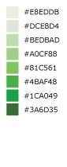
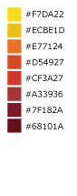
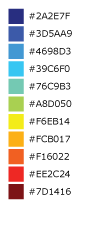
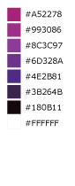

# Raster Rendering

## Rendering Common Image Formats
At some point, you'll want to output a visual representation of the
tiles you're processing. Likely, that's why you're reading this bit of
documentation. Luckily enough, geotrellis provides some methods which
make the process as painless as possible. Currently, both PNG and JPG
formats are supported.

To begin writing your tiles out as PNGs and JPGs, there are just a
few things to keep in mind. As elsewhere throughout geotrellis, the
functionality in this module is added through implicit class extension.
`import geotrellis.raster._` will import the necessary methods off of the
core types like `renderToPng`, and the the types like `ColorRamp` and `ColorMap`
live in `geotrellis.raster.render`.

#### First Steps
Let's say that the tile you've got is an integer tile and that the
integers in it are all *actually* hex codes for RGBA colors. In this
case, your task is nearly complete. The following code should be
sufficient:

```scala
import geotrellis.raster._

// Generate the tile - let's paint it red with #FF0000FF
// (red = 0xFF or 255; green = 0x00 or 0; blue = 0x00 or 0; and alpha = 0xFF or 255, which is completely opaque)
val hexColored: IntArrayTile = IntArrayTile.fill(0xFF0000FF, 100, 100)

// Making a PNG
val png: Png = hexColored.renderPng

// JPG variation
val jpg: Jpg = hexColorsHere.renderJpg
```

A `Png` and `Jpg` type represent the `Array[Byte]` that is the binary
encoding of the image. You can get to the bytes by calling the
`bytes` property, e.g. `png.bytes` or `jpg.bytes`. It's useful to use
the bytes directly if you are, say, returning PNG data from a web service.
These image format types also have a `write` method that can be called
to write that array of bytes to the file system, therefore writing out
a `PNG` or `JPG` representation of our `Tile` to the filesystem.

Clearly this won't suffice for the majority of use-cases. In general,
you're more likely to be working on tiles whose cells encode information
having only an incidental relation to human vision. In these cases,
you'll need to tell `renderPng` and `renderJpg` how the values in your
tile relate to the colors you'd like in your image. To this end, there
are arguments you can provide to the render method which
will tell geotrellis how to color cells for your tile.

## ColorRamp

A ColorRamp describes a range of colors that can be used to paint values of a tile.
You can use a built-in color ramp, or construct one with your own palette with the API described below.

### Built-in color ramps

GeoTrellis provides built-in color ramps in the `ColorRamps` object.
These are provided to ease the transition from developer to cartographer.
However, you need not feel constrained by these and can use your own color palettes as well.
There are many good resources online for selecting color ramps.


#### Diverging Color Schemes

   

_From left to right_

##### Blue to Orange
An 11-step diverging color ramp from blue to gray to orange.
The gray critical class in the middle clearly shows a median or zero value. Example uses include temperature, climate, elevation, or other color ranges where it is necessary to distinguish categories with multiple hues.

##### Blue to Red
A 10-step diverging color ramp from blue to red.
Example uses include elections and politics, voter swing, climate or temperature, or other color ranges where it is necessary to distinguish categories with multiple hues.

##### Green to Red-Orange
A 10-step diverging color ramp from green to red-orange.
Example uses include elections and politics, voter swing, climate or temperature, or other color ranges where it is necessary to distinguish categories with multiple hues.

##### Green to Orange
A 13-step diverging color ramp from green to orange.
Example uses include elevation, relief maps, topography, or other color ranges where it is necessary to distinguish categories with multiple hues.

#### Sequential Color Schemes

     

_From left to right_

##### Light to Dark - Sunset
An 11-step sequential color ramp showing intensity from light to dark.
This color ramp is perfect for showing density where it is critical to highlight very different values with bold colors at the higher, darker end of the ramp.
Example uses include population density, accessibility, or ranking.

##### Light to Dark - Green
A basic 8-step sequential color ramp showing light to dark in shades of green.
Example uses include density, ordered data, ranking, or any map where darker colors represent higher data values and lighter colors represent lower data values, generally.

##### Yellow to Red - Heatmap
An 8-step sequential heatmap from yellow to dark red.
Great for heatmaps on a light basemap where the hottest values are more opaque or dark.
Also useful for sequential color ranges where the lowest value is the median or zero value.

##### Blue to Yellow to Red Spectrum - Heatmap
An 11-step heatmap from blue to yellow to red.
Great for showing a wide range of values with clear differences in hue.

##### Dark Red to Yellow-White - Heatmap
A 10-step sequential heatmap from dark red to yellow to white.
Great for heatmaps where the hottest values should look more vibrant or intense.

##### Light Purple to Dark Purple to White
An 8-step sequential heatmap to show intensity with shades of purple with white as the "hottest" value.
Great for light or gray basemaps, or where the highest value needs to be called out visually.

#### Qualitative or Categorical Schemes

 

_From left to right_

##### Bold Land Use
An 8-hue qualitative scheme used to show a clear difference in categories that are unordered or very different.
Example uses include zoning, land use, land cover, or maps where all categories or groups are equal in visual strength/magnitude.

##### Muted Terrain
An 8-hue qualitative scheme used to show different kinds of map topology or features.
This is generally used to show landforms, terrain, and topology.

### Custom Color Ramps

You can create your own color ramp with a list of integar values, constructed using our RBG or RGBA helper objects.

```scala
val colorRamp =
  ColorRamp(
    RGB(0,255,0),
    RGB(63, 255 ,51),
    RGB(102,255,102),
    RGB(178, 255,102),
    RGB(255,255,0),
    RGB(255,255,51),
    RGB(255,153, 51),
    RGB(255,128,0),
    RGB(255,51,51),
    RGB(255,0,0)
  )
```

You can also do things like set the number of stops in a gradient between colors, and set an alpha gradient.
This example sets a 100 color stops that interpolates colors between red and blue, with an alpha
value that starts at totally opaque for the red values, and ends at 0xAA alpha for blue values:

```scala
val colorRamp =
      ColorRamp(0xFF0000FF, 0x0000FFFF)
        .stops(100)
        .setAlphaGradient(0xFF, 0xAA)
```

There are many online and offline resources for generating color palettes for cartography including:

- [ColorBrewer 2.0](http://colorbrewer2.org/js/)
- [Cartographer’s Toolkit: Colors, Typography, Patterns](http://www.amazon.com/Cartographers-Toolkit-Colors-Typography-Patterns/dp/0615467946), by Gretchen N. Peterson
- [Designing Better Maps](http://www.amazon.com/Designing-Better-Maps-Guide-Users/dp/1589480899/), by Cynthia A. Brewer
- [Designed Maps: A Sourcebook](http://www.amazon.com/Designed-Maps-Sourcebook-GIS-Users/dp/1589481607/), by Cynthia A. Brewer

RGBA vs RGB values
------------------

One way to represent a color is as an RGB hex value, as often seen in CSS or graphics programs. For example, the color red is represented by #FF0000 (or, in scala, 0xFF0000).

Internally to GeoTrellis, colors are represented as RGBA values, which includes a value for transparency. These can be represented with 8 instead of 6 hex characters (with the alpha opacity value being the last two charcters) such as 0xFF0000FF for opaque red. When using the programming interface, just be sure to keep the distinction in mind.

You can create RGB and RGBA colors in a variety of ways:

```scala
import geotrellis.raster.render._

val color1: Int = RGB(r = 255, g = 170, b = 85)
val color2: Int = RGBA(0xFF, 0xAA, 0x55, 0xFF)
val color3: Int = 0xFFAA55FF
assert(color1 == color2 && color2 == color3)
```

## ColorMap

A `ColorMap` is what actually determines how the values of a tile to colors.
It constitutes a mapping between class break values and color stops, as well as some options that
determine how to color raster values.

### ColorMap Options
The options available for a ColorMap are a class boundary type,
which determines how those class break values (one of `GreaterThan`, `GreaterThanOrEqualTo`, `LessThan`, `LessThanOrEqualTo`, or `Exact`),
an option that defines what color NoData values should be colored, as well as an option for a "fallback" color,
which determines the color of any value that doesn't fit to the color map. Also, if the `strict` option is true,
then no fallback color is used, and the code will throw an exception if a value does not fit the color map.
The default values of these options are:
```scala
val colorMapDefaultOptions =
  ColorMap.Options(
    classBoundaryType = LessThan,
    noDataColor = 0x00000000, // transparent
    fallbackColor = 0x00000000, // transparent
    strict = false
  )
```

To examplify the options, let's look at how two different color ramps will color values.

```scala
import geotrellis.render._

// Constructs a ColorMap with default options,
// and a set of mapped values to color stops.
val colorMap1 =
  ColorMap(
    Map(
      3.5 -> RGB(0,255,0),
      7.5 -> RGB(63,255,51),
      11.5 -> RGB(102,255,102),
      15.5 -> RGB(178,255,102),
      19.5 -> RGB(255,255,0),
      23.5 -> RGB(255,255,51),
      26.5 -> RGB(255,153,51),
      31.5 -> RGB(255,128,0),
      35.0 -> RGB(255,51,51),
      40.0 -> RGB(255,0,0)
    )
  )

// The same color map, but this time considering the class boundary type
// as GreaterThanOrEqualTo, and with a fallback and nodata color.
val colorMap2 =
  ColorMap(
    Map(
      3.5 -> RGB(0,255,0),
      7.5 -> RGB(63,255,51),
      11.5 -> RGB(102,255,102),
      15.5 -> RGB(178,255,102),
      19.5 -> RGB(255,255,0),
      23.5 -> RGB(255,255,51),
      26.5 -> RGB(255,153,51),
      31.5 -> RGB(255,128,0),
      35.0 -> RGB(255,51,51),
      40.0 -> RGB(255,0,0)
    ),
  ColorMap.Options(
    classBoundaryType = GreaterThanOrEqualTo,
    noDataColor = 0xFFFFFFFF,
    fallbackColor = 0xFFFFFFFF
  )
)
```

If we were to use the `mapDouble` method of the color maps to find color values of the following points, we'd see the following:

```scala
scala> colorMap1.mapDouble(2.0) == RGB(0, 255, 0)
res1: Boolean = true

scala> colorMap2.mapDouble(2.0) == 0xFFFFFFFF
res2: Boolean = true
```

Because `colorMap1` has the `LessThan` class boundary type, `2.0` will map to the color value of `3.5`.
However, because `colorMap2` is based on the `GreaterThanOrEqualTo` class boundary type, and `2.0` is not
greater than or equal to any of the mapped values, it maps `2.0` to the `fallbackColor`.

```scala
scala> colorMap1.mapDouble(23.5) == RGB(255,153,51)
res4: Boolean = true

scala> colorMap2.mapDouble(23.5) == RGB(255,255,51)
res5: Boolean = true
```

If we map a value that is on a class border, we can see that the `LessThan` color map maps the
to the lowest class break value that our value is still less than (`26.5`), and for the
`GreaterThanOrEqualTo` color map, since our value is equal to a class break value, we return
the color associated with that value.

### Creating a ColorMap based on Histograms

One useful way to create ColorMaps is based on a `Histogram` of a tile.
Using a histogram, we can compute the quantile breaks that match up to
the color stops of a `ColorRamp`, and therefore paint a tile
based on quantiles instead of something like equal intervals.
You can use the `fromQuantileBreaks` method to create a `ColorMap` from
both a `Histogram[Int]` and `Histogram[Double]`

Here is an example of creating a `ColorMap` from a `ColorRamp` and
a `Histogram[Int]`, in which we define a ramp from red to blue,
set the number of stops to 10, and convert it to a color map based on quantile
breaks:

```scala
val tile: Tile = ???

val colorMap = ColorMap.fromQuantileBreaks(tile.histogram, ColorRamp(0xFF0000FF, 0x0000FFFF).stops(10))
```

Here is another way to do the same thing,, using
the `ColorRamp.toColorMap`:

```scala
val tile: Tile = ???

val colorMap: ColorMap =
  ColorRamp(0xFF0000FF, 0x0000FFFF)
    .stops(10)
    .toColorMap(tile.histogram)
```

## PNG and JPG Settings
It might be useful to tweak the rendering of images for some use cases.
In light of this fact, both png and jpg expose a `Settings` classes
(`geotrellis.raster.render.jpg.Settings` and
`geotrellis.raster.render.png.Settings`) which provide a means to tune
image encoding.

In general, messing with this just isn't necessary. If you're unsure,
there's a good chance this featureset isn't for you.

#### PNG Settings
`png.Settings` allows you to specify a `ColorType` (bit depth and masks)
and a `Filter`. These can both be read about on the W3 specification and
[png Wikipedia
page]('https://en.wikipedia.org/wiki/Portable_Network_Graphics').

#### JPEG Settings
`jpg.Settings` allow specification of the compressionQuality (a Double
from 0 to 1.0) and whether or not Huffman tables are to be computed on
each run - often referred to as 'optimized' rendering. By default, a
compressionQuality of 0.7 is used and Huffman table optimization is not used.
