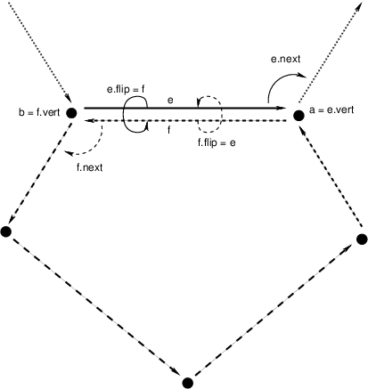

# Voronoi Diagrams and Delaunay Triangulations

Voronoi diagrams specify a partitioning of the plane into convex polygonal regions based on an input set of points, with the points being in one-to-one correspondence with the polygons.  Given the set of points `P`, let `p` be a point in that set; then `V(p)` is the Voronoi polygon corresponding to `p`. The interior of `V(p)` contains the part of the plane closer to `p` than any other point in `P`.

To compute the Voronoi diagram, one actually goes about creating a triangulation of the input points called the _Delaunay triangulation_.  In this structure, all the points in `P` are vertices of a set of non-overlapping triangles that comprise the set `T(P)`.  Each triangle `t` in `T(P)` has the property that the unique circle passing through the vertices of `t` has no points of `P` in its interior.

`T(P)` and `V(P)` (with the latter defined as `{V(p) | p in P}`) are _dual_ to each other in the following sense.  Each triangle in `T(P)` corresponds to a vertex in `V(P)` (a corner of some `V(p)`), each vertex in `T(P)` (which is just a point in `P`) corresponds to a polygon in `V(P)`, and each edge in `T(P)` corresponds to an edge in `V(P)`.  The vertices of `V(P)` are defined as the centers of the circumscribing circles of the triangles in `T(P)`.  These vertices are connected by edges such that if `t(p1)` and `t(p2)` share an edge, then the Voronoi vertices corresponding to those two triangles are connected in `V(P)`.  This duality between structures is important because it is much easier to compute the Delaunay triangulation and to take its dual than it is to directly compute the Voronoi diagram.

This PR provides a divide-and-conquer approach to computing the Delaunay triangulation based on Guibas and Stolfi's 1985 ACM Transactions on Graphics paper.  In this case, the oldies are still the goodies, since only minor performance increases have been achieved over this baseline result---hardly worth the increase in complexity.

The output of Delaunay triangulation and Voronoi diagrams are in the form of meshes represented by the half-edge structure.  These structures can be thought of as directed edges between points in space, where an edge needs two half-edges to complete its representation.  A half-edge, `e`, has three vital pieces of information: a vertex to which it points, `e.vert`; a pointer to its complementary half-edge, `e.flip`; and a pointer to the next half-edge in the polygon, `e.next`.  The following image might be useful:

Note that half-edges are only useful for representing orientable manifolds with boundary.  As such, half edge structures couldn't be used to represent a Moebius strip, nor could they be used for meshes where two polygons share a vertex without sharing an edge.  Furthermore, by convention, polygon edges are wound in counter-clockwise order.  We also allow each half-edge to point to an attribute structure for the face that it bounds.  In the case of a Delaunay triangle, that face attribute would be the circumscribing circle's center.
